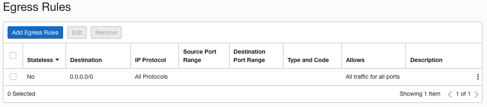

# Provision a Container Engine for Kubernetes (OKE)

## Introduction

This Lab will walk you through the step-by-step instructions of provisioning a Container Engine for Kubernetes (OKE). This Kubernetes cluster will be used to deploy an application that will be managed by GitLab CI/CD pipeline.

Estimated Time: 45 minutes

### Objectives

In this lab, you will:
* Configure Security Rules in Security Lists for Kubernetes Cluster creation
* Provision a Kubernetes Cluster and a Node Pool
* Configure GitLab Runner compute instance to Access Kubernetes Cluster
* Setup an Ingress Controller

### Prerequisites

This lab assumes you have:
* An Oracle Cloud account
* All previous labs successfully completed


<!-- *This is the "fold" - below items are collapsed by default* -->

## Task 1: Security Rule Configuration in Security Lists

The VCN in which you want to create and deploy OKE cluster must have specific security rules defined. The worker nodes, Kubernetes API endpoint, pods (when using VCN-native pod networking), and load balancer have different security rule requirements, as demonstrated in this lab. You can add additional rules to meet your specific needs.

1. Modify the Ingress rules in Security List of the *Public Subnet* as follows:

	

2. Modify the Ingress rules in Security List of the *Private Subnet* as follows:

  

3. The default Egress rules for both *Public and Private Subnets* should suffice. 

  

## Task 2: Create IAM Policies

Oracle Cloud Infrastructure Identity and Access Management (IAM) lets you control who has access to your cloud resources. Certain IAM policies are required to successfully access a cluster once it is provisioned.

1. Click on the main Navigation Menu, Select **Identity & Security** and then under **Identity** select **Compartment**
    - Navigate to the compartment that is being used for this Live Lab and copy the **OCID** of the compartment


  

2. Click on the main Navigation Menu, Select **Identity & Security** and then under **Identity** select **Dynamic Groups** and click **Create Dynamic Group**
    - Specify the Name and Description for the dynamic group
    - Specify the Rule for the Dynamic Group by specifying the OCID of the Compartment
        - Optionally, Rule Builder can also be used to specify the Rule

  

3. Click on the main Navigation Menu, Select **Identity & Security** and then under **Identity** select **Policies** and click **Create Policy**
    - Specify the Name and Description for the policy
    - Policy must be created in the **root** compartment
    - Specify the Policy rule. The policy specified would allow the user to *manage* the *cluster-family*. This policy enables users to perform any operation on cluster-related resources (this 'catch-all' policy effectively makes all users administrators insofar as cluster-related resources are concerned)
    - This policy would allow the user to access the Cluster details programmatically using OCI CLI

  

## Task 3: Create Managed Kubernetes (OKE) Cluster

1. In the Console, open the navigation menu and click **Developer Services**. Under **Containers & Artifacts**, click **Kubernetes Clusters (OKE)** and select the option **Create Cluster**. Use the **Custom Create** workflow option to create a cluster

  

2. Select the **Compartment** and the **Kubernetes version** from the drop-down menu.

  

3. Under the **Network type** selection, specify the **Flannel overlay**. Specify the VCN name, and the Public Subnet for *Kubernetes Service LB Subnet* and *Kubernetes API endpoint Subnet*. Make sure to assign a Public IP address to the API endpoint.

    

4. Click Next and specify configuration details for the node pool in the cluster.
    - Name: A name of your choice for the new node pool
    - Version: The version of Kubernetes to run on each worker node in the node pool. By default, the version of Kubernetes specified for the control plane nodes is selected
    - Shape: The shape to use for worker nodes in the node pool. The shape determines the number of CPUs and the amount of memory allocated to each node
    - Image: The image to use on worker nodes in the node pool. Make sure to select the image that is compatible with Kubernetes version

  

5. Number of Worker Nodes: Specify the number of worker nodes to create in the node pool.
6. Use the default Boot volume options
7. Placement Configuration: Specify one or more availability domains for the worker nodes, and specify the private regional subnet


8. Add an SSH Key: The public key portion of the key pair you want to use for SSH access to each node in the node pool. The public key is installed on all worker nodes in the cluster

  

9. Review the details you entered for the new cluster. Click **Create Cluster** to create the new cluster. 

  

10. Cluster creation continues

  

    - Container Engine for Kubernetes starts creating the cluster with the name you specified
    - Container Engine for Kubernetes creates:
        - node pool with the user define name
        - worker nodes with auto-generated names in the format oke-c&lt;part-of-cluster-OCID&gt;-n&lt;part-of-node-pool-OCID&gt;-s&lt;part-of-subnet-OCID&gt;-&lt;slot&gt;
    - Do not change the auto-generated names of worker nodes

Click Close to return to the Console. The cluster creation would continue and completes shortly.

11. Cluster creation completes

  


## Task 4: Install Kubectl Utility
> **Note:** The steps below need to be completed on the *runner* server.

1. Download the latest release with the command
    ```
    <copy>curl -LO "https://dl.k8s.io/release/$(curl -L -s https://dl.k8s.io/release/stable.txt)/bin/linux/amd64/kubectl"</copy>
    ```

2. Validate the binary (optional). Download the kubectl checksum file:
    ```
    <copy>curl -LO "https://dl.k8s.io/$(curl -L -s https://dl.k8s.io/release/stable.txt)/bin/linux/amd64/kubectl.sha256"</copy>
    ```

3. Validate the kubectl binary against the checksum file:
    ```
    <copy>echo "$(cat kubectl.sha256)  kubectl" | sha256sum --check</copy>
    ```

4. If valid, the output is:
    ```
    kubectl: OK
    ```

5. Get the Checksum from the Kubectl checksum file
    ```
    <copy>cat kubectl.sha256 ; echo</copy>
    e23cc7092218c95c22d8ee36fb9499194a36ac5b5349ca476886b7edc0203885
    ```

6. Get the checksum of the Kubect utility. download earlier
    ```
    <copy>sha256sum kubectl</copy>
    e23cc7092218c95c22d8ee36fb9499194a36ac5b5349ca476886b7edc0203885  kubectl
    ```

7. If the Checksum from the file and the Kubectl utility match, install the Kubectl utility
    ```
    <copy>sudo install -o root -g root -m 0755 kubectl /usr/local/bin/kubectl</copy>
    # Enable kubectl autocompletion
    <copy>echo 'source <(kubectl completion bash)' >>~/.bash_profile</copy>
    <copy>source ~/.bash_profile</copy>
    ```

## Task 5: Install OCI CLI on Linux 8.x
OCI CLI installation is required to access the OKE cluster.

1. Install OCI CLI
    ```
    <copy>sudo dnf -y install oraclelinux-developer-release-el8</copy>
    <copy>sudo dnf -y install python36-oci-cli</copy>
    <copy>oci --version</copy>
    ```
2. Enable Instance Principal Authentication and reload the profile
    ```
    <copy>sudo echo 'export OCI_CLI_AUTH=instance_principal' >> ~/.bash_profile</copy>
    <copy>source ~/.bash_profile</copy>
    ```


4. Verify the OCI CLI configuration using Instance Principal Authentication
    ```
    <copy>oci os ns get</copy>
    {
      "data": "&lt;object-storage-namespace&gt;"
    }
    ```


## Task 6: Access the OKE Cluster
1. To access the Kubernetes cluster access details, click the **Navigation Menu** in the upper left, navigate to **Developer Services** , and select **Kubernetes Clusters (OKE)**. Click the cluster name created earlier and click on **Access Cluster**. This shows all the steps needed to be performed on a machine to access the OKE Cluster successfully. Since a Public IP was assigned to the Kubernetes API endpoint, therefore the cluster would be accessible from anywhere.

* **Copy** the instructions to access the kubeconfig for your cluster using the **VCN-Native public endpoint**

  

2. Create a directory to contain the kubeconfig file
    ```
    <copy>mkdir -p $HOME/.kube</copy>
    ```

3. To access the kubeconfig for your cluster via the VCN-Native private endpoint, execute the command copied earlier (this should be different for everyone)
    ```
    oci ce cluster create-kubeconfig --cluster-id ocid1.cluster.oc1.eu-frankfurt-1.aaaaaaaaejvpasg53womynz4fl4gtqbodbvra3fxnu3f5f46ccctq5mfv7ia --file $HOME/.kube/config --region eu-frankfurt-1 --token-version 2.0.0  --kube-endpoint PUBLIC_ENDPOINT

    New config written to the Kubeconfig file /home/opc/.kube/config
    ```

4. Set your KUBECONFIG environment variable to the file for this cluster
    ```
    <copy>echo "export KUBECONFIG=$HOME/.kube/config" >>~/.bash_profile</copy>
    <copy>source ~/.bash_profile</copy>
    ```

5. Get the cluster details, to ensure authentication and access is working correctly
    ```
    <copy>kubectl get nodes</copy> 
    NAME          STATUS   ROLES   AGE     VERSION
    172.30.4.26   Ready    node    2m44s   v1.24.1
    172.30.7.28   Ready    node    3m27s   v1.24.1
    ```
## Task 7: Install Helm

1. Helm has an installer script that will automatically grab the latest version of Helm and install it locally. 
    ```
    <copy>curl -fsSL -o get_helm.sh https://raw.githubusercontent.com/helm/helm/main/scripts/get-helm-3</copy>
    <copy>chmod 700 get_helm.sh</copy>
    <copy>./get_helm.sh</copy>
    ```


## Task 8: Setup an Ingress Controller on OKE Cluster
An Ingress controller is a specialized load balancer for Kubernetes that is responsible for accepting the user traffic from the internet and load balances it to pods/containers running inside the Kubernetes cluster.

1. To get the user OCID, Navigate to Upper Right-Hand corner of the OCI Console, and click on **Profile**, and select **User settings** from the menu.  Copy the User **OCID** from the console.


2. Create the Access Rules for the Ingress Controller
Note that you must set up your own kubeconfig file. You cannot access a cluster using a kubeconfig file that a different user set up. Replace the User OCID with the one for your account.
*If your Oracle Cloud Infrastructure user is a tenancy administrator, skip this step and go straight to Creating the Service Account, and the Ingress Controller.*

  
    ```
    <copy>kubectl create clusterrolebinding gitlab-crb --clusterrole=cluster-admin --user=</copy> &lt;user-OCID&gt;
  
    clusterrolebinding.rbac.authorization.k8s.io/gitlab-crb created
    ```

3. Create the Service Account, and the Ingress Controller

  **NOTE:** To find out the version number of the latest version of the script, see the [kubenetes/ingress-nginx documentation on GitHub](https://github.com/kubernetes/ingress-nginx#support-versions-table). Make sure to use the version of Ingress Controller that is compatible with the Kubernetes version.

	```
  <copy>kubectl apply -f https://raw.githubusercontent.com/kubernetes/ingress-nginx/controller-v1.3.0/deploy/static/provider/cloud/deploy.yaml</copy>

  namespace/ingress-nginx created
  serviceaccount/ingress-nginx created
  serviceaccount/ingress-nginx-admission created
  role.rbac.authorization.k8s.io/ingress-nginx created
  role.rbac.authorization.k8s.io/ingress-nginx-admission created
  clusterrole.rbac.authorization.k8s.io/ingress-nginx created
  clusterrole.rbac.authorization.k8s.io/ingress-nginx-admission created
  rolebinding.rbac.authorization.k8s.io/ingress-nginx created
  rolebinding.rbac.authorization.k8s.io/ingress-nginx-admission created
  clusterrolebinding.rbac.authorization.k8s.io/ingress-nginx created
  clusterrolebinding.rbac.authorization.k8s.io/ingress-nginx-admission created
  configmap/ingress-nginx-controller created
  service/ingress-nginx-controller created
  service/ingress-nginx-controller-admission created
  deployment.apps/ingress-nginx-controller created
  job.batch/ingress-nginx-admission-create created
  job.batch/ingress-nginx-admission-patch created
  ingressclass.networking.k8s.io/nginx created
  validatingwebhookconfiguration.admissionregistration.k8s.io/ingress-nginx-admission created
  ```


4. Verify that the Public IP address is assigned to the Load Balancer

	```
  <copy>kubectl get svc -n ingress-nginx</copy>
  NAME                                 TYPE           CLUSTER-IP      EXTERNAL-IP       PORT(S)                      AGE
  ingress-nginx-controller             LoadBalancer   10.96.94.169    &lt;public-ip&gt;       80:31334/TCP,443:31826/TCP   45s
  ingress-nginx-controller-admission   ClusterIP      10.96.149.252   &lt;none&gt;            443/TCP                      45s
	```

## Learn More

* [Custom Create Workflow to Create a Cluster](https://docs.oracle.com/en-us/iaas/Content/ContEng/Tasks/contengcreatingclusterusingoke_topic-Using_the_Console_to_create_a_Custom_Cluster_with_Explicitly_Defined_Settings.htm)
* [Install Kubectl on Linux](https://kubernetes.io/docs/tasks/tools/install-kubectl-linux/)
* [Installing the OCI CLI](https://docs.oracle.com/en-us/iaas/Content/API/SDKDocs/cliinstall.htm)
* [Installing Helm](https://helm.sh/docs/intro/install/)
* [Setting Up an Ingress Controller on a Cluster](https://docs.oracle.com/en-us/iaas/Content/ContEng/Tasks/contengsettingupingresscontroller.htm)

## Acknowledgements
- **Created By/Date** - Farooq Nafey, Principal Cloud Architect, August 2022
* **Last Updated By/Date** - Farooq Nafey, September 2022
