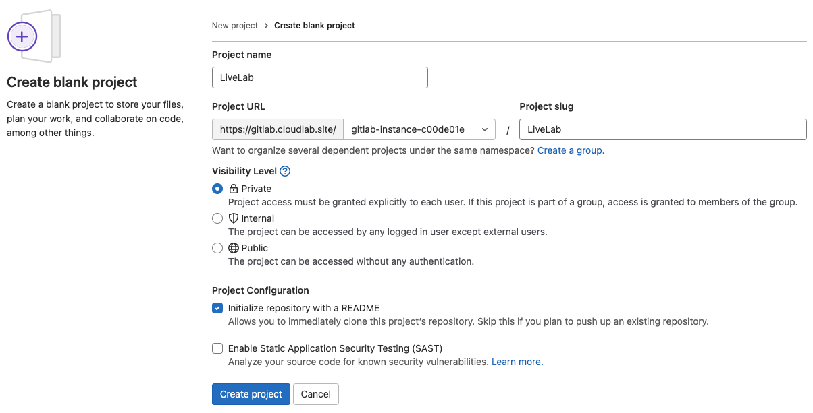

# GitLab Runner Installation and Registration

## Introduction

GitLab Runner is an application that works with GitLab CI/CD to run jobs in a pipeline. In this lab, we will install a GitLab runner and register it with the GitLab server.

Estimated Time: 30 minutes

### GitLab Runner versions
For compatibility reasons, the GitLab Runner ```major.minor``` version should stay in sync with the GitLab major and minor version. Older runners may still work with newer GitLab versions, and vice versa. However, features may not be available or work properly if a version difference exists.

### Objectives


In this lab, you will:
* Create a new GitLab project
* Install and configure GitLab Runner
* Install Docker on the runner server

### Prerequisites 


This lab assumes you have:
* Completed all the previous Labs successfully


## Task 1: Create a GitLab Project


1. To get Started, Create a **New project** in GitLab
  

1. Create a project from a **blank project**
  

3. Specify the **Project slug** and the **Project name**
  

4. Project with the specified name is created
  


## Task 2: Install GitLab Runner

> **Note:** The steps below need to be completed on the *runner* server.

1. Add the official GitLab repository

	```
  <copy>curl -L "https://packages.gitlab.com/install/repositories/runner/gitlab-runner/script.rpm.sh" | sudo bash</copy>
	```


2. Install the latest version of GitLab Runner

	```
	<copy>sudo yum -y install gitlab-runner</copy>
	```

## Task 3: Register a GitLab Runner

1. Get the Runner registration information
    - To access the runner registration information, go to **Settings** > **CI/CD** and expand the **Runners** section
    - The URL and the registration token are displayed that will be used to register a runner with the GitLab server

  

2. Register the GitLab runner with the GitLab instance 
    - Enter the GitLab instance URL 
    - Enter the registration token
    - Enter a description for the runner
    - Enter tags for the runner (comma-separated)
    - Enter optional maintenance note for the runner
    - Enter an executor
        - shell is used for this lab

	```
  <copy>sudo gitlab-runner register</copy>
  Runtime platform                  arch=amd64 os=linux pid=3073 revision=43b2dc3d version=15.4.0
  Running in system-mode.

  Enter the GitLab instance URL (for example, https://gitlab.com/):
  https://gitlab.cloudlab.site/
  Enter the registration token:
  GR13489412vF5MSLMCh6m4oGEqyZ2
  Enter a description for the runner:
  [runner]: oci-runner
  Enter tags for the runner (comma-separated):
  oci,runner
  Enter optional maintenance note for the runner:

  Registering runner... succeeded                     runner=GR13489412vF5MSLM
  Enter an executor: shell, ssh, virtualbox, docker+machine, custom, docker, docker-ssh, parallels, docker-ssh+machine, kubernetes:
  shell
  Runner registered successfully. Feel free to start it, but if it's running already the config should be automatically reloaded!

  Configuration (with the authentication token) was saved in "/etc/gitlab-runner/config.toml"
	```  

3. Once the runner is registered successfully, it should show up under the list of available runners
  

4. Click on the **Pencil Icon** next to the runner, and modiy the properties as follows:
    - Make sure to click the checkbox *Run untagged jobs*

  

## Task 4: Install Docker

GitLab CI/CD uses Docker to build container images. Docker will be used to build custom application image and publish it to a OCI Container Registry (OCIR)

1. Setup Docker Registry

	```
  <copy>sudo yum install -y yum-utils
  sudo yum-config-manager \
      --add-repo \
      https://download.docker.com/linux/centos/docker-ce.repo</copy>
	```

2. Install Docker Engine

	```
  <copy>sudo yum install -y docker-ce docker-ce-cli containerd.io docker-compose-plugin</copy>
	```


3. Enable and Start Docker

	```
  <copy>sudo systemctl enable docker --now</copy>
	```

4. Verify the Docker service status

	```
    <copy>sudo systemctl status docker</copy>
  ● docker.service - Docker Application Container Engine
    Loaded: loaded (/usr/lib/systemd/system/docker.service; enabled; vendor preset: disabled)
    Active: active (running) since Tue 2022-09-20 21:55:32 GMT; 20s ago
      Docs: https://docs.docker.com
  Main PID: 49263 (dockerd)
      Tasks: 8
    Memory: 30.7M
    CGroup: /system.slice/docker.service
            └─49263 /usr/bin/dockerd -H fd:// --containerd=/run/containerd/containerd.sock
	```

3. Add the gitlab-runner user to the docker group, this enables users to use the docker commands without using sudo 

	```
  <copy>sudo usermod -aG docker gitlab-runner</copy>
  # Optionally add opc user to docker group
  <copy>sudo usermod -aG docker opc</copy>
	```

4. Verify that gitlab-runner has access to Docker

	```
  <copy>sudo -u gitlab-runner -H docker info</copy>
	```

## Learn More

* [Install GitLab Runner](https://docs.gitlab.com/runner/install/linux-repository.html)
* [Register a Runner](https://docs.gitlab.com/runner/register/)
* [Install Docker](https://docs.docker.com/engine/install/centos/)
* [Deploy GitLab Runners on Oracle Container Engine for Kubernetes with autoscaling](https://docs.oracle.com/en/solutions/git-lab-runners-on-oke)


## Acknowledgements
- **Created By/Date** - Farooq Nafey, Principal Cloud Architect, August 2022
* **Last Updated By/Date** - Farooq Nafey, September 2022