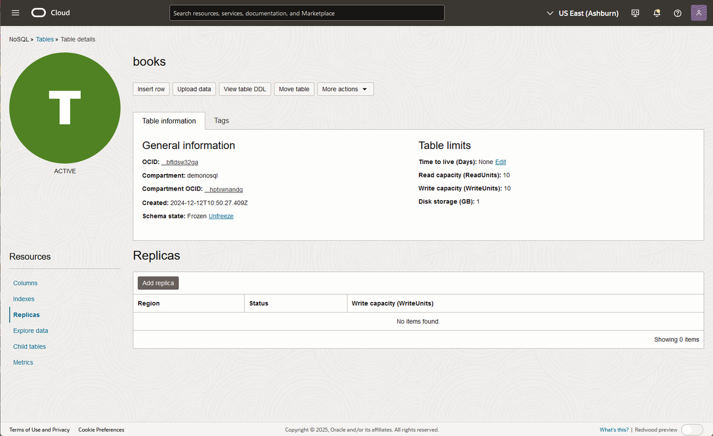
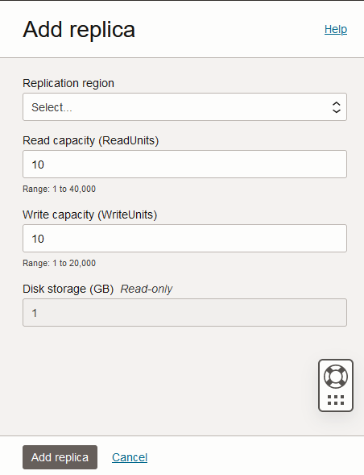
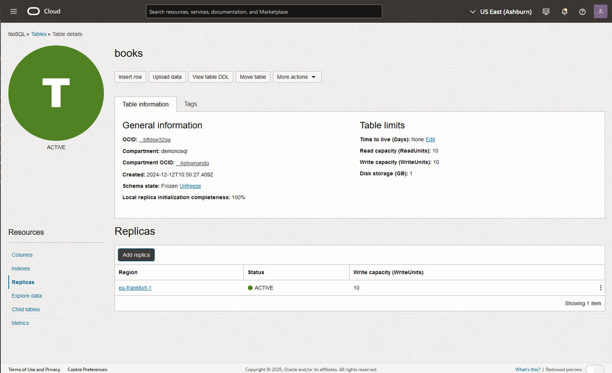
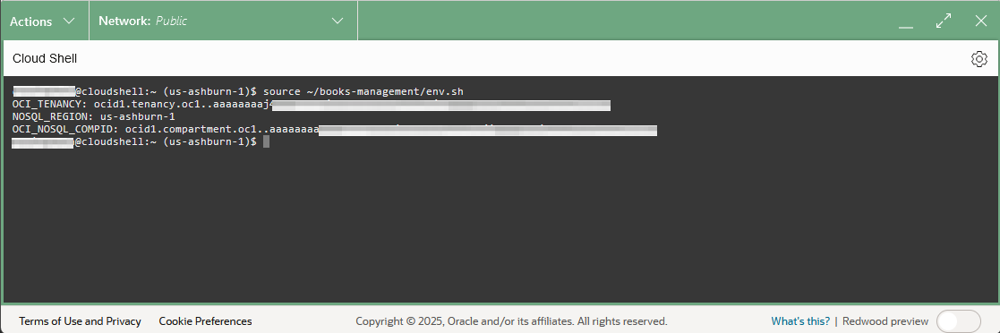
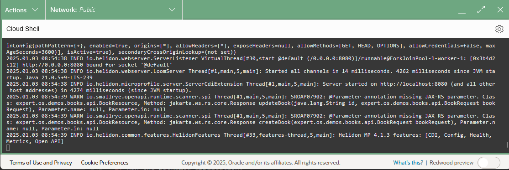
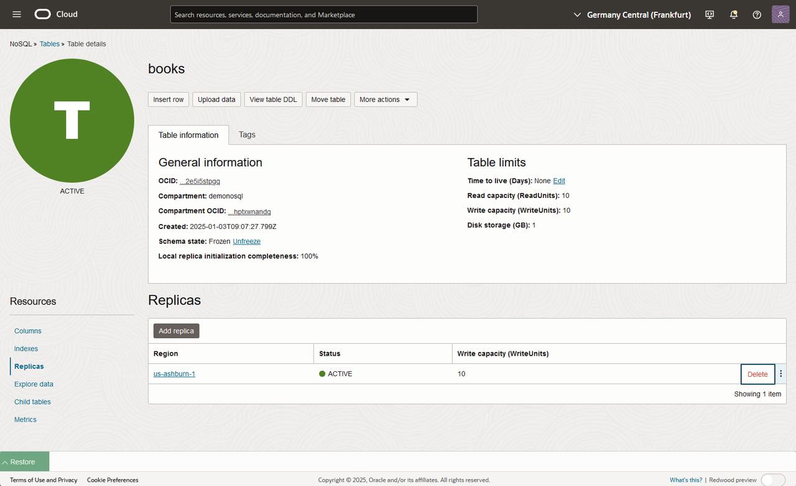

# Set Up Global Active Tables

## Introduction

This lab picks up where Lab 4 left off. You are going to setup a GAT configuration,
and deploy your application in multiple regions. Oracle NoSQL Global Active Tables
provide active-active replication of table data between geographically separated regions.

_Estimated Time:_ 20 minutes

### Objectives

* GAT Offers low-latency local access to data irrespective of where the data originated.

### Prerequisites

* An Oracle Free Tier, Paid Account or Green Button.
* Connection to the Oracle NoSQL Database Cloud Service.
* Working knowledge of bash shell.


## Task 1: Create a GAT

Before deploying the application in multiple regions, we will create replicas for the `book` table.

1. On the Oracle Cloud Infrastructure menu drop-down on the top left corner, go to **Databases**. Under Oracle NoSQL Databases, click **Tables**.
Click the **books** table. Under **Resources**, click **Replicas**.
The list of replicas already created in the table is listed. In our case, the list start empty


2. Click on `Add replica` button.

3. Choose a Replication region from the list. It does not matter which one is selected. Other information does not need to be changed for this LiveLab. Click **Add Replica**.

  

4. Wait few seconds until the deployment is created - Status will change from Updating to Active.  Any data that was in the originating table (the table created in Lab 2) will be immediately pushed to the newly created replica.  

  

  Click on the link for the `replica` added. It will open a new Tab with the information for the region selected.

5. You can query the table created as we learned in lab 3. You will have exactly the same data in both regions.

   

6. Modify a row in a region and query in the other region to verify that the changes got pushed to the other region.


## Task 2: Set up the Book Management Catalog Microservice in the New Region

We are going to set up the Movie Stream Microservice in the new region and follow similar steps to what  we used in **Lab 3 - Run the Movie Stream Catalog Microservice.**

1. Make sure you are in the region where you added your replica.  Let's get into the Cloud Shell from that region.

   

2. Execute the following environment setup shell script in the Cloud Shell to
set up your environment. If you close/open the Cloud Shell Console, please re-execute it.

    ```shell
    <copy>
    export NOSQL_DEPLOYMENT=CLOUD_INSTANCE_OBO_USER
    source ~/books-management/env.sh
    </copy>
    ```
    

3. Set the JAVA HOME to use JDK 21 as the current JDK.   

    ```shell
    <copy>
    export JAVA_HOME=`pwd`/jdk-21.0.5
    </copy>
    ```

## Task 3: Start the Book Management Catalog Microservice  and look at data

1. Use the following maven wrapper command to start the Spring application. Execute in the Cloud Shell.

    ```shell
    <copy>
    cd ~/books-management/
    nohup $JAVA_HOME/bin/java -jar target/books.jar &
    </copy>
    ```
    **Note:** This will start the "book" application in the background.

2. After you complete step 1, you can use the command tail to see the startup for the application.

    

    ```shell
    <copy>
    tail nohup.out
    </copy>
    ```
    The `mvnw` command will compile and start the application, please wait for the message *Started DemoApplication in xx seconds*

3. Let us review the data created in the prior Labs. Execute in the Cloud Shell.

    ```shell
    <copy>
    curl  http://localhost:8080/books | jq
    </copy>
    ```

4. Stop the application and delete temporary files

    execute the linux command `fg` followed by CTRL-C and enter to stop the application.
    ```shell
    <copy>
    fg
    </copy>
    ```
    Note: you can rexecute the command `fg` to validate that there are not jobs running in background.

    Delete the temporary files created.
    ```shell
    <copy>
    rm nohup.out result-test.txt
    </copy>
    ```

5. Close the tab for the remote region.


Adding a new region and starting up the application in that region is a straight forward process.  You can use the same process to extend to more regions.   You can also use the application to insert new data into your replicated region and verify that data got properly transmitted to the other region.   

## Task 4: Delete a remote region


This task deletes the resources that got created.  Ensure you are back in your original region.

1. On the Oracle Cloud Infrastructure menu drop-down on the top left corner, go to click **Databases**. Under Oracle NoSQL Databases, click Tables. Click the Movie table. Under Resources, click Replicas.
The list of replicas already created in the table is listed. Click on delete

  

  Deleting tables is an async operation, the status will get changed to deleting. Wait for the end of this operation.


You may now **proceed to the next lab.**

## Learn More


* [Oracle NoSQL Database Cloud Service page](https://www.oracle.com/database/nosql-cloud.html)
* [Global Active Tables in NDCS](https://docs.oracle.com/en/cloud/paas/nosql-cloud/gasnd/)


## Acknowledgements
* **Author** - Dario Vega, Product Manager, NoSQL Product Management
