# Create Tables, Load Tables

## Introduction

This lab walks you through creating and loading NoSQL tables. This can be done a
variety of different ways including using the Oracle Cloud Console, writing an
application program, or triggering actions through a function. This lab will
walk you through a couple of different approaches. Oracle NoSQL Database Cloud
Service supports both schema-based and schema-less (JSON) modeling so we will
create examples of both tables.

_Estimated Time:_ 11 minutes

### Objectives

* Create 2 tables with provisioned reads/sec, writes/sec, and GB storage.
* Write data to the table and read data from the table.
* Look at the data in the tables with the Oracle Cloud Console.

### Prerequisites

* An Oracle Free Tier, Paid Account or Green Button
* Connection to the Oracle NoSQL Database Cloud Service
* Working knowledge of bash shell

## Task 1: Create an Oracle NoSQL Table with the Console

1. On the Oracle Cloud Infrastructure menu drop-down on the left,
go to **Databases** and then select **Tables** under Oracle NoSQL Database.
This brings you to the 'Tables' screen where you can create a table from the console.

    

<if type="freetier">
2. On the 'Tables' screen there is a **Compartment** field on the left.
Please ensure that you select the  **demonosql** compartment.

  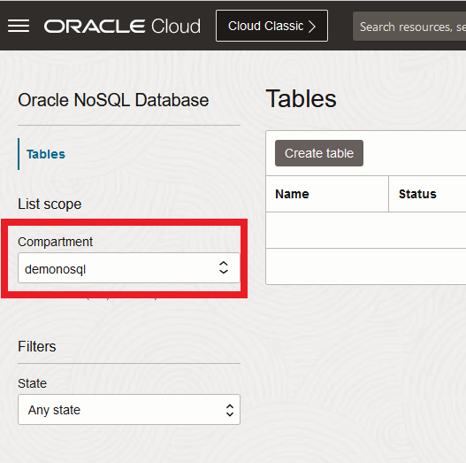
</if>

<if type="livelabs">
2. On the 'Tables' screen there is a **Compartment** field on the left.
Please make sure the compartment you were assigned is selected. In Lab 2, task 1
you identified your compartment. You will need to expand the root compartment,
and then expand the **LiveLabs** compartment to find it. In this example,
we are using **LL46279-COMPARTMENT**. Yours will be different.
You will not be able to create tables in any other compartment.

  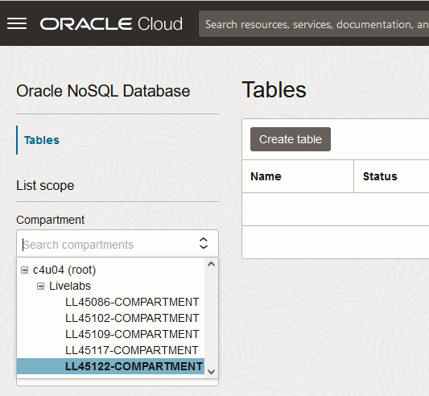
</if>

3. Click **Create table** and the 'Create table' screen appears.

    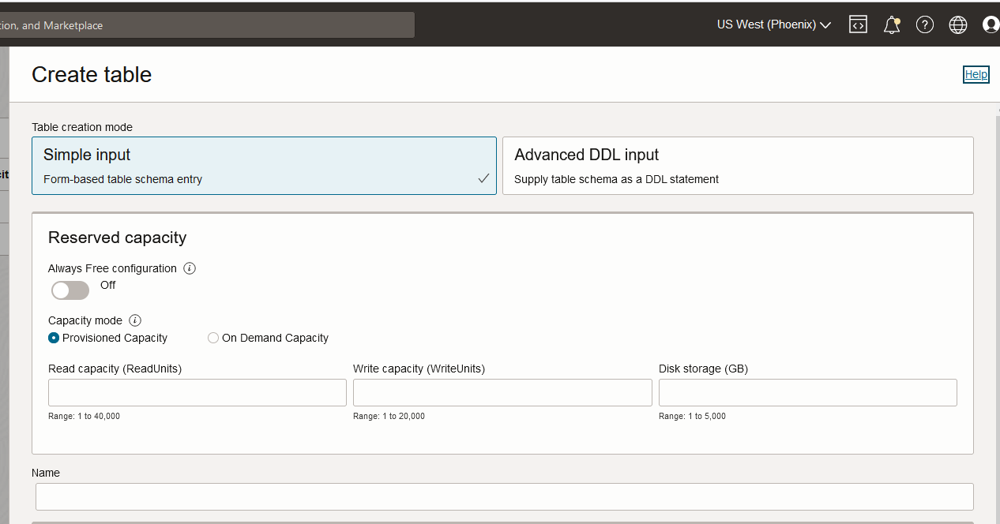

  This screen allows you to create tables in one of two different ways, either
  using simple input or using DDL input. For this Lab we are going to use the
  simple input method.

4. Enter in values for **Read capacity**, **Write capacity**, and **Disk storage**.
Enter in 10,10, and 5 respectively.

   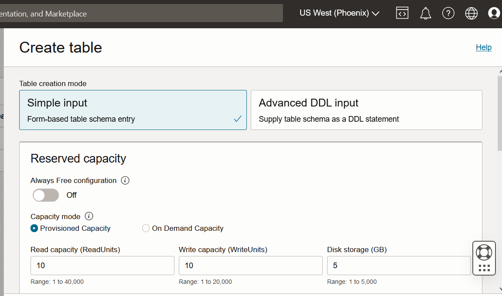

   Next enter a **name** for your table, a **primary key** and a **column**
   and click **Set as a shard key.** For this example, we used test as the
   name, pkey with a type of integer as the primary key, and name with a type
   of string as an additional column.

5. After providing the inputs, click **Create table** at the bottom.

   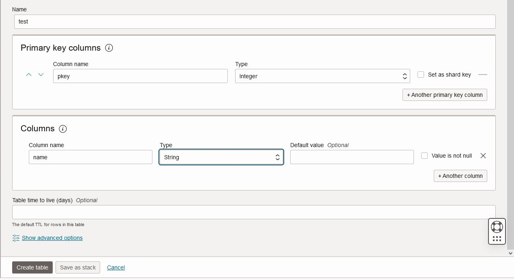

  In summary, this screen allows to create a table with multiple columns for the
  primary key, as well as adding many additional columns. You can create simple
  or more complex tables with this interface.

7. After clicking **Create table** you will be brought to the 'Tables' screen. This screen shows you a list of tables you have created, as well as basic information about the table. One important thing to notice is that our table has a status of 'Active' which means we are ready to load data into our table.

    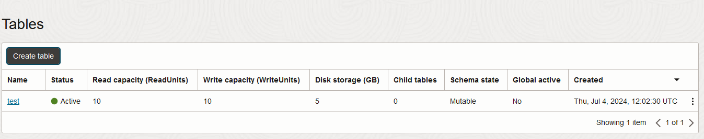


## Task 2: Deploy NoSQL Tables

In this task we are going to create tables using the Cloud Shell, and Oracle Cloud
Infrastructure Command Line Interface (CLI). The CLI commands issued from the Cloud
Shell make REST calls to the Oracle NoSQL Database Cloud Service (NDCS).
Oracle Cloud Infrastructure offers several SDKs in different languages that
you can use to make REST calls to NDCS. To make things a little simpler,
we have created some shell scripts and files that will assist you in this Task.
We need to download those to the Cloud Shell first.

1. Open the **Cloud Shell** from the top right menu.

    

2. Execute the following environment setup shell script in the Cloud Shell. If you close/open the Cloud Shell, please reexecute it.

    ```shell
    <copy>
    source ~/books-management/env.sh
    </copy>
    ```
3. Let us create NoSQL table using the Oracle Cloud Infrastructure Command Line Interface (CLI).
The CLI command for Oracle NoSQl is 'oci nosql <command>'. We will create a table
and  echo the DDL statement so you can see what is being created.


    ```shell
    <copy>
    cd ~/books-management
    DDL_TABLE=$(cat nosql/books-create-table-for-jakarta-nosq-with-frozen.ddl)
    echo $DDL_TABLE
    </copy>
    ```
    The echo command will show you the DDL statement that you will execute next.

    ```shell
    <copy>
    oci nosql table create --compartment-id "$OCI_NOSQL_COMPID"   \
    --name books --ddl-statement "$DDL_TABLE" \
    --table-limits="{\"maxReadUnits\": 10,  \"maxStorageInGBs\": 1,  \"maxWriteUnits\": 10 }" \
    --wait-for-state SUCCEEDED --wait-for-state FAILED
    </copy>
    ```
    At the end of this command you should see a "status": "SUCCEEDED" on your screen.

4. Exit the Cloud Shell.


## Task 3:  Add Data From the Oracle Cloud Console

1. Make sure you see the 'Tables' screen. You should see 2 tables listed. You
may see different values for read units, write units and storage.

    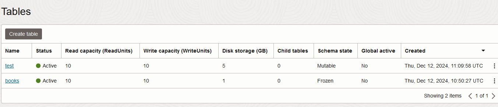

2. Let's start with the simple table we created in Task 1. Click **test** table.
The details screen that shows up, displays all the key information about the table.
Explore that screen.

    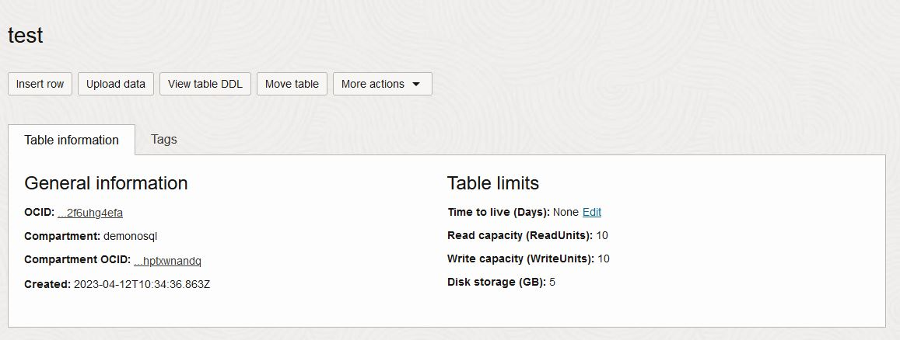

3. Click **Insert row**, and the 'Insert row' screen appears.

    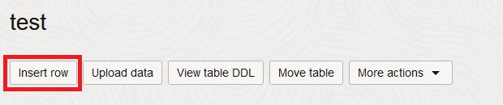

4. On the 'Insert row' screen, you will see two ways to input data - a simple and advanced.
For our test table we will use the simple method. Enter a value for the **pkey** column
and the **name** column. When done, press **Insert row.**

    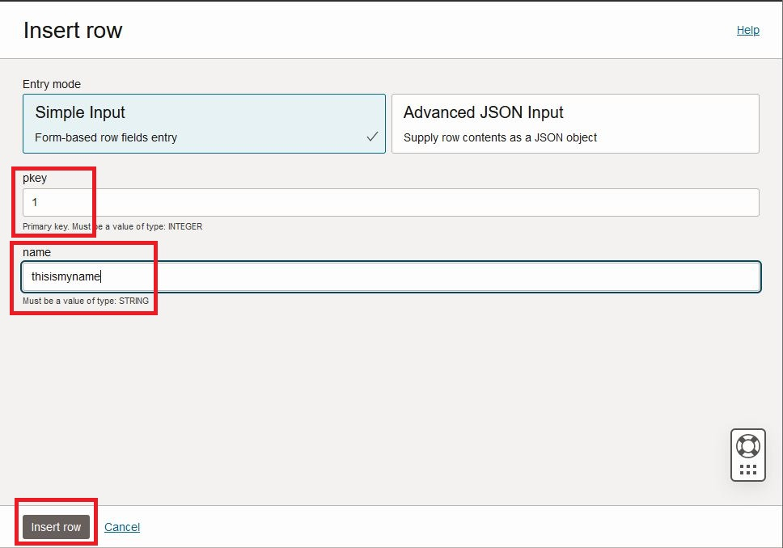

5. Let's insert rows into another table. First we need to get back to the 'Tables'
screen. Click **Tables** on top right.

    

6. Click **books** table

    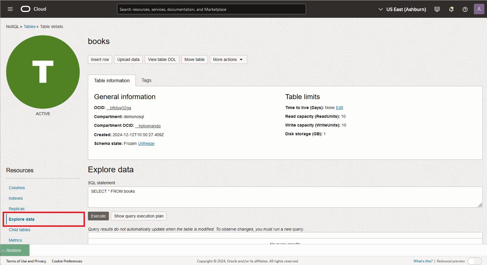

7. Click **Explore data**

  Copy/Paste the following command below in the **SQL statement** text box. Because
  this JSON document is complex, it is easiest to copy/paste into the field.
  However, you could have typed it all in. You will notice at the end of our UPSERT statement
  we have a RETURNING clause.   This clause acts the same way as a SELECT clause and
  in this case it returns the full row.  Click on **Execute.**

  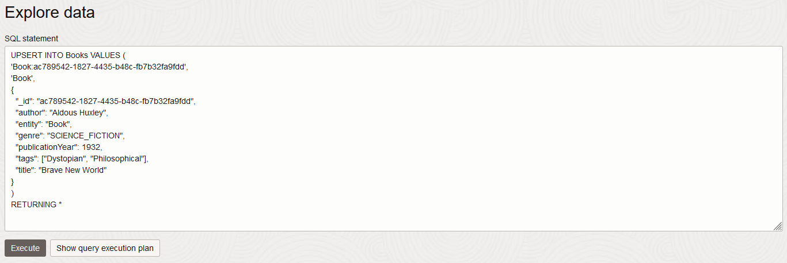


  SQL statement

    ```
    <copy>
    UPSERT INTO Books VALUES (
    'Book:ac789542-1827-4435-b48c-fb7b32fa9fdd',
    'Book',
    {
      "_id": "ac789542-1827-4435-b48c-fb7b32fa9fdd",
      "author": "Aldous Huxley",
      "entity": "Book",
      "genre": "SCIENCE_FICTION",
      "publicationYear": 1932,
      "tags": ["Dystopian", "Philosophical"],
      "title": "Brave New World"
    }
    )
    RETURNING *
    </copy>
    ```
8. Let's insert rows using the upload data feature. Download the file `book-file-kvjson.json` in your computer.

   Right click button on this link [upload-file](./files/book-file-kvjson.json), then click on **Save link as**.


9. Click **Upload Data**, and the 'Upload Data' screen appears.

    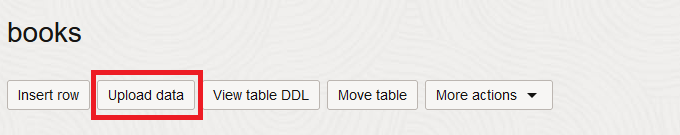

10. Upload the file `book-file-kvjson.json` that you download in the step 8 and wait for the download of 50 records. Click on **close** when finished with the upload.
    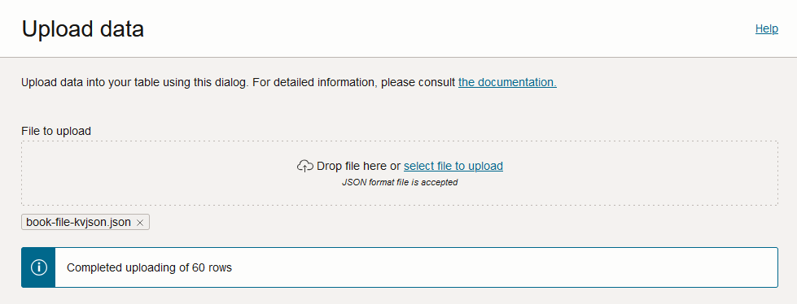

    To summarize, in this Lab you have seen two different ways to insert data into a table.

## Task 4:  Show Data from the Console

Starting with the `Book` demo table, we can go and look at the data we
inserted for that table.

1. On the left click **Explore data**

    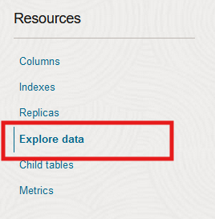

2. In the textbox **SQL statement**, check to see if the text **SELECT * FROM Book** is
present in the box.   If not, remove what is there and insert it.  This will
select all the rows from our table. Click **Execute**

    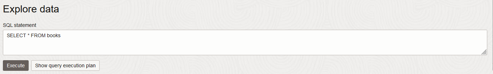

  You will see in the bottom of the screen the rows that we inserted.  You will see
  little arrows pointing either down or to the right.   You can click on arrows pointing to the
  right to expand the contents OR click on the ones pointing down to compress the
  contents.

  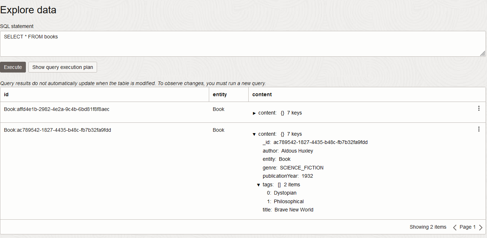


3. Go to the top left, press **Tables**, select the **test** table, and look at
the row inserted into that table.

You may now **proceed to the next lab.**

## Learn More

* [Oracle NoSQL Database Cloud Service page](https://www.oracle.com/database/nosql-cloud.html)
* [About Oracle NoSQL Database Cloud Service](https://docs.oracle.com/en/cloud/paas/nosql-cloud/index.html)
* [About Cloud Shell](https://docs.oracle.com/en-us/iaas/Content/API/Concepts/cloudshellintro.htm)


## Acknowledgements
* **Authors** - Dario Vega, Product Manager, NoSQL Product Management; Otavio Santana, Award-winning Software Engineer and Architect
