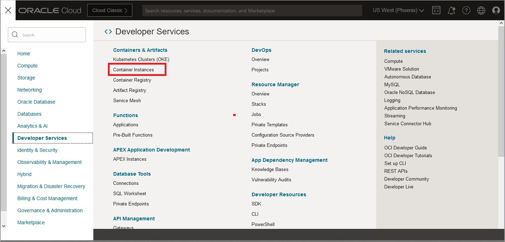
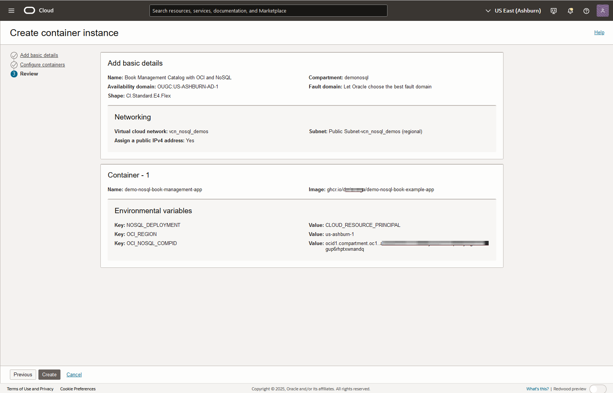

# Deploy the Book Management Catalog Microservice with Container Instances

## Introduction

This lab picks up where lab 3 left off. We will explore another deployment option using Container Instances.

Oracle Cloud Infrastructure (OCI) Container Instances is a serverless compute service that enables you to quickly and easily run containers without managing any servers. Container Instances provide serverless compute optimized for container workloads with the same isolation as virtual machines.

Container Instances are suitable for containerized workloads that do not require a container orchestration platform like Kubernetes. These use cases include APIs, web applications, CI/CD jobs, cloud operations automation, data/media processing, development or test environments, and more.

_Estimated Time:_ 20 minutes

[Lab 4 Walkthrough](videohub:1_7yxajmgz)

### Objectives

* Deploy the application using Container Instances
* Read data with REST API deployed in the new Container Instances

### Prerequisites

* An Oracle Free Tier, Paid Account, or Green Button
* Connection to the Oracle NoSQL Database Cloud Service
* Working knowledge of bash shell
* Working knowledge of SQL language

## Task 1: Review the Code Using OCI Code Editor

In this task, we will review the code using the OCI Code Editor.

1. Open the OCI Code Editor in the top-right menu.

   

2. Open `application.properties` in the `global-microservices-nosql/src/main/resources` directory. This file configures the database connection and deployment settings, providing flexibility for different environments.

   

3. Review the `Dockerfile` in the `global-microservices-nosql/code-nosql-jakarta-sdk` directory. This file defines the instructions for building the container image for the Book Management application.

4. Take a look at the GitHub Actions script used to build and push the container image to GitHub Container Registry. You can [review it here](https://github.com/oracle/nosql-examples/blob/master/.github/workflows/build-and-push-demo-book-image.yml) for details on container deployment.

After reviewing the code, you can close the Code Editor.

## Task 2: Restart the Cloud Shell

1. Open the Cloud Shell. If you minimized it earlier, expand it. If it’s disconnected or timed out, restart it.

   

2. Execute the following setup shell script in Cloud Shell to set up your environment. Please copy the values for `OCI_REGION` and `OCI_NOSQL_COMPID` (labeled `NOSQL_REGION` and `NOSQL_COMPID` in your environment):

    ```shell
    source ~/global-microservices-nosql/env.sh
    ```
   

   Minimize the Cloud Shell.

## Task 3: Deploy Container Instances

1. In the left side menu (under the Oracle Cloud banner), go to Developer Services and select **Containers & Artifacts** - **Container Instances**.

   

2. Click on **Create Container Instance**. In the new window, enter **Book Management Catalog with OCI and NoSQL** as the name. Ensure the compartment is `demonosql`. Verify the 'Networking' section as shown below. Click **Next**.

   

3. Enter **demo-nosql-book-management-app** as the name. Click **Select Image**, choose **External Registry**, and enter:
   - **Registry hostname**: `ghcr.io`
   - **Repository**: `oracle/demo-nosql-book-management-app`

   Then, click **Select Image** at the bottom of the screen.

   

4. Scroll down and add the following environment variables:
   - `NOSQL_SERVICETYPE` as key and `useResourcePrincipal` as value
   - `OCI_REGION` as key with the value copied in Task 2
   - `OCI_NOSQL_COMPID` as key with the value copied in Task 2

   

5. Click **Next**, review the setup, and then click **Create**.

   

6. Wait a few seconds for the deployment to complete. The status will change from **Creating** to **Active**.

   

7. Copy the Public IP address of the container instance.

## Task 4: Read Data and Examine It

1. Set up the Cloud Shell environment again.

    ```shell
    source ~/global-microservices-nosql/env.sh
    ```

2. Set the `IP_CI` environment variable to the Public IP address of the container instance.

    ```shell
    export IP_CI=<copied Public IP address>
    ```

3. Use the REST API to read data from the Book Management application running in the container:

    ```shell
    curl http://$IP_CI:8080/api/books | jq
    ```

   This will display all the rows in the table. You can execute additional queries as needed.

Exit the Cloud Shell, and you may now **proceed to the next lab.**

## Learn More

* [Oracle NoSQL Database Cloud Service](https://www.oracle.com/database/nosql-cloud.html)
* [About Oracle NoSQL Database Cloud Service](https://docs.oracle.com/en/cloud/paas/nosql-cloud/index.html)
* [About Container Instances](https://docs.oracle.com/en-us/iaas/Content/container-instances/home.htm)

## Acknowledgements

* **Authors** - Dario Vega, Product Manager, NoSQL Product Management; Michael Brey, Director NoSQL Development; Otavio Santana, Award-winning Software Engineer and Architect
