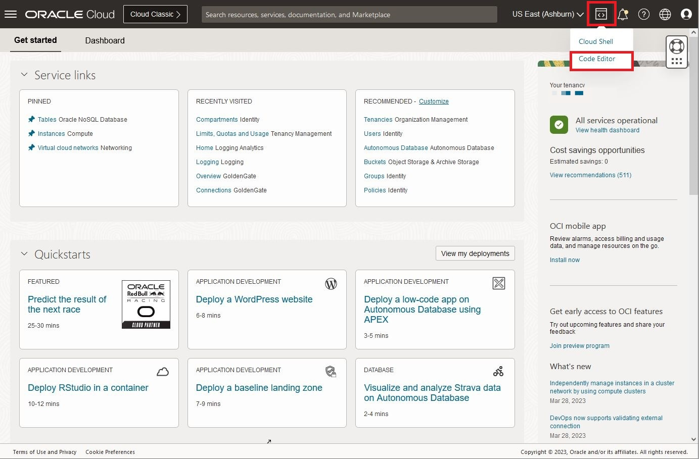

# Run the Book Management Catalog Microservice

## Introduction

This lab picks up where lab 2 left off. We will explore the tables created, load data, and execute queries using a Jakarta EE and Helidon-based REST application.

_Estimated Time:_ 16 minutes

[Lab 3 Walkthrough](videohub:1_m5ilj0z4)

### Objectives

* Understand the different Java Classes in this Jakarta EE SDK project.
* Read and load data with REST API.

### Prerequisites

* An Oracle Free Tier, Paid Account, or Green Button
* Connection to the Oracle NoSQL Database Cloud Service
* Working knowledge of bash shell
* Working knowledge of SQL language

## Task 1: Review the Code Using OCI Code Editor

In this task, we will review the code using the OCI Code Editor.

1. Open the OCI Code Editor from the top-right menu.

   

2. Click on the Explorer button in the OCI Code Editor.

   

3. Open `microprofile-config.properties` in the directory `global-microservices-nosql/src/main/resources`. This configuration file is used to set application properties and database connection settings, enabling flexibility for deployment.

   

4. Next, review the `Book.java` entity class in `expert/os/demos/books/domain`. This class represents a `Book` in the database and includes fields for `id`, `title`, `genre`, `publicationYear`, `author`, and `tags`.

   Jakarta Data automatically maps this entity to a NoSQL table with the primary key as `id` and the rest of the fields stored as JSON.

   

5. Review `BookRepository.java`, also located in `expert/os/demos/books/domain`. This repository interface extends `BasicRepository`, which provides CRUD methods to interact with the `Book` entity in Oracle NoSQL.

   Open `BookRepository.java`:

   

6. Open `BookService.java` in the `application` package to view the main logic for managing books. `BookService` injects `BookRepository` and `BookMapper` to handle CRUD operations on books.

   - `create`: Maps `BookRequest` to `Book` and saves it.
   - `update`: Updates an existing book by ID.
   - `findById`: Retrieves a book by ID.
   - `getAllBooks`: Retrieves all books with pagination and sorting by title.
   - `delete`: Deletes a book by ID.

   This class also logs activities, providing visibility into operations performed.

7. Open `BookMapper.java` in the `application` package. This mapper uses MapStruct to convert between `Book`, `BookRequest`, and `BookResponse`.

## Task 2: Restart the Cloud Shell

1. Open the Cloud Shell and restart it if it has timed out.

   

2. Execute the setup shell script in Cloud Shell:

    ```shell
    export OCI_obo_token=$(cat $OCI_obo_token_path)
    source ~/global-microservices-nosql/env.sh
    ```
   

3. List installed JDKs and set GraalVM for JDK 21 as the current JDK.

    ```shell
    csruntimectl java list
    ```

    ```shell
    csruntimectl java set graalvmjdk-21
    ```

## Task 3: Build, Deploy, and Examine Data

1. Package the Jakarta EE application using Maven:

    ```shell
    cd ~/global-microservices-nosql/code-nosql-jakarta-sdk/
    mvn package
    ```

2. Run the packaged application:

    ```shell
    java -jar target/books.jar
    ```

3. Review the data created in Lab 2 by querying the API:

    ```shell
    curl http://localhost:8080/api/books | jq
    ```

4. Insert a new Book using the REST API:

    ```shell
    curl -X POST -H "Content-Type:application/json" -d @../data/book-example.json http://localhost:8080/api/books | tee result-test.txt
    ```

5. Read the book information using the self-link generated above:

    ```shell
    URL=`cat result-test.txt | jq -r '."_links".self.href'`
    echo $URL
    curl $URL
    ```

6. Search for a book by title:

    ```shell
    curl http://localhost:8080/api/books/search/findByTitle?title=NewBookTitle
    ```

7. Delete the book and validate its removal:

    ```shell
    curl -i -X DELETE $URL
    curl $URL
    ```

8. Stop the application (use `CTRL + C`) and delete temporary files:

    ```shell
    rm nohup.out result-test.txt
    ```

9. Execute SQL queries over REST using the OCI CLI.

    ```shell
    SQL_STATEMENT="SELECT * from Book"
    echo "$SQL_STATEMENT"
    oci nosql query execute -c  $OCI_NOSQL_COMPID --statement "$SQL_STATEMENT"
    ```

Exit the Cloud Shell to **proceed to the next lab.**

## Learn More

* [Oracle NoSQL Database Cloud Service](https://www.oracle.com/database/nosql-cloud.html)
* [Jakarta Data SDK Developers Guide](https://docs.oracle.com/en/database/other-databases/nosql-database/24.1/jakarta-data/persistence-model.html)
* [OCI Cloud Shell](https://docs.oracle.com/en-us/iaas/Content/API/Concepts/cloudshellintro.htm)

## Acknowledgements
* **Authors** - Dario Vega, Product Manager, NoSQL Product Management; Michael Brey, Director NoSQL Development; Otavio Santana, Award-winning Software Engineer and Architect
