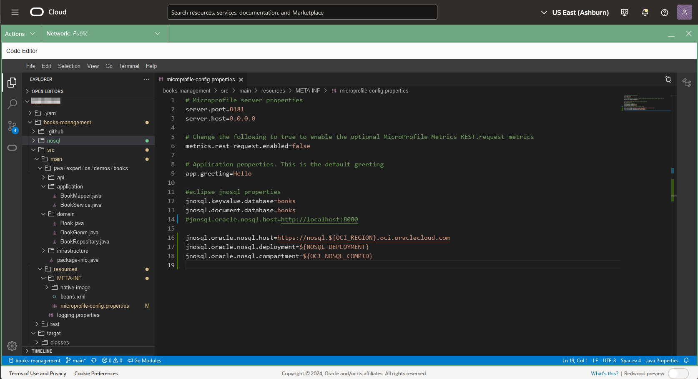
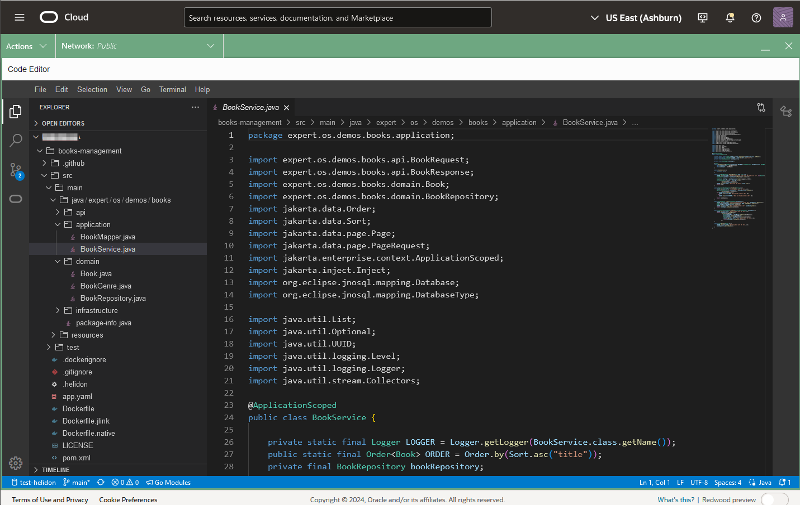

# Run the Book Management Catalog Microservice

## Introduction

This lab picks up where lab 2 left off. We will explore the tables created, load data, and execute queries using a Jakarta EE and Helidon-based REST application.

_Estimated Time:_ 16 minutes

### Objectives

* Understand the different Java Classes in this Jakarta EE SDK project.
* Read and load data with REST API.

### Prerequisites

* An Oracle Free Tier, Paid Account, or Green Button
* Connection to the Oracle NoSQL Database Cloud Service
* Working knowledge of bash shell
* Working knowledge of SQL language

## Task 1: Review the Code Using OCI Code Editor

In this task, we will review the code using the OCI Code Editor.

1. Open the OCI Code Editor from the top-right menu.

   

2. Click on the Explorer button in the OCI Code Editor.

   

3. Open `microprofile-config.properties` in the directory `books-management/src/main/resources/META-INF/`.
This configuration file is used to set application properties and database connection settings, enabling flexibility for deployment.

   

   Oracle NoSQL Database offers flexible deployment options to suit the needs of its customers.
   Whether deploying on an "On-Premises" cluster or utilizing the Oracle NoSQL Database Cloud Service,
   developers and end-users get the latest in NoSQL technology. Oracle offers a complete range of deployment
   options to support your Oracle NoSQL database, from on-premises to private cloud to public cloud.
   Depending on which deployment option you choose, you may need different authentication strategies.

   There are 5 authentication methods available (using the property `jnosql.oracle.nosql.deployment`)

    - `CLOUD_API_KEY`: Represents a cloud deployment using an API key for authentication and authorization.
    - `CLOUD_INSTANCE_PRINCIPAL`: Represents a cloud deployment using instance principal for authentication and authorization.
    - `CLOUD_INSTANCE_OBO_USER`: Represents a cloud deployment using instance principal for delegation with an OBO token.
    It is a pre-authenticated option available in the Cloud Shell.
    - `CLOUD_RESOURCE_PRINCIPAL`: Represents a cloud deployment using resource principal for authentication and authorization.
    - `CLOUD_SECURITY_TOKEN`: Represents a cloud deployment using Token-based Authentication.

    When you create a table, you can choose between *Provisioned Capacity* and *On Demand Capacity*.
    With the availability of both models, businesses have total flexibility when choosing the most cost-effective deployment
    to meet their business and application workload requirements. Such flexibility empowers businesses to solely focus on application
    innovations to delight their customers, making operational costs "worry-free" in their decision-making process.
    You can also modify the Capacity mode from Provisioned Capacity to On Demand Capacity and vice-versa.

    The Jakarta Data Framework supports the persistence of entities to Oracle NoSQL Database tables. An entity is mapped to a table.
    It automatically creates the table using the properties `jnosql.document.database` and `jnosql.keyvalue.database`

    In this application we will use Common application properties and variables for easy setup and changeability when deploying using container services.

4. Next, review the `Book.java` entity class in `books-management/src/main/java/expert/os/demos/books/domain`. This class represents a `Book` in the database and includes fields for `id`, `title`, `genre`, `publicationYear`, `author`, and `tags`.

    The annotations used in this class are part of Jakarta NoSQL and are designed to map Java objects to NoSQL database tables effectively. Key annotations include:

    - **`@Entity`**: This class is identified as a persistable entity, meaning it will be mapped to a table in the NoSQL database.
    - **`@Id`**: Marks the field used as the primary key for the entity, uniquely identifying each record in the database.
    - **`@Column`**: Specifies which fields are persistable in the database. Unlike JPA, where fields are persistable by default, in Jakarta NoSQL, you must explicitly annotate each field you want to store in the database.

    These annotations give developers precise control over how objects are stored and retrieved in NoSQL databases, aligning with NoSQL systems' flexibility and schema-less nature.

   

5. Review `BookRepository.java`, also located in `books-management/src/main/java/expert/os/demos/books/domain`. This repository interface extends `BasicRepository`, which provides CRUD methods to interact with the `Book` entity in Oracle NoSQL.

    The `BasicRepository` interface is part of Jakarta Data and offers a set of predefined database operations, such as `save,` `delete,` `findById,` and more, to streamline
    interaction with the database. Beyond these built-in methods, Jakarta Data allows you to define custom queries through method naming conventions, such as `findByName`, where
    the query is automatically derived based on the method name. Additionally, Jakarta Data supports annotation-based operations, such as `@Insert`, `@Update`, `@Delete`, and
    `@Save`, which let you explicitly define specific actions. The provider implements all these functionalities, meaning developers only need to define the interface, and the
    underlying implementation is automatically handled, simplifying development and reducing boilerplate code.

    Open `BookRepository.java`:

    

6. Open `BookService.java` in the `application` package to view the main logic for managing books. `BookService` injects `BookRepository` and `BookMapper` to handle CRUD operations on books.

    - `create`: Maps `BookRequest` to `Book` and saves it.
    - `update`: Updates an existing book by ID.
    - `findById`: Retrieves a book by ID.
    - `delete`: Deletes a book by ID.

    This class also logs activities, providing visibility into operations performed.

    


7. Open `BookMapper.java` in the `application` package. This mapper uses MapStruct to convert between `Book`, `BookRequest`, and `BookResponse`.

    


## Task 2: Restart the Cloud Shell

1. Open the Cloud Shell and restart it if it has timed out.

   

2. Execute the setup shell script in Cloud Shell:

    ```shell
    <copy>
    export NOSQL_DEPLOYMENT=CLOUD_INSTANCE_OBO_USER
    source ~/books-management/env.sh
    </copy>
    ```
   

3. Set the JAVA HOME to use JDK 21 as the current JDK.

    ```shell
    <copy>
    export JAVA_HOME=`pwd`/jdk-21.0.5
    </copy>
    ```

## Task 3: Build, Deploy, and Examine Data

1. Package the Jakarta EE application using Maven:

    ```shell
    <copy>
    cd ~/books-management/
    mvn package
    </copy>
    ```

2. Run the packaged application:

    ```shell
    <copy>
    nohup $JAVA_HOME/bin/java -jar target/books.jar &
    </copy>
    ```

3. Review the data created in Lab 2 by querying the API:

    ```shell
    <copy>
    curl http://localhost:8080/books | jq
    </copy>
    ```

4. Insert a new Book using the REST API:

    ```shell
    <copy>
    curl -X POST -H "Content-Type: application/json" -d '{"title":"The Catcher in the Rye","genre":"FICTION","publicationYear":1951,"author":"J.D. Salinger","tags":["Classic","Literature","American"]}' http://localhost:8080/books| tee result-test.txt |jq
    </copy>
    ```

5. Read the book information using the id generated above:

    ```shell
    <copy>
    URL="http://localhost:8080/books/"`cat result-test.txt | jq -r '.id' `
    echo $URL
    curl $URL | jq
    </copy>
    ```

6. Delete the book and validate its removal:

    ```shell
    <copy>
    curl -i -X DELETE $URL
    curl $URL
    </copy>
    ```

7. Stop the application and delete temporary files.

    Execute the linux command `fg` followed by CTRL-C and enter to stop the application.
    ```shell
    <copy>
    fg
    </copy>
    ```
    Note: you can reexecute the command `fg` to validate that there are not jobs running in background.

    Delete the temporary files created.
    ```shell
    <copy>
    rm nohup.out result-test.txt
    </copy>
    ```

8. Execute SQL queries over REST using the OCI CLI.

    ```shell
    <copy>
    SQL_STATEMENT="SELECT * from Books"
    echo "$SQL_STATEMENT"
    oci nosql query execute --compartment-id  $OCI_NOSQL_COMPID --statement "$SQL_STATEMENT"
    </copy>
    ```

9. Exit the Cloud Shell

You may now **proceed to the next lab.**

## Learn More

* [Oracle NoSQL Database Cloud Service](https://www.oracle.com/database/nosql-cloud.html)
* [Jakarta Data SDK Developers Guide](https://docs.oracle.com/en/database/other-databases/nosql-database/24.1/jakarta-data/persistence-model.html)
* [OCI Cloud Shell](https://docs.oracle.com/en-us/iaas/Content/API/Concepts/cloudshellintro.htm)

## Acknowledgements
* **Authors** - Dario Vega, Product Manager, NoSQL Product Management; Otavio Santana, Award-winning Software Engineer and Architect
