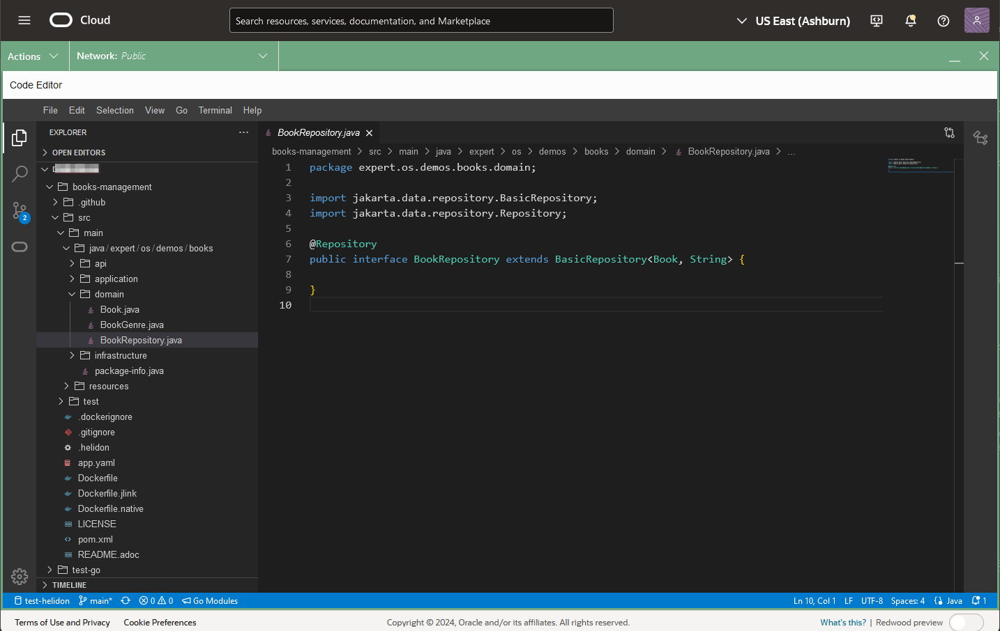

# Run the Book Management Catalog Microservice

## Introduction

This lab picks up where lab 2 left off. We will explore the tables created, load data, and execute queries using a Jakarta EE and Helidon-based REST application.

_Estimated Time:_ 16 minutes

[Lab 3 Walkthrough](videohub:1_m5ilj0z4)

### Objectives

* Understand the different Java Classes in this Jakarta EE SDK project.
* Read and load data with REST API.

### Prerequisites

* An Oracle Free Tier, Paid Account, or Green Button
* Connection to the Oracle NoSQL Database Cloud Service
* Working knowledge of bash shell
* Working knowledge of SQL language

## Task 1: Review the Code Using OCI Code Editor

In this task, we will review the code using the OCI Code Editor.

1. Open the OCI Code Editor from the top-right menu.

   

2. Click on the Explorer button in the OCI Code Editor.

   

3. Open `microprofile-config.properties` in the directory `global-microservices-nosql/src/main/resources`. This configuration file is used to set application properties and database connection settings, enabling flexibility for deployment.

   

4. Next, review the `Book.java` entity class in `expert/os/demos/books/domain`. This class represents a `Book` in the database and includes fields for `id`, `title`, `genre`, `publicationYear`, `author`, and `tags`.

The annotations used in this class are part of Jakarta NoSQL and are designed to map Java objects to NoSQL database tables effectively. Key annotations include:

- **`@Entity`**: This class is identified as a persistable entity, meaning it will be mapped to a table in the NoSQL database.
- **`@Id`**: Marks the field used as the primary key for the entity, uniquely identifying each record in the database.
- **`@Column`**: Specifies which fields are persistable in the database. Unlike JPA, where fields are persistable by default, in Jakarta NoSQL, you must explicitly annotate each field you want to store in the database.

These annotations give developers precise control over how objects are stored and retrieved in NoSQL databases, aligning with NoSQL systems' flexibility and schema-less nature.

   

5. Review `BookRepository.java`, also located in `expert/os/demos/books/domain`. This repository interface extends `BasicRepository`, which provides CRUD methods to interact with the `Book` entity in Oracle NoSQL.

The `BasicRepository` interface is part of Jakarta Data and offers a set of predefined database operations, such as `save,` `delete,` `findById,` and more, to streamline interaction with the database. Beyond these built-in methods, Jakarta Data allows you to define custom queries through method naming conventions, such as `findByName`, where the query is automatically derived based on the method name. Additionally, Jakarta Data supports annotation-based operations, such as `@Insert`, `@Update`, `@Delete`, and `@Save`, which let you explicitly define specific actions. The provider implements all these functionalities, meaning developers only need to define the interface, and the underlying implementation is automatically handled, simplifying development and reducing boilerplate code.

   Open `BookRepository.java`:

   

6. Open `BookService.java` in the `application` package to view the main logic for managing books. `BookService` injects `BookRepository` and `BookMapper` to handle CRUD operations on books.

   - `create`: Maps `BookRequest` to `Book` and saves it.
   - `update`: Updates an existing book by ID.
   - `findById`: Retrieves a book by ID.
   - `delete`: Deletes a book by ID.

   This class also logs activities, providing visibility into operations performed.

7. Open `BookMapper.java` in the `application` package. This mapper uses MapStruct to convert between `Book`, `BookRequest`, and `BookResponse`.

## Task 2: Restart the Cloud Shell

1. Open the Cloud Shell and restart it if it has timed out.

   

2. Execute the setup shell script in Cloud Shell:

    ```shell
    export OCI_obo_token=$(cat $OCI_obo_token_path)
    source ~/global-microservices-nosql/env.sh
    ```
   

3. List installed JDKs and set GraalVM for JDK 21 as the current JDK.

    ```shell
    csruntimectl java list
    ```

    ```shell
    csruntimectl java set graalvmjdk-21
    ```

## Task 3: Build, Deploy, and Examine Data

1. Package the Jakarta EE application using Maven:

    ```shell
    cd ~/global-microservices-nosql/code-nosql-jakarta-sdk/
    mvn package
    ```

2. Run the packaged application:

    ```shell
    java -jar target/books.jar
    ```

3. Review the data created in Lab 2 by querying the API:

    ```shell
    curl http://localhost:8080/api/books | jq
    ```

4. Insert a new Book using the REST API:

    ```shell
    curl -X POST -H "Content-Type:application/json" -d @../data/book-example.json http://localhost:8080/api/books | tee result-test.txt
    ```

5. Read the book information using the self-link generated above:

    ```shell
    URL=`cat result-test.txt | jq -r '."_links".self.href'`
    echo $URL
    curl $URL
    ```

6. Delete the book and validate its removal:

    ```shell
    curl -i -X DELETE $URL
    curl $URL
    ```

7. Stop the application (use `CTRL + C`) and delete temporary files:

    ```shell
    rm nohup.out result-test.txt
    ```

8. Execute SQL queries over REST using the OCI CLI.

    ```shell
    SQL_STATEMENT="SELECT * from Book"
    echo "$SQL_STATEMENT"
    oci nosql query execute -c  $OCI_NOSQL_COMPID --statement "$SQL_STATEMENT"
    ```

Exit the Cloud Shell to **proceed to the next lab.**

## Learn More

* [Oracle NoSQL Database Cloud Service](https://www.oracle.com/database/nosql-cloud.html)
* [Jakarta Data SDK Developers Guide](https://docs.oracle.com/en/database/other-databases/nosql-database/24.1/jakarta-data/persistence-model.html)
* [OCI Cloud Shell](https://docs.oracle.com/en-us/iaas/Content/API/Concepts/cloudshellintro.htm)

## Acknowledgements
* **Authors** - Dario Vega, Product Manager, NoSQL Product Management; Michael Brey, Director NoSQL Development; Otavio Santana, Award-winning Software Engineer and Architect
