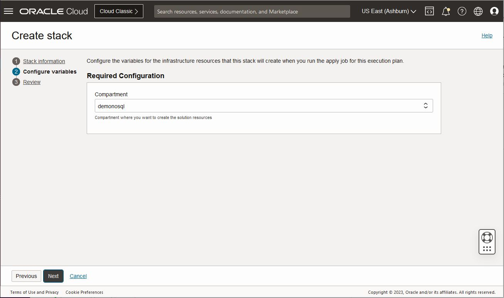
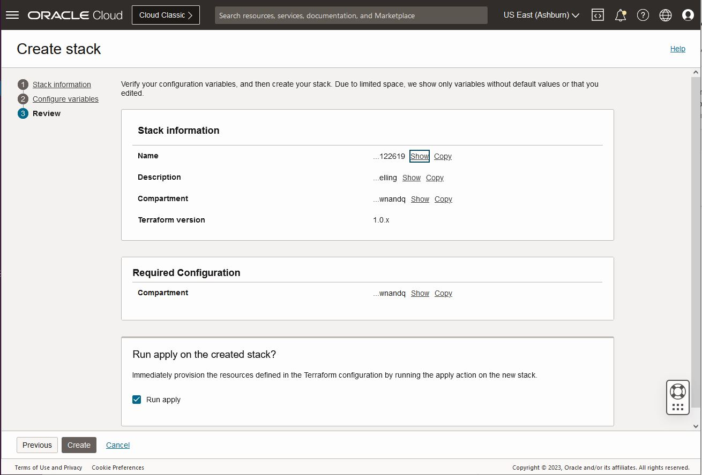

# Prepare Your Environment

## Introduction

This lab walks you through the steps necessary to create a proper operating environment.

_Estimated Time:_ 9 minutes

### Objectives

In this lab you will:
* Create a Compartment.
* Download code bundle.
* Deploy Infrastructure using Terraform.
* Learn about credentials, and policies.

### Prerequisites

This lab assumes you have:

* An Oracle Free Tier, Paid Account or Green Button


## Task 1: Create a Compartment

1. Log into the Oracle Cloud Console using your tenancy. Please make a note of
what region you are at.

    

2. On the left side drop-down (under Oracle Cloud banner), go to **Identity & Security**
and then **Compartments.**

    

3. Click **Create Compartment.** This opens up a new window.

  Enter **demonosql** as compartment **Name** field, enter text into **Description**
  field and press **Create Compartment** button at bottom of window.
  The **Parent Compartment** field will display your current parent compartment.
  Ensure this is your **root** compartment. This HOL assumes the 'demonosql' compartment
  is a child of the root compartment.

    

## Task 2: Get Data and Code Bundle

In this task we will copy over a data bundle stored on object storage and
place that in the Cloud Shell.

1. Open the **Cloud Shell** in the top right menu. It can take about 2 minutes
to get the Cloud Shell started.

    

2. Execute the following in your Cloud Shell.

    ```shell
    <copy>
    cd $HOME
    rm -rf books-management
    curl -L https://github.com/oracle/nosql-examples/raw/master/zips/books-management.zip  -o books-management.zip
    unzip books-management.zip

    arch=`uname -m | sed  's/x86_64/x64/g'`
    wget https://download.oracle.com/java/21/latest/jdk-21_linux-${arch}_bin.tar.gz
    tar -xzvf jdk-21_linux-${arch}_bin.tar.gz
    rm -f jdk-21_linux-${arch}_bin.tar.gz
    </copy>
    ```

3. Exit from the Cloud Shell

## Task 3: Deploy Infrastructure using Terraform

1. To deploy the application, we will use terraform scripts provided for this Lab. Click the 'Deploy to Oracle Cloud ' button.  This will create a new window in your browser.

  [](https://cloud.oracle.com/resourcemanager/stacks/create?zipUrl=https://github.com/oracle/nosql-examples/raw/master/zips/books-management.zip)

2. After successfully hitting the 'Deploy to Oracle Cloud' button, you will be brought to a new screen.

  


3. Provide your **Cloud Account Name** (tenancy name, not your username or email) and click on Next.

  Log into your account using your credentials (system may have remembered this from a prior log in).  You will see the Create Stack screen below:

  

  Click the box "I have reviewed and accept the Oracle Terms of Use".  After clicking this box, OCI will populate the stack information, the name, and the description.  Check the 'Create in compartment' box and make sure it shows demonosql.   If it does not, change it to demonosql.  

4. Click on Next on bottom left of screen.  This will move you to the 'Configure Variables' screen. Configure the variables for the infrastructure resources that this stack needs prior to running the apply job.

  Choose demonosql as the _Compartment_  from the drop-down list.

  

5. Click on Next, which brings you to the 'Review' screen.  Click on Create.

  

  A job will run automatically. It takes approximately a minute. Wait still "State" field becomes **Succeeded.**  While the job is running you will see a new screen that has the status displayed.   

  

  While it is running, go ahead and start Task 4. Once it has succeeded you can sign out and  delete that window from your browser.

## Task 4: Understand Credentials, and Policies

  1. Please read the following information.

    Oracle NoSQL Database Cloud Service uses Oracle Cloud Infrastructure Identity and Access Management, which enables you to create user accounts and control access to cloud resources.  With respect to Oracle NoSQL, you can give users permission to inspect, read, use, or manage NoSQL tables.  There are 4 authentication methods available: API key-based, Session token-based (delegation tokens), Instance Principal, and Resource Principal. The Oracle NoSQL Database SDKs allow you to provide the credentials for an application using any of these authentication methods. Credentials are typically associated with a specific user.

    Oracle NoSQL has SDKs in the following languages:  **Java, Node.js, Python, Go, Spring, and C#.**

    The SDKs support a configuration file as well as API interfaces that allow direct specification of the credential information. You can use the SignatureProvider API to supply your API key-based credentials to Oracle NoSQL Database. The usual things provided include user OCID, tenancy OCID, private key, and fingerprint. The Session token-based approach is similar but it adds a temporary session token which usually expires in an hour.   This is useful when a temporary authentication is required.

    You can also handle authentication by using Instance and Resource Principals.

    Resource Principals allow you to authenticate and access Oracle Cloud Infrastructure resources.  A Resource Principal consists of a temporary session token (which typically is cached for 15 minutes) and secure credentials that enables the owner/user to authenticate to Oracle Cloud Infrastructure services. To use them, you have to set up a dynamic group and create a policy that grants the dynamic group access to a resource.   These are typically used when authenticating into the NoSQL Cloud Service from functions (NoSQL Cloud Service would be the resource).

    Instance Principals is a capability in Oracle Cloud Infrastructure Identity and Access Management (IAM) that lets you make service calls from an instance. With Instance Principals, you don’t need to configure user credentials or rotate the credentials. Instances themselves are a principal type set up in IAM. You can think of them as an IAM service feature that enables instances to be authorized actors (or principals) to perform actions on service resources.

    Oracle NoSQL Database Cloud service has three different resource types, namely,`nosql-tables`, `nosql-rows`, and `nosql-indexes`. It also has one aggregate resource called `nosql-family`. Policies are created that allow a group to work in certain ways with resources such as `nosql-tables` in a particular compartment. All NoSQL tables belong to a defined compartment. In Task 1 of this Lab, we created the demonosql compartment and this is where we will create our tables.

    You can use Instance Principals to connect to NoSQL Cloud Service instead of specifying the credentials as shown below in the Node.js example . Once they are set up, they are simple to use because all you need to do is call the appropriate authorization constructor.

    **Node.js SDK for Oracle NoSQL Database**

    ```typescript
    <copy>
    SignatureProvider provider = SignatureProvider.createWithInstancePrincipal();
    NoSQLHandleConfig config = new NoSQLHandleConfig(OCI_REGION, provider);
    config.setDefaultCompartment(OCI_COMPID);
    return new NosqlDbConfig(config);
    </copy>
    ```

   Also in one of our next labs we are going to be running application code and we need an instance to run that from. We will run that application using Cloud Shell with a delegation token.

    ```java
    <copy>
    SignatureProvider provider = SignatureProvider.createWithInstancePrincipalForDelegation(System.getenv("OCI_obo_token"));
    NoSQLHandleConfig config = new NoSQLHandleConfig(OCI_REGION, provider);
    config.setDefaultCompartment(OCI_COMPID);
    return new NosqlDbConfig(config);
    </copy>
    ```

   You may now **proceed to the next lab.**

## Learn More

* [About Identity and Access Management](https://docs.oracle.com/en-us/iaas/Content/Identity/Concepts/overview.htm)
* [About Managing User Credentials](https://docs.oracle.com/en-us/iaas/Content/Identity/Tasks/managingcredentials.htm)
* [About Cloud Shell](https://docs.oracle.com/en-us/iaas/Content/API/Concepts/cloudshellintro.htm)


## Acknowledgements
* **Author** - Dario Vega, Product Manager, NoSQL Product Management
