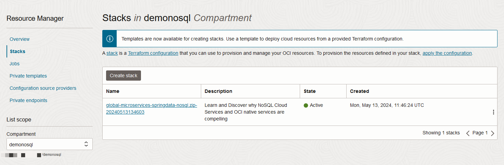

# Clean Up

## Introduction

This lab is finished. We will delete all resources created.

_Estimated Time:_ 5 minutes

## Task 1: Delete resources created using Cloud Shell

In this task we will deleted the resource created using the Cloud Shell.

1. Open the **Cloud Shell** in the top right menu to get the Cloud Shell started.

  

2. Execute the following in your Cloud Shell.

    ```
    <copy>
    source ~/global-microservices-springdata-nosql/env.sh
    oci nosql table delete --compartment-id "$OCI_NOSQL_COMPID" --table-name-or-id Movie \
    --wait-for-state SUCCEEDED --wait-for-state FAILED
    </copy>
    ```
    ```
    <copy>
    cd $HOME
    rm -rf global-microservices-springdata-nosql
    rm -rf global-microservices-springdata-nosql.zip
    </copy>
    ```

3. Exit from Cloud Shell.

## Task 2: Delete resources created using Console


This task deletes the resources that got created.

1. On the top left, go to menu, then Databases, then under Oracle NoSQL Database, hit 'Tables'
Set your compartment to 'demonosql'
Click on the Test table, which will bring up the table details screen.  Hit Delete.

  

  Deleting tables is an async operation, so you will not immediately see the results on the OCI console.  Eventually the status of the tables will get changed to deleted.  

2. On the top left, go to menu, then Developer Services and then Containers & Artifacts - Container Instances.

   In the Container instance screen, click on the container with the name `Creating Scalable, Global Microservices with OCI, Spring Data, and NoSQL`. Under 'More actions' click on Delete.

   

   Wait until the status changed from 'Deleting' to 'Deleted'.

   

## Task 3: Delete resources created using Resource Manager - terraform


1.  Clean up from the deployment.   In the top left corner, hit the OCI drop down menu, then go to 'Developer Services' and then Stacks under Resource manager.

  

2.  In the Stacks screen, click on the stack with the name global-microservices-springdata-nosql.zip-xxxxxx.

  

3.  This will bring you to the stacks detail page.  On that screen hit the 'Destroy' button.  This will then pop up another window where you will have to hit 'Destroy' again.    This process takes 1-2 minutes to run and clean everything up.  

  

4.  When the destroy task will show Succeeded, return to the stack page.

5. Click on more actions and delete stack.  

    

## Task 4: Delete the compartment created

1. Remove the 'demonosql' compartment. From upper left hand menu, go to **Identity and Security** then **Compartments** under 'Identity.'

    

2. The 'Compartments' screen appears and click **demonosql**

    

3. Press the **Delete** button. This will fire off a job that runs asynchronously. It takes a while.

    


## Acknowledgements
* **Author** - Dario Vega, Product Manager, NoSQL Product Management and Michael Brey, Director, NoSQL Product Development
* **Last Updated By/Date** - Dario Vega, Product Manager, NoSQL Product Management, Michael Brey, Director, NoSQL Product Development July 2024
