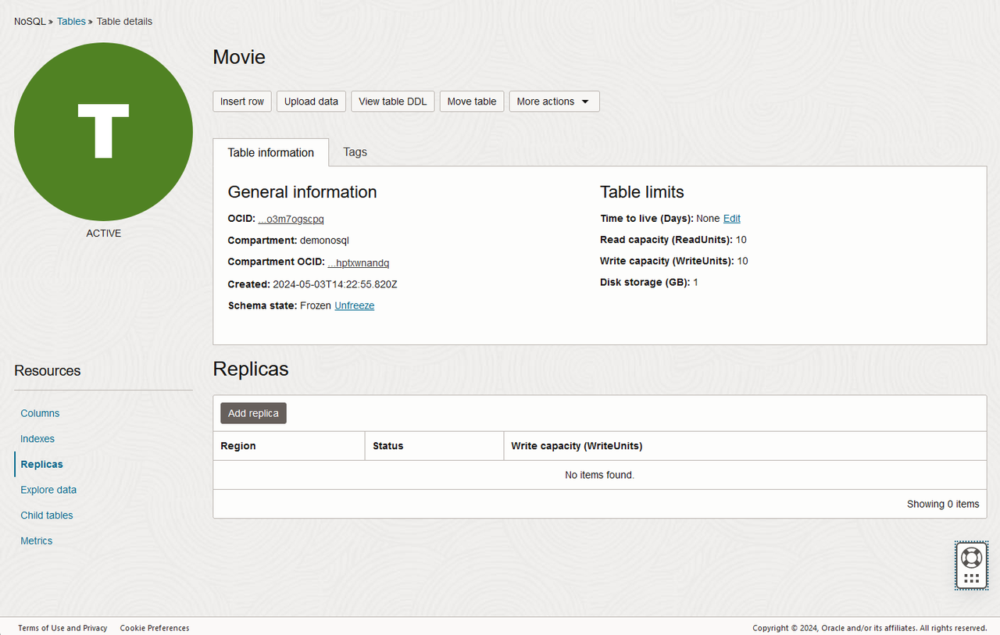
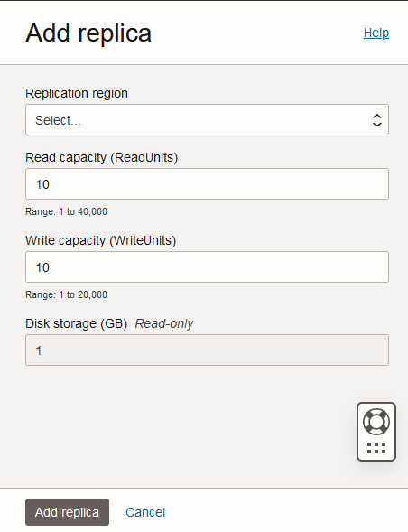
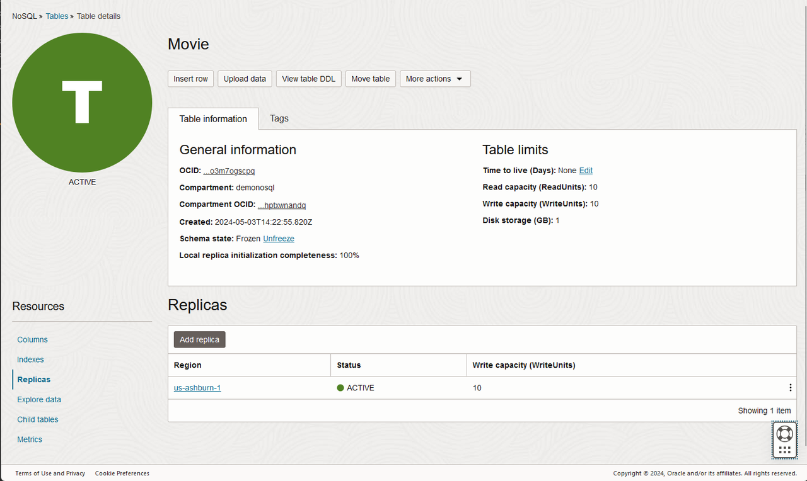

# Explore Data and Run Queries

## Introduction

This lab picks up where Lab 5 left off. You are going to setup a GAT configuration,
and deploy your application in multiple regions. Oracle NoSQL Global Active Tables
provide multi-active replication of table data between geographically separated regions.

**And now, for the fun part, let’s look at some queries over the streaming data.**

_Estimated Time:_ 20 minutes

### Objectives

* GAT Offers low-latency local access to data irrespective of where the data originated.

### Prerequisites

* An Oracle Free Tier, Paid Account or Green Button
* Connection to the Oracle NoSQL Database Cloud Service
* Working knowledge of bash shell

## Task 1: Create a GAT

Before deploying the application in multiple regions, we will create replicas for `movie` table.

1. From the hamburger menu, click **Databases**. Under Oracle NoSQL Databases, click **Tables**.
Click the **Movie** table. Under **Resources**, click **Replicas**.
The list of replicas already created in the table is listed. In our case, the list start empty

2. Click on `Add replica` button.

3. Choose a Replication region from the list. Other information does not need to be changed for this LiveLab. Click **Add Replica**.

  

4. Wait few second until the deployment is created - Status will change from Updating to Active.

  

  Click on the link for the `replica` added. It will open a new Tab with the information for the region selected.

5. You can query the table created as we Learned in lab 3. You will have exactly the same data in both region.

   

6. Modify a row in a region and query in the other region.

## Task 2: Run the Movie Stream Catalog Microservice in the New Region

Execute the same instructions provided in **Lab 4 - Run the Movie Stream Catalog Microservice** but from the new Region.

You may now **proceed to the next lab.**

## Learn More

* [Oracle NoSQL Database Cloud Service page](https://www.oracle.com/database/nosql-cloud.html)
* [NoSQL SQL Reference Manual](https://docs.oracle.com/en/database/other-databases/nosql-database/22.3/sqlreferencefornosql/index.html)

## Acknowledgements
* **Author** - Dario Vega, Product Manager, NoSQL Product Management
* **Last Updated By/Date** - Dario Vega, Product Manager, NoSQL Product Management, May 2023
