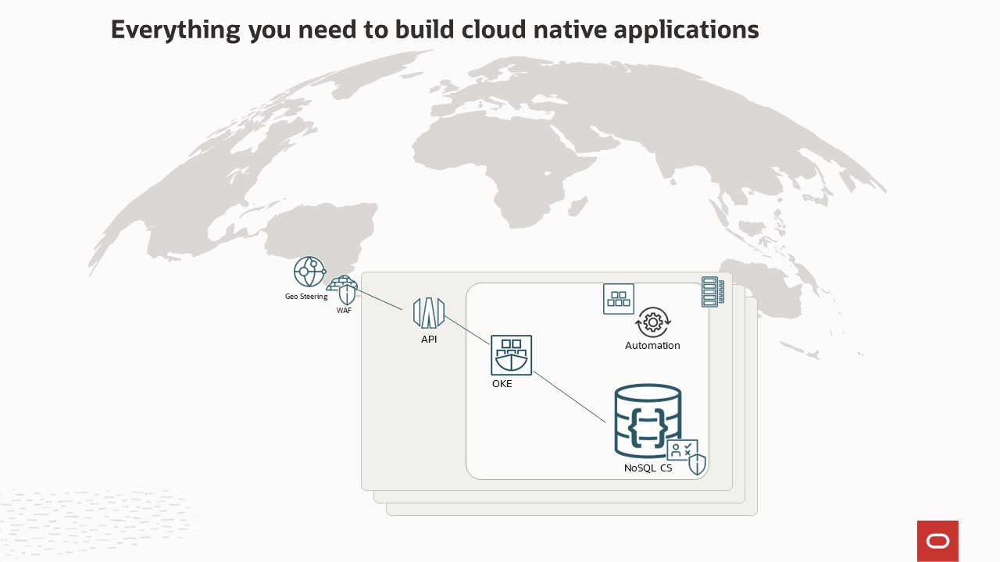
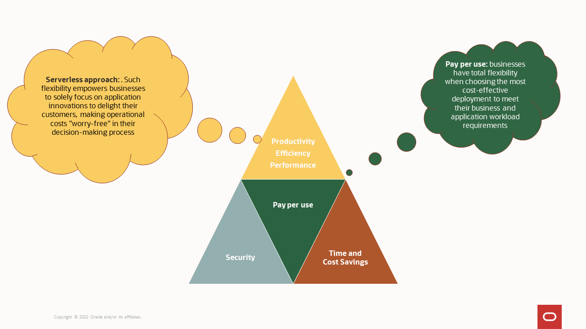

# Introduction

## About this Workshop

Welcome to the server-less world where provisioning instances is a thing of the past.
Oracle NoSQL Database Cloud Service enables modern application development in mere minutes.

**Simply connect and go.**

Unchain yourself from rigid data modeling and use Oracle NoSQL’s rich JSON query language to go schema-less.  Get an in-depth look at the simplicity of the Oracle NoSQL cloud developer experience and see how
Oracle’s own developers make use of this new development paradigm.

Learn how Oracle NoSQL Database can provide a delightful developer experience with features
such as predictable single-digit millisecond latencies, Global Active Tables, and deep integration
with Visual Studio Code and IntelliJ. One can also simply use the Oracle Cloud Infrastructure (OCI) Code Editor.

This lab is based on the data catalog used by Oracle's MovieStream application; a fictitious online movie-streaming company.  This Oracle home-grown application models what you would see in Netflix, Hulu, Peacock, Disney+ and the many others available.  This live lab walks you through the steps to create tables in Oracle NoSQL Database Cloud Service (NDCS), load data into the database, and perform basic queries. Additionally, you will learn how to create an application using the Oracle NoSQL Database SDK for Spring Data.

Spring Data REST is part of the umbrella Spring Data project and makes it easy to build hypermedia-driven REST web services on top of Spring Data repositories.  Building on top of Spring Data repositories, Spring Data REST analyzes your application’s domain model and exposes hypermedia-driven
HTTP resources for aggregates contained in the model.

Finally, boost your applications with Oracle NoSQL Global Active Tables where the design motto is *Simplicity Hides Complexity*. The Global Active Tables feature is an active/active set of table replicas across your choice of cloud regions, making it possible to achieve local read and write performance of globally distributed applications. Global Active Tables provide businesses with data synchronization and built-in conflict resolution of business application data when data is written simultaneously to any participating regional table replica.

_Estimated Workshop Time:_ 90 Minutes

_Estimated Time:_ 4 minutes

### About Oracle NoSQL database
Modern application developers have many choices when faced with deciding when and how to persist a piece of data.  In recent years, NoSQL databases have become tremendously popular and are now seen as one of the necessary tools every application developer must have at their disposal. While 'tried and true' relational databases are great at solving classic application problems like data normalization, strict consistency, and arbitrarily complex queries to access that data, NoSQL databases take a different approach.

Most modern applications targeted at end users have been designed to personalize the user experience to the individual, ingest huge volumes of machine generated data, deliver blazingly fast and crisp user interface experiences, and deliver these experiences to large populations of concurrent users **distributed around the globe**. In addition, these applications must always be operational, with zero down-time, and with zero tolerance for failure. The approach taken by Oracle NoSQL Database is to offer extreme availability and exceptionally predictable, single digit millisecond response times to simple queries at scale. The Oracle NoSQL Database Cloud Service is designed from the ground up for high availability, predictably fast responses, resiliency to failure, all while operating at extreme scale. Largely, this is because of Oracle NoSQL Database’s shared nothing, replicated, horizontal scale-out architecture. Also, when using the Oracle NoSQL Database Cloud Service, Oracle manages the scale out, monitoring, tuning, and hardware/software maintenance: basically everything.

Once you are authenticated with your Oracle Cloud account, you can create a NoSQL table, along with the throughput and storage requirements for that table. Oracle reserves and manages those resources to meet your requirements, and provisions the capacity for you. Capacity is specified using read and write units for throughput and storage units for your on-disk space requirements.

As a developer, you can connect to NDCS and work with NoSQL tables using the NoSQL SDKs available in common developer languages.

### Objectives

In this workshop you will:
  * Set up your environment
  * Create a table with provisioned reads/sec, writes/sec, and GB storage and write data to the table and read data from the table
  * Develop a NoSQL Application using Oracle NoSQL Database SDK for Spring Data
  * Deploy this application as a **containerized application** using OCI services
  * Set up Global Active Table for your application

### Prerequisites

This workshop assumes you have:
  * An Oracle Free Tier or Paid Account
  * Programming knowledge in Java and Spring framework
  * Understanding of query languages

*Note: If you have a **Free Tier  account,*** when your Free Trial credits expire your account will be converted to an **Always Free** account. You will not be able to conduct this workshop after your account has been converted to an Always Free environment. The Oracle NoSQL Database Cloud Service **Always Free** tenancies are only available in the Phoenix region.
**[Free Tier FAQ](https://www.oracle.com/cloud/free/faq.html)**

## Task 1: Architecture of the Application

  1. Read the following information about the architecture.

    The application behind this Live Lab uses a three-tier architecture, representing the brains of the application. Integrating these components: an API Gateway, and OKE, in your logic tier can be revolutionary. The features of these services enable you to build a server-less production application that is highly available, scalable, and secure. Your application can use thousands of servers, however, by leveraging the server-less paradigm you do not have to manage a single one.

    Recently, REST has become the standard for designing web APIs. The REST architectural style allows for running on stateless servers and offers structured access to resources. It reduces the complexity of the application and things become easier for developers.

    In this Live Lab, we will learn how easy it is to develop the data catalog used by Oracle's MovieStream application using Spring and Oracle NoSQL Database.

    In addition, by using managed services you gain the following benefits:
    *	No operating systems to choose, secure, patch, or manage.
    *	No servers to size, monitor, or scale out.
    *	No risk to your cost by over-provisioning.
    *	No risk to your performance by under-provisioning.

    Here is a diagram of architecture behind the Live Lab.

      

    * The API Gateway service enables you to publish APIs with private endpoints that are accessible from within your network, and which you can expose with public IP addresses if you want them to accept internet traffic. The endpoints support API validation, request and response transformation, CORS, authentication and authorization, and request limiting.

    * Oracle Cloud Infrastructure Container Engine for Kubernetes is a fully-managed, scalable, and highly available service that you can use to deploy your containerized applications to the cloud. Use Container Engine for Kubernetes (sometimes abbreviated to just OKE) when your development team wants to reliably build, deploy, and manage cloud-native applications. You specify whether to run applications on virtual nodes or managed nodes, and Container Engine for Kubernetes provisions them on Oracle Cloud Infrastructure in an existing OCI tenancy. The live running application was deployed using OKE.

        * In this Live Lab, we will use Oracle Cloud Infrastructure (OCI) Container Instances because we do not need the full orchestration platform and the Kubernetes platform takes 10 minutes to setup. OCI Container Instances is a server-less compute service that enables you to quickly and easily run containers without managing any servers. Container Instances runs your containers on server-less compute optimized for container workloads that provides the same isolation as virtual machines. Container instances are suitable for containerized workloads that do not require a container orchestration platform like Kubernetes. These use cases include: APIs, web applications, build and deployment jobs in CI/CD pipelines, automation tasks for cloud operations, data/media processing jobs, development or test environments, and more.

    * Oracle NoSQL Database Cloud Service is a sever-less database cloud service that is designed for database operations that require predictable, single-digit millisecond latency responses to simple queries. NoSQL Database Cloud Service allows developers to focus on application development rather than setting up cluster servers, or performing system monitoring, tuning, diagnosing, and scaling.

    The interconnected world of software applications requires sharing data between systems and components.  Sharing data is a cornerstone of their functionality.  While this lab isnt going to explore all the different components of Oracle's MovieStream application, we will focus one key component - the data catalog.

## Task 2: Key takeaways

  1. Read the following information.

    This lab is used as a demo application by the Oracle NoSQL Product Management team. While this was a simple demo, it uses many components that are available in Oracle Cloud Infrastructure (OCI) today.
    * The MovieStream catalog application is running live in all Oracle Cloud Infrastructure Regions
    * The MovieStream catalog uses Oracle Cloud Infrastructure traffic Management for
Geo-Steering to steer network requests to closest Oracle Cloud Infrastructure region
    * The MovieStream catalog uses Oracle Cloud Infrastructure API gateway
    * Data is stored in Oracle NoSQL Cloud Service as JSON documents
    * Spring Database is a popular language to build micro-service, which provides a complete and understandable description of the data in your API.  

    The benefits to customers are shown in this slide.

      
  After finishing this lab, we hope you will find it is easy to integrate with the Oracle NoSQL Database Cloud Service. You may now **proceed to the next lab.**

## Learn More

* [About Architecting Microservices-based applications](https://docs.oracle.com/en/solutions/learn-architect-microservice/index.html)
* [Speed Matters! Why Choosing the Right Database is Critical for Best Customer Experience?](https://blogs.oracle.com/nosql/post/speed-matters-why-choosing-the-right-database-is-critical-for-best-customer-experience)
* [About Security, Identity, and Compliance](https://www.oracle.com/security/)
* [Application Development](https://www.oracle.com/application-development/)

* [Oracle NoSQL Database Cloud Service page](https://www.oracle.com/database/nosql-cloud.html)
* [About Oracle NoSQL Database Cloud Service](https://docs.oracle.com/en/cloud/paas/nosql-cloud/index.html)
* [About API Gateway](https://www.oracle.com/cloud/cloud-native/api-management/)
* [About Container Engine for Kubernetes (OKE)](https://www.oracle.com/cloud/cloud-native/container-engine-kubernetes/)
* [About Container Instance](https://www.oracle.com/cloud/cloud-native/container-instances/)
* [About Cloud Shell](https://docs.oracle.com/en-us/iaas/Content/API/Concepts/cloudshellintro.htm)
* [About Code Editor](https://docs.oracle.com/en-us/iaas/Content/API/Concepts/code_editor_intro.htm)

## Acknowledgements
* **Authors** - Dario Vega, Product Manager, NoSQL Product Management; Michael Brey, Director NoSQL Development
