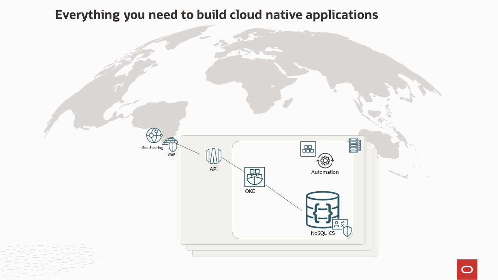

# Video Stream - Geo Distributed Catalog Microservices Demo

## Introduction

This lab walks you through a Movie Stream application demo created by the Oracle NoSQL development team Mike Brey.
This application is composed of several micro-services using different Oracle Cloud Infrastructure services.
During this demo, the focus will be on the Catalog micro-service. This service will be deployed in multiple regions.
The data will be stored in Global Active Tables. Oracle NoSQL Global Active Tables provide multi-active replication of
table data between geographically separated regions.
The Geo Distributed Catalog offers low-latency local access to data irrespective of where the data originated.

_Estimated Time:_ 12 minutes

### Catalog Microservice

### Serverless Logic Tier

We selected this demo because it solves real world business problems. Many of those are listed on the slide.

  

This application is running in all the Oracle Cloud Infrastructure regions.

The application behind the demo uses a three-tier architecture, representing the brains of the application.
The features of these services enable you to build a serverless production application that is highly available, scalable, and secure.
Your application can use thousands of servers, however, by leveraging the serverless paradigm you do not have to manage a single one.

Recently, REST has become the standard for designing web APIs.
The REST architectural style allows for running on stateless servers and offers structured access to resources.

In this demo, we will learn how easy it is develop the Catalog service using Spring and Oracle NoSQL Database.

In addition, by using managed services you gain the following benefits:
*	No operating systems to choose, secure, patch, or manage.
*	No servers to size, monitor, or scale out.
*	No risk to your cost by over-provisioning.
*	No risk to your performance by under-provisioning.

Here is a diagram of architecture behind the demo.

  

* The API Gateway service enables you to publish APIs with private endpoints that are accessible from within your network,
and which you can expose with public IP addresses if you want them to accept internet traffic. The endpoints support API validation,
request and response transformation, CORS, authentication and authorization, and request limiting.

* Oracle Cloud Infrastructure Container Engine for Kubernetes is a fully-managed, scalable, and highly available service that
you can use to deploy your containerized applications to the cloud. Use Container Engine for Kubernetes (sometimes abbreviated to just OKE)
when your development team wants to reliably build, deploy, and manage cloud-native applications. You specify whether to run applications
on virtual nodes or managed nodes, and Container Engine for Kubernetes provisions them on Oracle Cloud Infrastructure in an existing OCI tenancy.
The live running application was deployed using OKE.

    * In this Live Lab, we will use Container Instances because we do not need the orchestration platform and the kubernetes platform takes 10 minutes to setup.
    Oracle Cloud Infrastructure (OCI) Container Instances is a serverless compute service that enables you to quickly and easily
    run containers without managing any servers. Container Instances runs your containers on serverless compute optimized
    for container workloads that provides the same isolation as virtual machines. Container instances are suitable for containerized workloads
    that do not require a container orchestration platform like Kubernetes. These use cases include: APIs, web applications, build and deployment
    jobs in CI/CD pipelines, automation tasks f or cloud operations, data/media processing jobs, development or test environments, and more.

* Oracle NoSQL Database Cloud Service is a severless database cloud service that is designed for database operations that require predictable, single-digit millisecond latency responses to simple queries. NoSQL Database Cloud Service allows developers to focus on application development rather than setting up cluster servers, or performing system monitoring, tuning, diagnosing, and scaling.

The features of these services enable you to build a serverless production application that is highly available, scalable, and secure. Your application can use thousands of servers, however, by leveraging this pattern you do not have to manage a single one.

### Objectives

* Explore the Movie Stream - Catalog service  

### Prerequisites

*  Connection to the internet

## Task 1: The "Streaming" challenge

This particular application came to the NoSQL team from an internal Oracle team working
with us to deliver a service with a very high value-add.

When we thought about this for a little bit, we realized that this was a perfect use case for NoSQL.
<etc>
1. Read the following bullet points to understand a few goals of this application:

    * Predictable low latency
    * Scalable to your user base
    * Highly available
    * Auto expiry of the data

## Task 2: Explore data using REST queries

Let us explore our API and showing some advantages of using GraphQL.

**Move faster with powerful developer tools**

## Task 7: Key takeaways

  1. Read the following information.

    While this was a simple demo, it used many components that are available in Oracle Cloud Infrastructure today.
    * The Movie Stream Catalog application is running live in all Oracle Cloud Infrastructure Regions
    * The Movie Stream Catalog uses Oracle Cloud Infrastructure traffic Management for
Geo-Steering to steer network requests to closest Oracle Cloud Infrastructure region
    * The Movie Stream Catalog uses Oracle Cloud Infrastructure API gateway
    * Data is stored in Oracle NoSQL Cloud Service as JSON documents
    * Spring Database is a popular language to build micro-service, which provides a complete and understandable description of the data in your API.  It is easy to integrate with the Oracle NoSQL Database Cloud Service.

    The benefits to customers are shown in this slide.

      

    You may now **proceed to the next lab.**

## Learn More
* [About Architecting Microservices-based applications](https://docs.oracle.com/en/solutions/learn-architect-microservice/index.html)
* [Speed Matters! Why Choosing the Right Database is Critical for Best Customer Experience?](https://blogs.oracle.com/nosql/post/speed-matters-why-choosing-the-right-database-is-critical-for-best-customer-experience)
* [About Security, Identity, and Compliance](https://www.oracle.com/security/)
* [Application Development](https://www.oracle.com/application-development/)

* [Oracle NoSQL Database Cloud Service page](https://www.oracle.com/database/nosql-cloud.html)
* [About Oracle NoSQL Database Cloud Service](https://docs.oracle.com/en/cloud/paas/nosql-cloud/index.html)
* [About API Gateway](https://www.oracle.com/cloud/cloud-native/api-management/)
* [About Container Engine for Kubernetes (OKE)](https://www.oracle.com/cloud/cloud-native/container-engine-kubernetes/)
* [About Container Instance](https://www.oracle.com/cloud/cloud-native/container-instances/)

* [About AI Services](https://www.oracle.com/artificial-intelligence/ai-services/)
* [About Media Streams](https://www.oracle.com/cloud/media-streams/)

## Acknowledgements
* **Author** - Dario Vega, Product Manager, NoSQL Product Management
* **Last Updated By/Date** - Michael Brey, Director, NoSQL Product Development, July 2023
