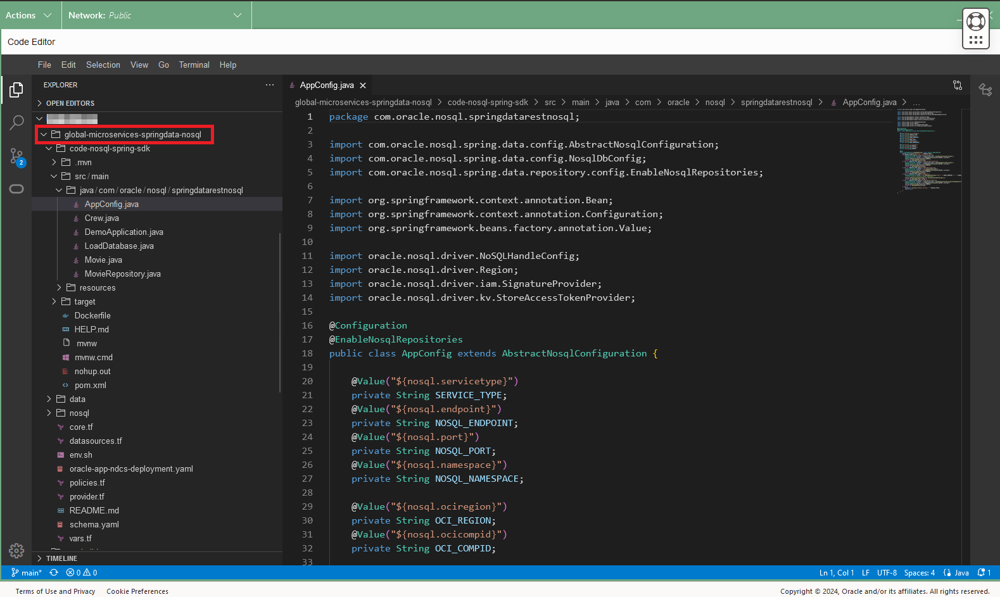
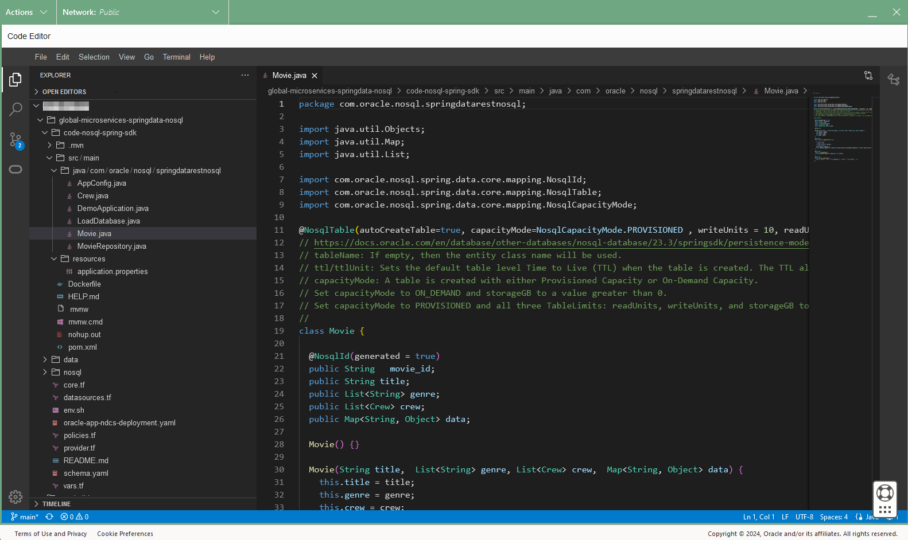

# Run the MovieStream Catalog Microservice

## Introduction

This lab picks up where lab 2 left off. We are going to explore in more detail
the tables we created, load data, and execute queries using a Spring Data REST based application.

_Estimated Time:_ 16 minutes

[Lab 3 Walkthrough](videohub:1_m5ilj0z4)

### Objectives

* Understand the different Java Classes in this Spring Data SDK project.
* Read and Load data with REST API

### Prerequisites

* An Oracle Free Tier, Paid Account or Green Button
* Connection to the Oracle NoSQL Database Cloud Service
* Working knowledge of bash shell
* Working knowledge of SQL language


## Task 1: Review the code using OCI Code Editor

In this task we will review the code using OCI Code Editor.

1. Open the OCI Code Editor in the top right menu.

    

2. Click on the Explorer button of OCI Code Editor.

    

3. Go to the Code Editor, and open the file `AppConfig.java` in the following directory
`global-microservices-springdata-nosql/code-nosql-spring-sdk/src/main/java/com/oracle/nosql/springdatarestnosql` as shown in the screen-shot:

    

    Oracle NoSQL Database offers **flexible deployment** options to suit the needs of
its customers. Whether deploying on an "On-Premises" cluster or utilizing the
Oracle NoSQL Database Cloud Service, developers and end-users get the latest in
NoSQL technology. Oracle offers a complete range of deployment options to
support your Oracle NoSQL database, from on-premises to private cloud to public cloud.  Depending
on which deployment option you choose, you may need different authentication strategies.

  The class `AppConfig.java` illustrates the different authentication options in the case
statement. We covered the authentication basics in Lab 2. If the function is not visible in your
screen, go ahead and scroll to it:
    * You can use **Instance Principals** to do the connection to NoSQL Cloud Service as
shown in this code. Once Instance Principals are set up, you can make API calls to
different Oracle Cloud Infrastructure services.  The benefit is applications running
on those instances do not have to configure user credentials or a configuration file.

    * You can use **Delegation Tokens** to do the connection to NoSQL Cloud Service
    and in this lab we will use them.

    * You can use **Resource Principals** to do the connection to NoSQL Cloud Service as
shown in this code.

    * Finally, **onprem**, allows you to do the connection
to on-premise non-secure configuration. It is not the topic of this workshop but if you
want to learn more [check here.](https://github.com/oracle/nosql-examples/blob/master/demo-livelab/video-on-demand-with-nosql-database/README.md)

  In this application we will use Common Application Properties and variables for easy setup and changeability when deploying using container services.

  Go to the Code Editor, and open the file `application.properties` in the following directory
`global-microservices-springdata-nosql/src/main/resources` as shown in the screen-shot:

    

4. When you create a table, you can choose between **Provisioned Capacity** and
**On-Demand Capacity**. With the availability of both models, businesses have total flexibility when
choosing the most cost-effective deployment to meet their business and application
workload requirements. Such flexibility empowers businesses to solely focus on application
innovations to delight their customers, making operational costs "worry-free" in their decision-making process.
You can also modify the **Capacity mode** from Provisioned Capacity to On Demand Capacity and vice-versa.

  The annotation `NosqlTable` in the class `Movie.java` illustrates this.

  Go to the Code Editor, and open the file `Movie.java` in the following directory
  `global-microservices-springdata-nosql/code-nosql-spring-sdk/src/main/java/com/oracle/nosql/springdatarestnosql` as shown in the screen-shot:

      

  The Spring Data Framework supports the persistence of entities to Oracle NoSQL Database tables.
  An entity is mapped to a table. The ID field in that entity is mapped to the primary key column of that table.
  All other fields in the entity are mapped to a JSON column of that table. Each instance of the entity will be stored as a single row in that table.
  The value of the ID field in that instance will be stored as the primary key value of that row.
  The values of all other fields (including other objects) in that instance will be serialized and stored as values in the JSON column of that row.
  Effectively, the table will always have: a primary key and a JSON column.

  If a persistent POJO has a reference to another persistent POJO (nested objects) that maps to a different table,
  the Spring Data Framework will not serialize objects to multiple tables. Instead, all the nested objects will be serialized
  and stored as values in the JSON column.

  We support composite primary keys. You can define a composite key class type to represent the composite keys. In this example we are using a single column key
  with the option auto generated (UUID GENERATED BY DEFAULT).

  The Spring Data Framework looks for the repositories used in the application in the init phase.
  If the table does not exist, and if the `@NosqlTable` annotation has the `autoCreateTable` as true,
  then the table will be created in the init phase.

  Finally, the table name is the entity class name but you can overwrite using the attribute `tableName` in the `NosqlTable` Annotation.


5. The entity class that is used for persistence is discoverable by the Spring Data Framework either via annotation or inheritance.
  The *NosqlRepository* interface allows you to inherit and create an interface for each entity that will use the Oracle NoSQL Database for persistence.
  The *NosqlRepository* interface extends Spring's PagingAndSortingRepository interface that provides many methods that define queries.
  In addition to those methods that are provided by the *NosqlRepository* interface, you can add methods to your repository interface
  to define derived or native queries. These interface methods follow a specific naming pattern for Spring queries intercepted by the Spring Data Framework.
  The Spring Data Framework will use this naming pattern to generate an expression tree, passing this tree to the Oracle NoSQL Database SDK for Spring Data,
  where this expression tree is converted into an Oracle NoSQL Database query, which is compiled and then executed.
  These Oracle NoSQL Database queries are executed when you call the repository's respective methods.

  Go to the Code Editor, and open the file `MovieRepository.java` in the following directory
  `global-microservices-springdata-nosql/code-nosql-spring-sdk/src/main/java/com/oracle/nosql/springdatarestnosql` as shown in the screen-shot:

      

  See also the `RepositoryRestResource` annotation, in this example we are using Spring Data REST.

  Spring MVC and Spring WebFlux each offer a solid foundation to build theses kinds of services. However, implementing even the simplest tenet of REST web services
  for a multi-domain object system can be quite tedious and result in a lot of boilerplate code. Spring Data REST builds on top of the Spring Data repositories and
  automatically exports those as REST resources. It leverages hypermedia to let clients automatically find functionality exposed by the repositories and integrate these
  resources into related hypermedia-based functionality.

  Review the rest of the code in `MovieRepository.java` and you will notice that we are using a combination of Native and derived queries in our sample application.
    * Get, put, scan APIs for raw key/value pairs and tables – CRUD API
    * SQL for rich access to JSON, more complex filtering expressions

   Let's continue with this Lab so go ahead and exit from the Code Editor.

## Task 2: Restart the Cloud Shell

 1. Let's get back into the Cloud Shell. From the earlier lab, you may have
 minimized it in which case you need to enlarge it. It is possible it may have
 become disconnected and/or timed out. In that case, restart it.

    

 2. Execute the following environment setup shell script in the Cloud Shell to
 set up your environment. If you close/open the Cloud Shell Console, please re-execute it.

     ```shell
     <copy>
     export OCI_obo_token=$(cat $OCI_obo_token_path)
     source ~/global-microservices-springdata-nosql/env.sh
     </copy>
     ```
     

3. List the installed JDKs using the `csruntimectl java list` command. Select GraalVM for JDK 17 as the current JDK.   

    ```shell
     <copy>
     csruntimectl java list
     </copy>
     ```

     ```shell
      <copy>
      csruntimectl java set graalvmeejdk-17
      </copy>
      ```

## Task 3: Load Data and Examine It

1. Use the following maven wrapper command to start the Spring application. Execute in the Cloud Shell.

    ```shell
    <copy>
    cd ~/global-microservices-springdata-nosql/code-nosql-spring-sdk/
    nohup ./mvnw spring-boot:run &
    </copy>
    ```
    **Note:** This will start the "movie" application in the background.

2. After you complete step 1, you can use the command tail to see the startup for the application.

    

    ```shell
    <copy>
    tail nohup.out
    </copy>
    ```
    The `mvnw` command will compile and start the application, please wait for the message *Started DemoApplication in xx seconds*

3. Lets review the data created in the Lab 2.  Execute in the Cloud Shell.

    ```shell
    <copy>
    curl  http://localhost:8080/api/movie | jq
    </copy>
    ```

4. Lets insert a new Movie using the REST API.

    ```shell
    <copy>
    curl -X POST -H "Content-Type:application/json" -d @../data/movie-example.json  http://localhost:8080/api/movie | tee result-test.txt
    </copy>
    ```

    We will create a variable with the self link provided by the command above

    ```shell
    <copy>
    URL=`cat result-test.txt | jq -r '."_links".self.href'`
    echo $URL
    </copy>
    ```

5. Use the self link from the result of the call above to read again the information about the film.

    ```shell
    <copy>
    curl  $URL
    </copy>
    ```

6. Use the search API to read the data.

    ```shell
    <copy>
    curl http://localhost:8080/api/movie/search/findByTitle?title=Redemption
    </copy>
    ```

    Explore the other possibilities `http://localhost:8080/api/movie/search`.
    Spring Data REST exposes the queries defined in the MovieRepository.java class.


7. Use the link copied to delete the movie.

    ```shell
    <copy>
    curl -i -X DELETE $URL
    </copy>
    ```
    Re execute the REST API call to validate that the movie was deleted

    ```shell
    <copy>
    curl  $URL
    </copy>
    ```

8. Stop the application and delete temporary files

    execute the linux command `fg` followed by CTRL-C and enter to stop the application.
    ```shell
    <copy>
    fg
    </copy>
    ```
    Note: you can rexecute the command `fg` to validate that there are not jobs running in background.

    Delete the temporary files created.
    ```shell
    <copy>
    rm nohup.out result-test.txt
    </copy>
    ```

9. You can also execute sql statements using Oracle Cloud Infrastructure CLI commands.
Going this route, you will be querying the data over REST. Execute in Cloud Shell.

    ```shell
    <copy>
    SQL_STATEMENT="SELECT * from Movie"
    echo "$SQL_STATEMENT"
    </copy>
    ```

    ```shell
    <copy>
    oci nosql query execute -c  $OCI_NOSQL_COMPID --statement "$SQL_STATEMENT"
    </copy>
    ```
  In this case, the data is formatted as a nice JSON document.


Exit out of the Cloud Shell.  You may now **proceed to the next lab.**

## Learn More


* [Oracle NoSQL Database Cloud Service page](https://www.oracle.com/database/nosql-cloud.html)
* [About Oracle NoSQL Database Cloud Service](https://docs.oracle.com/en/cloud/paas/nosql-cloud/index.html)
* [Spring Data SDK Developers Guide](https://docs.oracle.com/en/database/other-databases/nosql-database/24.1/springsdk/persistence-model.html)
* [About Cloud Shell](https://docs.oracle.com/en-us/iaas/Content/API/Concepts/cloudshellintro.htm)


## Acknowledgements
* **Author** - Dario Vega, Product Manager, NoSQL Product Management, Michael Brey, Director, NoSQL Product Development
