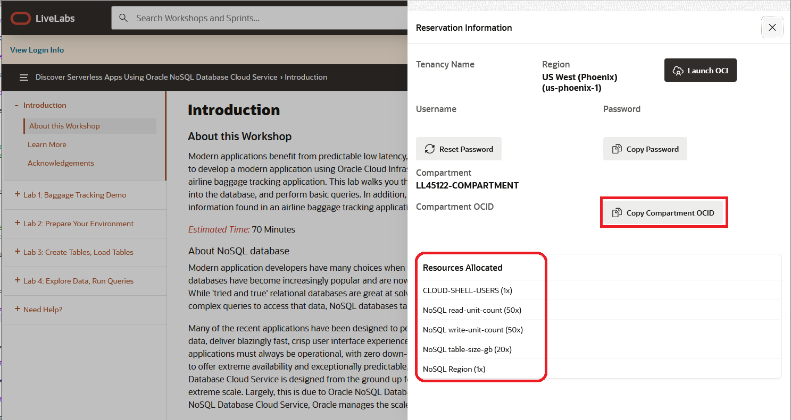
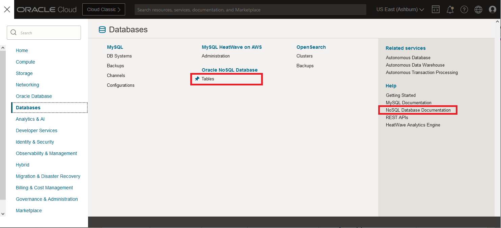
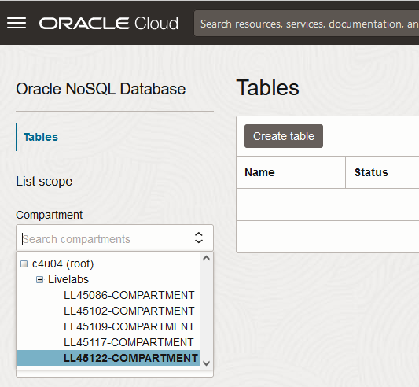
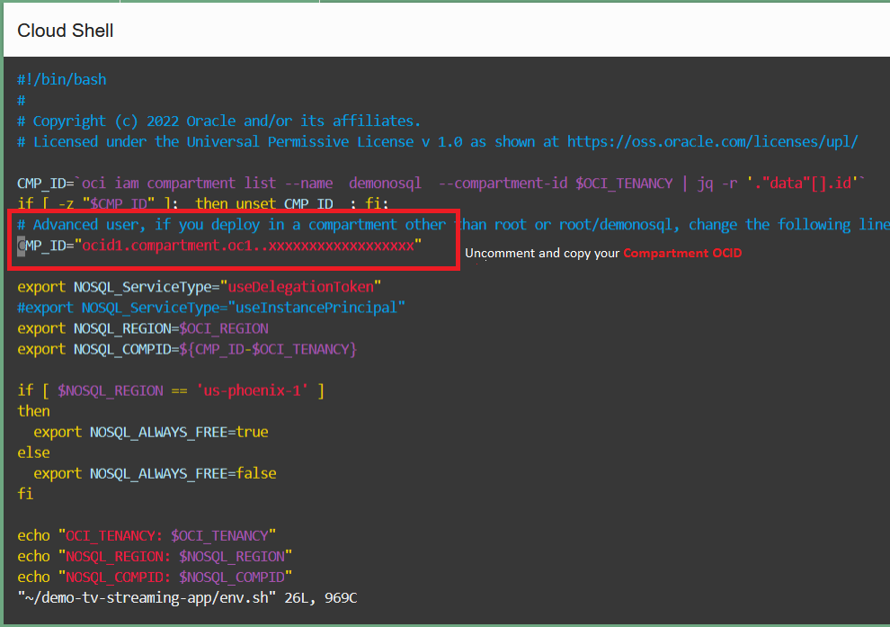

# Prepare Your Environment

## Introduction

This lab walks you through the steps necessary to create a proper operating environment.

_Estimated Time:_ 2 minutes

### Objectives

In this lab you will:
* Use Compartment Created by Green Button
* Learn about Credentials, and Policies
* Set up Cloud Shell

### Prerequisites

This lab assumes you have:

* An Oracle Free Tier, Paid Account or Green Button
* Knowledge of vi, vim or emacs

## Task 1: Get Compartment OCID

Once you LiveLabs test environment was set up, you should have clicked on a button
saying to 'Attend the Workshop.'This will take you to a screen that looks similar to this.

  

This environment does not allow you to create any compartments. Please take note
of the compartment assigned. Under the **Compartment** is the **Compartment OCID.**
Copy your **Compartment OCID** with the copy button and save for features steps.
Paste it into notepad or some text file for use.

## Task 2: Get Data and Code Bundle

In this task we will copy over a data bundle stored on object storage and place
that in the Cloud Shell.

1. In this step we need to execute a few commands in the Cloud Shell.
To start the Cloud Shell, we have to select our compartment first.
Click on the 'hamburger' menu on the top left. Click on **Databases**
and then click on **Tables**.

    

2. In the **Compartment** drop down on the left, pick you compartment.
In Task 1, you should have taken note of your compartment. To find it, expand
the root node (**c4u04**), then expand the **Livelabs** node.
Your compartment should be listed under there.
In this example we are using **LL45112-COMPARTMENT**.

    

3. Open the **Cloud Shell** in the top right menu. It can take about 2 minutes
to get the Cloud Shell started.

    

4. Execute the following in your Cloud Shell.

    ```shell
    <copy>
    cd $HOME
    rm -rf global-microservices-springdata-nosql
    curl -L https://github.com/oracle/nosql-examples/raw/master/zips/global-microservices-springdata-nosql.zip -o global-microservices-springdata-nosql.zip
    unzip global-microservices-springdata-nosql.zip
    chmod +x ~/global-microservices-springdata-nosql/code-nosql-spring-sdk/mvnw
    </copy>
    ```

5. Edit the file env.sh and provide the **Compartment OCID** copied in the Task 1

    ```
    <copy>
      vi ~/global-microservices-springdata-nosql/env.sh
    </copy>
    ```

    


6. Exit from Cloud Shell

7. Open the **OCI Code Editor** in the top right menu. It can take about 2 minutes
to get the Code Editor started. You can continue the next Task. Cloud Editor
will be used only in the Lab4

    

## Task 3: Understand Credentials, and Policies

  1. Read the following information.

    **Oracle NoSQL Database Cloud Service uses Oracle Cloud Infrastructure Identity
Infrastructure Identity and Access Management enables you to create user accounts
and Access Management to provide secure access to Oracle Cloud.** Oracle Cloud
and give users permission to inspect, read, use, or manage NoSQL tables.  There are 4
authentication methods available: API key-based, Session token-based
(delegation tokens), Instance Principal and Resource Principal. The Oracle NoSQL Database
SDKs allow you to provide the credentials for an application using any of these
authentication methods. Credentials are typically associated with a specific user.

    Oracle NoSQL has SDKs in the following languages:  Java, Node.js, Python, Go, Spring and C#.
The SDKs support a configuration file as well as API interfaces that allow direct
specification of the credential information. You can use the
SignatureProvider API to supply your API key-based credentials to Oracle NoSQL Database. The
usual things provided include user OCID, tenancy OCID, private key, and fingerprint.
The Session token-based approach is similar but it adds a temporary session token which
usually expires in an hour.   This is useful when a temporary authentication is
required.

    Another way to handle authentication is with Instance and Resource Principals.

    Resource Principals allow you to authenticate and access Oracle Cloud Infrastructure
resources.  A resource principal consists of a temporary session token (which
typically is cached for 15 minutes) and secure
credentials that enables the owner/user to authenticate to Oracle Cloud Infrastructure services.
To use them you have to set up a dynamic group and create a policy that grants the
dynamic group access to a resource.   These are typically used when authenticating
into the NoSQL Cloud Service from functions (NoSQL Cloud Service would be the resource).

    Instance Principals is a capability in Oracle Cloud Infrastructure Identity
and Access Management (IAM) that lets you make service calls from an instance.
With Instance Principals, you don’t need to configure user credentials or
rotate the credentials. Instances themselves are a principal type in IAM and
are set up in IAM. You can think of them as an IAM service feature that enables
instances to be authorized actors (or principals) to perform actions on service resources.


    Oracle NoSQL Database Cloud service has three different resource types, namely,
`nosql-tables`, `nosql-rows`, and `nosql-indexes`. It also has one aggregate resource
called `nosql-family`. Policies are created that allow a group to work in certain
ways with specific types of resources such as `nosql-tables` in a particular
compartment. All NoSQL tables belong to a defined compartment.
In Task 1 of this Lab, we created the demonosql compartment and this is where
 we will create our tables.

    You can use **Instance Principals** to do the connection to NoSQL Cloud Service
as shown below in the Node.js example instead of specifying the credentials.
Once they are set up, they are simple to use because all you need to do is call
the appropriate authorization constructor.

**Oracle NoSQL SDK for Java**

    ```java
    <copy>
    SignatureProvider provider = SignatureProvider.createWithInstancePrincipal();
    NoSQLHandleConfig config = new NoSQLHandleConfig(OCI_REGION, provider);
    config.setDefaultCompartment(OCI_COMPID);
    return new NosqlDbConfig(config);
    </copy>
    ```

    Also in one of our next labs we are going to be running application code and we need an instance to run that from. We will run that application using Cloud Shell with a delegation token.

    ```java
    <copy>
    SignatureProvider provider = SignatureProvider.createWithInstancePrincipalForDelegation(System.getenv("OCI_obo_token"));
    NoSQLHandleConfig config = new NoSQLHandleConfig(OCI_REGION, provider);
    config.setDefaultCompartment(OCI_COMPID);
    return new NosqlDbConfig(config);
    </copy>
    ```

   You may now **proceed to the next lab.**
## Learn More

* [About Identity and Access Management](https://docs.oracle.com/en-us/iaas/Content/Identity/Concepts/overview.htm)
* [About Managing User Credentials](https://docs.oracle.com/en-us/iaas/Content/Identity/Tasks/managingcredentials.htm)
* [About Cloud Shell](https://docs.oracle.com/en-us/iaas/Content/API/Concepts/cloudshellintro.htm)


## Acknowledgements
* **Author** - Dario Vega, Product Manager, NoSQL Product Management; Michael Brey, Director NoSQL Development
