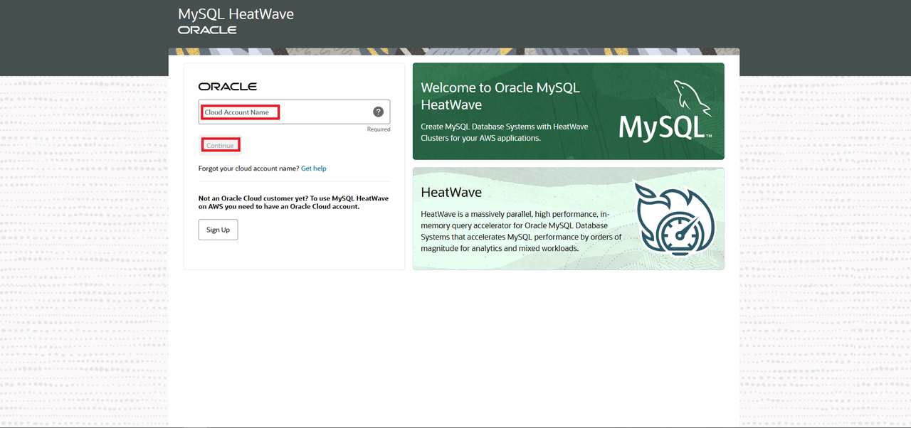
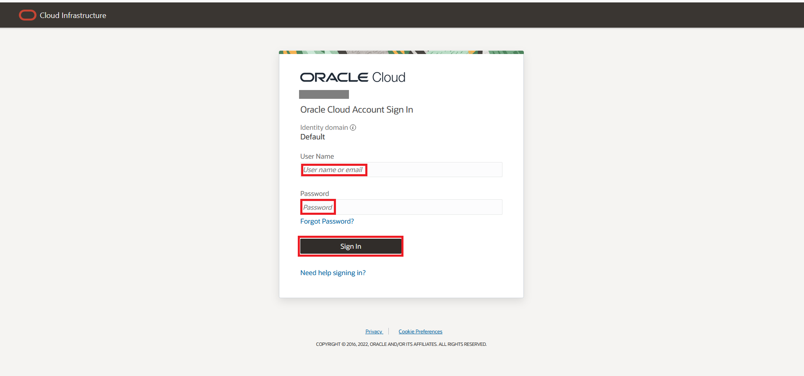
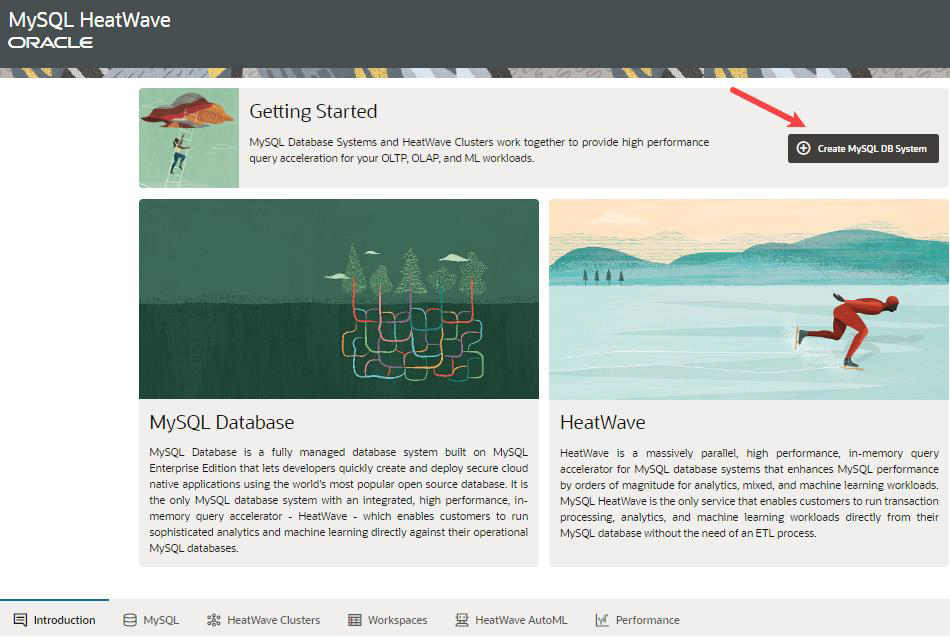
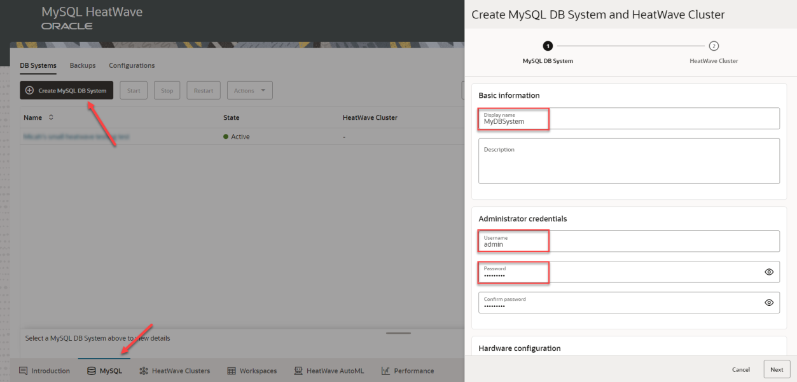
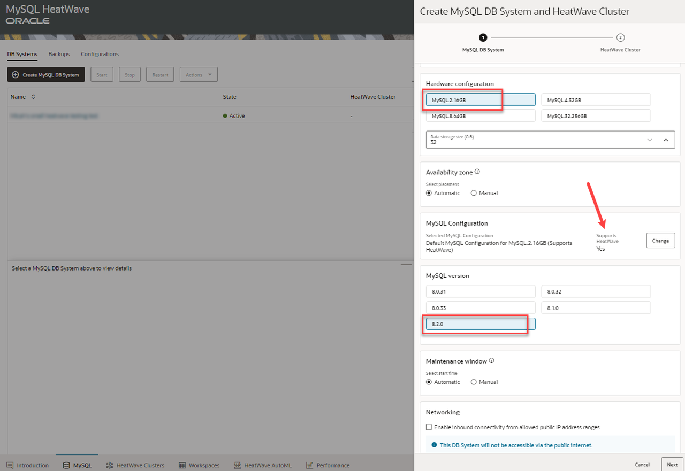
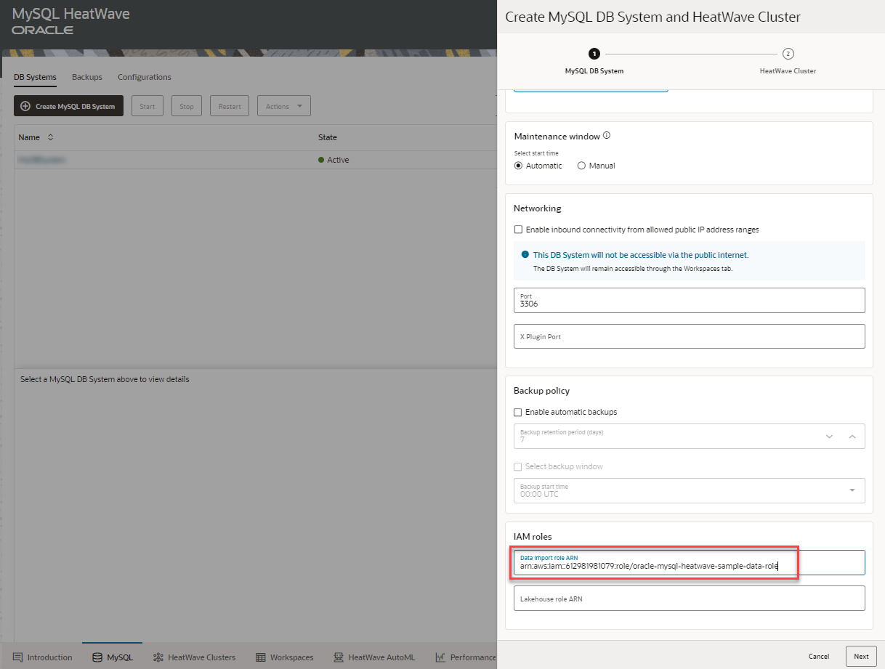
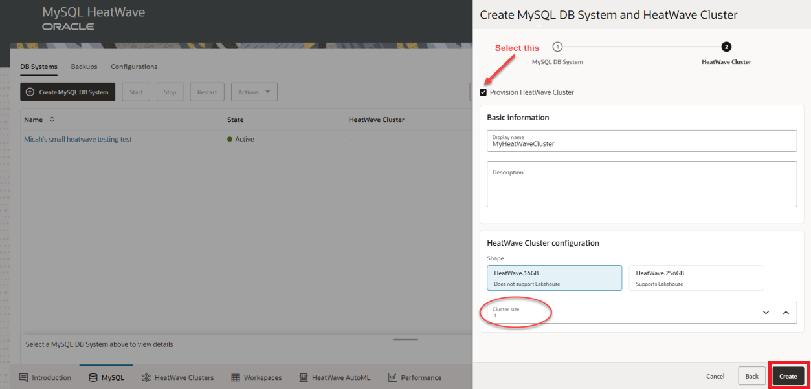
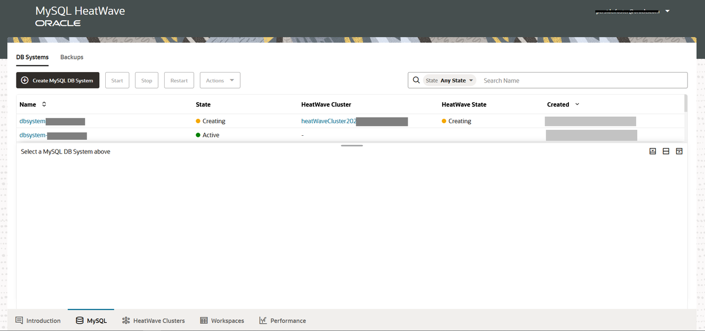
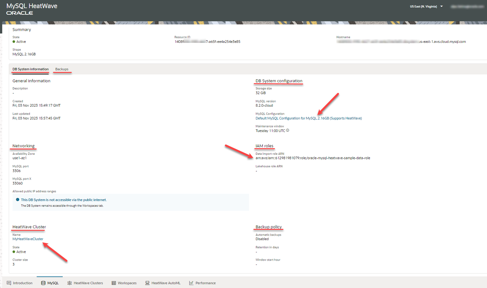

# Create MySQL HeatWave DB System  and add a HeatWave Cluster

## Introduction

In this lab you will create a MySQL HeatWave DB System on AWS and add a HeatWave cluster to it.

_Estimated Time:_ 15 minutes

### Objectives

In this lab, you will be guided through the following tasks:

- Signin to MySQL HeatWave on AWS Service console page.
- Create a MySQL HeatWave DB System and add on a HeatWave Cluster.

### Prerequisites

- A MySQL HeatWave on AWS Trial or Paid Cloud Account. If you are a first-time user, follow the  [Sign Up](https://dev.mysql.com/doc/heatwave-aws/en/heatwave-aws-sign-procedure.html) instructions.

## Task 1: Signin to MySQL HeatWave on AWS Service console page

1. Go to the [MySQL HeatWave Console](https://cloud.mysql.com).

2. Enter your **Cloud Account Name** then click the **Continue** button.
    

3. Enter the OCI account credentials. This is your User Name and Password.  Click the **Sign In** button.
    

4. Once you are logged in, you will see the MySQL HeatWave Page. click the **Create MySQL DB System** button.
    

## Task 2: Create a MySQL HeatWave DB System and add on a HeatWave Cluster

1. Create a MySQL DB system, MyDBSystem, which is the logical container for MySQL HeatWave instances, and note the administrator username and password as you will need it to connect to the DB System

    

2. Select a shape for MySQL. A shape determines the number of vCPUs, amount of memory, and other resources that are allocated within a DB system. Each shape can have a couple of configurations. Ensure that you select a configuration that supports HeatWave.

    

3. We will later import sample data from Amazon S3 into this DB System. To be able to import data to a DB System later, specify an IAM role with correct policies and trust relationships required to access Amazon S3. The IAM role grants exclusive access to the data on Amazon S3 to specific MySQL HeatWave DB Systems, providing tighter security, which is suited for enterprise production workloads.

    - Oracle has pre-created an IAM role with required policies and permissions. Copy and paste the following code in the IAM roles field:

    ```bash
    <copy>arn:aws:iam::612981981079:role/oracle-mysql-heatwave-sample-data-role</copy>
    ```

    

4. Now we will provision a HeatWave cluster. You can select the HeatWave cluster size, that is, the number of HeatWave nodes present in the cluster. The cluster size depends on the tables and columns that are to be loaded into HeatWave, and the compression achieved in memory for this data.

    - We will use the default (1 node of HeatWave.16GB) here. For cases where you have data already imported to MySQL, you can estimate the cluster size using MySQL Autopilot. MySQL Autopilot utilizes advanced machine learning techniques to estimate optimal cluster size by adaptively sampling and analyzing the data on your MySQL and recommends an appropriate cluster size.

    - Click the **Create** button. to create the DB System.

    

5. The DB System should be created in a few minutes.

    

6. Once the instance is created, click the name of the DB System to see the detailed information.

    

You may now **proceed to the next lab**.

## Learn More

- [MySQL HeatWave on AWS Service Guide](https://dev.mysql.com/doc/heatwave-aws/en/)

- [MySQL Database Documentation](https://dev.mysql.com/)


## Acknowledgements

- **Author** - Perside Foster, MySQL Solution Engineering
- **Contributors** - Mandy Pang, Senior Principal Product Manager, Aijaz Fatima, Product Manager
- **Last Updated By/Date** - Perside Foster, MySQL Solution Engineering, March 2024