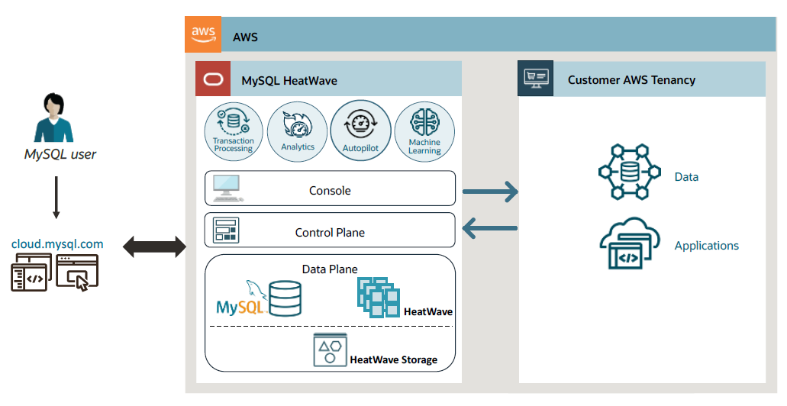
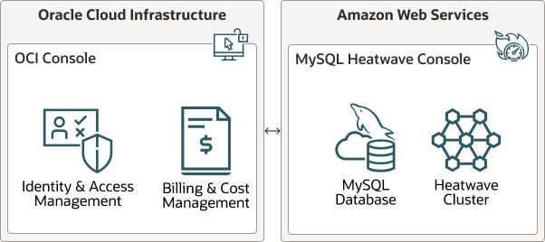

# Introduction

MySQL HeatWave is the only MySQL based service that combines transaction processing (OLTP), real-time analytics (OLAP), and machine learning in a single database. MySQL HeatWave eliminates the need for complex and time-consuming ETL operations between separate databases and thus avoids the latency and security risks of data movement between data stores while at the same time reducing costs.

MySQL HeatWave is now available on AWS. MySQL HeatWave’s native integration with AWS enables the applications already deployed in AWS to benefit from MySQL HeatWave without incurring the latency associated with accessing a database service running outside of AWS. You also don’t incur the high data egress fees charged by AWS that would be necessary to migrate data to a service running outside of AWS. Lastly, the tight integration of MySQL HeatWave with other AWS services such as Amazon S3, CloudWatch, and PrivateLink, makes it easy for you to rely on MySQL HeatWave for new applications.

## About this Workshop

In this QuickStart Workshop, we will first create a DB System on HeatWave on AWS, and then then we will import a sample dataset airportdb from a Amazon S3 bucket into this DB system. We will load the data from the DB System into HeatWave for accelerated query processing. HeatWave is a massively parallel, high performance, in-memory query accelerator that accelerates MySQL performance by orders of magnitude for analytics and mixed workloads. We will then run queries with and without HeatWave to find out what query performance we get when we use HeatWave. We will also see how to monitor the performance of a DB System and HeatWave Cluster.

_Estimated Time:_ 1.5 hours

## About Product/Technology

MySQL HeatWave on AWS delivers a true native experience for AWS customers. The console, control plane, and data plane completely reside in AWS and are responsible for managing the MySQL HeatWave database resources in AWS. The control plane communicates with Oracle Cloud Infrastructure (OCI) Identity for account management, and with OCI metering & billing for monitoring and managing the usage and expenses associated with the customer’s account.

Once the user signs up for an OCI cloud account and registers their OCI account with MySQL HeatWave on AWS, the main interactions with the MySQL HeatWave service take place in AWS, through the service console hosted at  [cloud.mysql.com](https://cloud.mysql.com/login).

The following diagram illustrates MySQL HeatWave on AWS integration with Oracle Cloud Infrastructure (OCI).

## Objectives

In this lab, you will be guided through the following steps:

- Create a DB System
- Import data from Amazon S3
- Load data into HeatWave
- Run queries on HeatWave
- Monitor performance

## Prerequisites

Please make sure you can sign in to your MySQL HeatWave OCI Cloud Account. See [Sign Up](https://dev.mysql.com/doc/heatwave-aws/en/heatwave-aws-sign-procedure.html).

## Learn More

- [MySQL HeatWave on AWS Service Guide](https://dev.mysql.com/doc/heatwave-aws/en/)

- [MySQL Database Documentation](https://dev.mysql.com/)

## Acknowledgements

- **Author** - Perside Foster, MySQL Solution Engineering
- **Contributors** - Mandy Pang, Senior Principal Product Manager, Aijaz Fatima, Product Manager
- **Last Updated By/Date** - Perside Foster, MySQL Solution Engineering, March 2024
