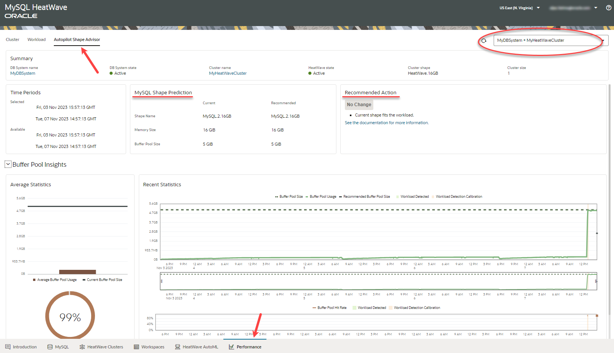

# Monitor HeatWave Performance

## Introduction

The MySQL HeatWave console allows you to monitor the overall and per-node utilization of MySQL HeatWave hardware resources such as CPU, memory, and storage. It also provides a detailed breakdown of your resource consumption, such as data dictionary size, buffer pool size, and database connections.

_Estimated Time:_ 10 minutes

### Objectives

In this lab, you will be guided through the following task:

- Monitor HeatWave Performance - Cluster.
- Monitor HeatWave Performance - Workload.
- Monitor HeatWave Performance - Autopilot Shape Advisor.

### Prerequisites

- Must complete Lab 3.

## Task 1: Monitor HeatWave Performance - Cluster

You can monitor the HeatWave Cluster performance by performing the following steps:

1. Click the **Performance** tab.
2. Click the **Cluster** tab.
3. Select the MySQL DB System and the HeatWave Cluster whose performance you want to monitor.

    You can see performance data such as cluster memory utilization, node memory utilization, and buffer pool.

    

## Task 2: Monitor HeatWave Performance - Workload

You can monitor the most recent queries that ran in HeatWave, allowing you to analyze when a query was executed, how long it took, and what the query actually does. Perform the following steps:

1. Click the **Performance** tab.
2. Click the **Workload** tab.
3. Select the MySQL DB System and the HeatWave Cluster whose workload you want to monitor.

    You can see the details of execution and recent queries that were run on HeatWave.

    

## Task 3: Monitor HeatWave Performance - Autopilot Shape Advisor

Autopilot Shape Advisor analyses the buffer pool usage, workload activity, and access patterns, and then assesses the suitability of the current MySQL shape. The advisor collects statistics at varying intervals and creates a prediction every five minutes while it is active. If there is insufficient or no activity in a five-minute interval Autopilot Shape Advisor cannot make a prediction for that interval. Perform the following steps:

1. Click the **Performance** tab.
2. Click the **Autopilot Shape Advisor** tab.
3. Select the MySQL DB System and the HeatWave Cluster whose workload you want to monitor.

    You can see the shape prediction details and the recommended actions.

    
.

By making MySQL HeatWave natively available on AWS, you can very easily benefit from the only cloud database service that combines transactions, analytics, and machine learning services into one MySQL database, delivering real-time, secure analytics without the complexity, latency, and cost of ETL duplication—on AWS.
MySQL HeatWave on AWS is optimized for AWS with a superior architecture that delivers higher performance and lower cost, as demonstrated by industry-standard benchmarks.

## Learn More

- [MySQL HeatWave on AWS Service Guide](https://dev.mysql.com/doc/heatwave-aws/en/)

- [MySQL Database Documentation](https://dev.mysql.com/)

## Acknowledgements

- **Author** - Perside Foster, MySQL Solution Engineering
- **Contributors** - Mandy Pang, Senior Principal Product Manager, Aijaz Fatima, Product Manager
- **Last Updated By/Date** - Perside Foster, MySQL Solution Engineering, March 2024
