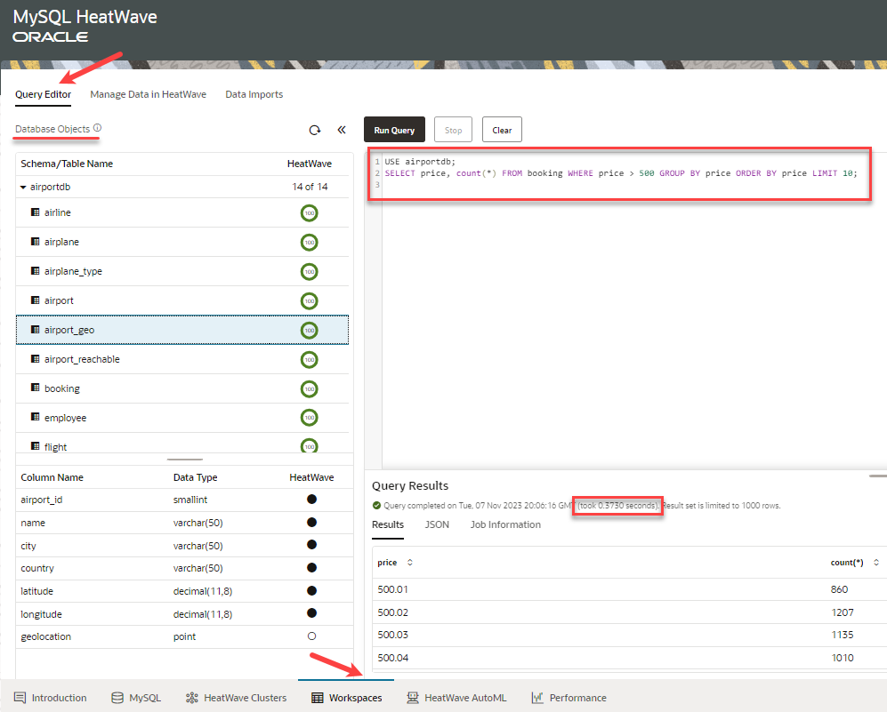

# Run Queries in HeatWave

## Introduction

MySQL HeatWave console provides a Query Editor to ease your interaction with the DB system eliminating the need to go back and forth between the Console and an external MySQL client for resource and data management.

_Estimated Time:_ 10 minutes

### Objectives

In this lab, you will be guided through the following task:

- Run queries with  HeatWave turned on.
- Run queries with  HeatWave turned off.
- Run additional queries with  HeatWave turned on.

### Prerequisites

- Must complete Lab 2

## Task 1: Run queries with HeatWave turned on

On the Query Editor, under Database Objects, you can see the schemas and tables in the MySQL DB System, the associated table definitions, and the HeatWave load status of each table.

Once the tables are loaded into HeatWave, you can run a query on HeatWave by performing the following steps:

1. Click the Query Editor tab.

2. Enter the following query in the query editor:

    ```bash
    <copy>USE airportdb; 
    SELECT price, count(*) FROM booking WHERE price > 500 GROUP BY price ORDER BY price LIMIT 10;</copy> 
    ```

3. Click the **Run Query** button to execute the query.

    When you run the query with HeatWave, it took only 0.3730 seconds.

    

## Task 2: Run queries with HeatWave turned off

Let us run the same query by turning off HeatWave to find out what query performance we get with HeatWave. Perform the following steps:

1. Enter the following query in the query editor:

    ```bash
    <copy>USE airportdb; 
    SET SESSION use_secondary_engine=OFF; 
    SELECT price, count(*) FROM booking WHERE price > 500 GROUP BY price ORDER BY price LIMIT 10;</copy> 
    ```

2. Click the **Run Query** button to execute the query.

    When you run the query without HeatWave, it took 32.4638 seconds, which means that HeatWave executed this query many times faster.

    

3. Turn HeatWave back on

    ```bash
    <copy> 
    SET SESSION use_secondary_engine=ON;
    SHOW VARIABLES LIKE 'use_secondary_engine%';
    </copy>
    ```

## Task 3: Run additional queries with HeatWave turned on

1. **Query 1** - Find per-company average age of passengers from Switzerland, Italy and France

2. Before running a query, use EXPLAIN to verify that the query can be offloaded to the HeatWave cluster. You should see "Use secondary engine RAPID" in the explain plan. For example:

    ```bash
    <copy>EXPLAIN SELECT
    airline.airlinename,
    AVG(datediff(departure,birthdate)/365.25) as avg_age,
    count(*) as nb_people
    FROM
        booking, flight, airline, passengerdetails
    WHERE
        booking.flight_id=flight.flight_id AND
        airline.airline_id=flight.airline_id AND
        booking.passenger_id=passengerdetails.passenger_id AND
        country IN ("SWITZERLAND", "FRANCE", "ITALY")
    GROUP BY
        airline.airlinename
    ORDER BY
        airline.airlinename, avg_age
    LIMIT 10;</copy>
    ```

    

3. After verifying that the query can be offloaded, run the query and note the execution time. Enter the following command at the prompt:

     ```bash
    <copy>USE airportdb;
    SELECT
    airline.airlinename,
    AVG(datediff(departure,birthdate)/365.25) as avg_age,
    count(*) as nb_people
    FROM
        booking, flight, airline, passengerdetails
    WHERE
        booking.flight_id=flight.flight_id AND
        airline.airline_id=flight.airline_id AND
        booking.passenger_id=passengerdetails.passenger_id AND
        country IN ("SWITZERLAND", "FRANCE", "ITALY")
    GROUP BY
        airline.airlinename
    ORDER BY
        airline.airlinename, avg_age
    LIMIT 10;
    </copy>
    ```

4. To compare the HeatWave execution time with MySQL DB System execution time, disable the `use_secondary_engine` variable to see how long it takes to run the same query on the MySQL DB System. For example:

    Enter the following command at the prompt:

    ```bash
    <copy>SET SESSION use_secondary_engine=OFF;</copy>
    ```

5. Enter the following command at the prompt:

    ```bash
    <copy>USE airportdb;
    SELECT
    airline.airlinename,
    AVG(datediff(departure,birthdate)/365.25) as avg_age,
    count(*) as nb_people
    FROM
        booking, flight, airline, passengerdetails
    WHERE
        booking.flight_id=flight.flight_id AND
        airline.airline_id=flight.airline_id AND
        booking.passenger_id=passengerdetails.passenger_id AND
        country IN ("SWITZERLAND", "FRANCE", "ITALY")
    GROUP BY
        airline.airlinename
    ORDER BY
        airline.airlinename, avg_age
    LIMIT 10;</copy>
    ```

6. To see if `use_secondary_engine` is enabled (=ON)

    Enter the following command at the prompt:

    ```bash
    <copy>SHOW VARIABLES LIKE 'use_secondary_engine%';</copy>
    ```

7. Run additional queries. Remember to turn on and off the `use_secondary_engine`  to compare the execution time.

    (Example  **SET SESSION `use_secondary_engine`=On;**)

    (Example  **SET SESSION `use_secondary_engine`=Off;**)      

8. Enter the following command at the prompt

    ```bash
    <copy>SET SESSION use_secondary_engine=ON;</copy>
    ```

9. **Query 2** -  Find top 10 companies selling the biggest amount of tickets for planes taking off from US airports. Run Pricing Summary Report Query:

    ```bash
    <copy>USE airportdb;
    SELECT
    airline.airlinename,
    SUM(booking.price) as price_tickets,
    count(*) as nb_tickets
    FROM
        booking, flight, airline, airport_geo
    WHERE
        booking.flight_id=flight.flight_id AND
        airline.airline_id=flight.airline_id AND
        flight.from=airport_geo.airport_id AND
        airport_geo.country = "UNITED STATES"
    GROUP BY
        airline.airlinename
    ORDER BY
        nb_tickets desc, airline.airlinename
    LIMIT 10;
        </copy>
    ```

10. Enter the following command at the prompt:

    ```bash
    <copy>SET SESSION use_secondary_engine=OFF;</copy>
    ```

    Run Query again:

    ```bash
    <copy>USE airportdb;
    SELECT
    airline.airlinename,
    SUM(booking.price) as price_tickets,
    count(*) as nb_tickets
    FROM
        booking, flight, airline, airport_geo
    WHERE
        booking.flight_id=flight.flight_id AND
        airline.airline_id=flight.airline_id AND
        flight.from=airport_geo.airport_id AND
        airport_geo.country = "UNITED STATES"
    GROUP BY
        airline.airlinename
    ORDER BY
        nb_tickets desc, airline.airlinename
    LIMIT 10;
    </copy>
    ```

11. **Query 3** - Give me the number of bookings that Neil Armstrong and Buzz Aldrin made for a price of > $400.00

    ```bash
    <copy>SET SESSION use_secondary_engine=ON;</copy>
    ```

    ```bash
    <copy>USE airportdb;
    SELECT
    firstname,
    lastname,
    COUNT(booking.passenger_id) AS count_bookings
    FROM
        passenger,
        booking
    WHERE
        booking.passenger_id = passenger.passenger_id
            AND passenger.lastname = 'Aldrin'
            OR (passenger.firstname = 'Neil'
            AND passenger.lastname = 'Armstrong')
            AND booking.price > 400.00
    GROUP BY firstname , lastname;</copy>
    ```

    ```bash
    <copy>SET SESSION use_secondary_engine=OFF;</copy>
    ```

    ```bash
    <copy>USE airportdb;
    SELECT
    firstname,
    lastname,
    COUNT(booking.passenger_id) AS count_bookings
    FROM
        passenger,
        booking
    WHERE
        booking.passenger_id = passenger.passenger_id
            AND passenger.lastname = 'Aldrin'
            OR (passenger.firstname = 'Neil'
            AND passenger.lastname = 'Armstrong')
            AND booking.price > 400.00
    GROUP BY firstname , lastname;</copy>
    ```

12. Keep HeatWave processing enabled

    ```bash
    <copy>SET SESSION use_secondary_engine=ON;</copy>
    ```

You may now **proceed to the next lab**.

## Learn More

- [MySQL HeatWave on AWS Service Guiden](https://dev.mysql.com/doc/heatwave-aws/en/)

- [MySQL Database Documentation](https://dev.mysql.com/)

## Acknowledgements

- **Author** - Perside Foster, MySQL Solution Engineering
- **Contributors** - Mandy Pang, Senior Principal Product Manager, Aijaz Fatima, Product Manager
- **Last Updated By/Date** - Perside Foster, MySQL Solution Engineering, March 2024
