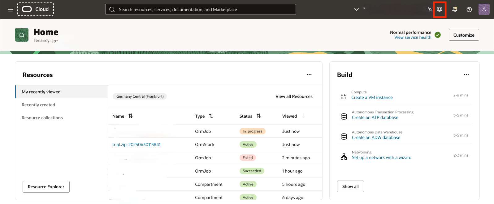
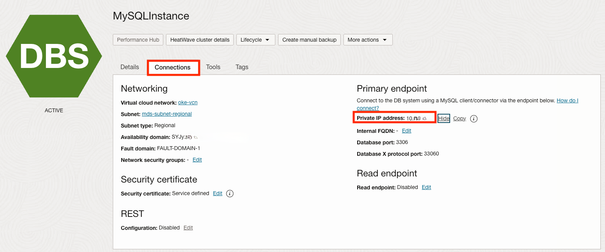
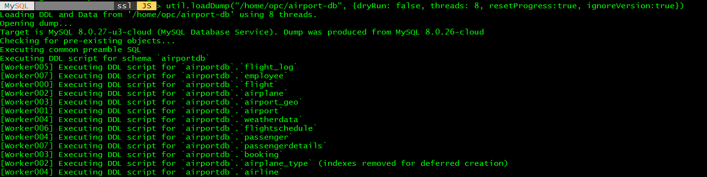
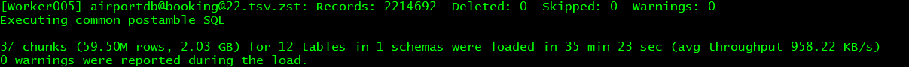

# Load data into MySQL HeatWave

## Introduction

In this lab, we will walk you through the steps to upload the data into **MySQL** using MySQL shell utility

Estimated Time: 10 minutes

### Objectives

In this lab, you will:

* Load data into MySQL HeatWave Cluster from MySQL Database System in Oracle Cloud.

### Prerequisites

This lab assumes you have:

* An Oracle account
* You have enough privileges to use OCI
* You have one Compute instance having <a href="https://dev.mysql.com/doc/mysql-shell/8.0/en/mysql-shell-install.html" target="\_blank">**MySQL Shell**</a> installed on it.

## Task 1: Connect to oke-operator compute instance

1. Log in to **OCI** and click on the **Hamburger Menu**  at the top left corner of the OCI console, select **Compute**, and click on **Instances**

	

2. In the Compute>Instance page, select the right compartment under “Compartment” > “HOL-compartment” on the right side. The list of instances will be shown. Then, find out the **Public IP** of the compute instance **oke-operator**, we will need this to connect to the compute instance to load the data into **MySQL Database Service**

	

3. Launch OCI Cloud Shell to connect to the **oke-operator** compute instance
  Click on the icon on the top right corner of OCI Console to launch the Cloud Shell.
	

  OCI Cloud Shell is a web browser-based terminal accessible from the Oracle Cloud Console to access various OCI services including OCI Compute instances.

	

4. Follow the steps below to download the private key for connecting to oke-operator compute instance. Please use the public IP address of the oke-operator in Step 2

	```
	<copy>
	wget https://raw.githubusercontent.com/rayeswong/terraform-oke-mds/main/keys/id_rsa
	chmod 400 id_rsa
	ssh opc@ip_address -i id_rsa
	</copy>
	```

	

## Task 2: Load airportdb data into MySQL

1. Download the database (airportdb) export

	```
	<copy>
	cd /home/opc
	</copy>
	```
	```
	<copy>
	wget -O airport-db.zip https://bit.ly/3pZ1PiW
	</copy>
	```
	

2. Unpack the downloaded zip file

	```
	<copy>
	unzip airport-db.zip
	</copy>
	```
	```
	<copy>
	cd airport-db
	ls
	</copy>
	```
	

3. Next we need to connect to the provisioned MDS instance. Click on the <a href="#menu">&#9776; hamburger menu</a> at the top left corner of the OCI console, and select **Databases**, anc click on **DB Systems**
	

4. Select the provisioned MySQL instance, **MDSInstance**
	

5. If you did not note down the private ip of **MDSInstance**
	

6. Connect to MySQL instance. Update password (default: Oracle#123) and host (same as MySQL host private IP address).

	```
	<copy>
	mysqlsh --user=admin --password=<password> --host=<mysql_private_ip_address> --port=3306 --js
	</copy>
	```

7. Load data

  We will first simulate the data loading to make sure that we can load the data without any errors. Note the flag **dryRun** to simulate the data loading without executing the actual data loading

	```
	<copy>
	util.loadDump("/home/opc/airport-db", {dryRun: true, threads: 8, resetProgress:true, ignoreVersion:true})
	</copy>
	```
	

  If the command completes without any error, we will execute the data loading by setting the **dryRun** flag to false

	```
	<copy>
	util.loadDump("/home/opc/airport-db", {dryRun: false, threads: 8, resetProgress:true, ignoreVersion:true})
	</copy>
	```
	

	

  It will take about 5-10 minutes to complete the data loading on our provisioned compute instance.

## Task 3: Verify the database import

1. Execute query on MySQL

  Now that we have imported the airportdb data, lets verify the database

	```
	<copy>
	mysqlsh --user=admin --password=**PASSWORD** --host=<mysql_private_ip_address> --port=3306 --sql
	</copy>
	```
	```
	<copy>
	show databases;
	</copy>
	```
	```
	<copy>
	use airportdb;
	</copy>
	```
	```
	<copy>
	show tables;
	</copy>
	```

	

  Execute the following query to find the per-company average age of passengers from Germany, Spain, and Greece. This query will take about 12-13s to complete

	```
	<copy>
	SELECT
	airline.airlinename,
	AVG(datediff(departure,birthdate)/365.25) as avg_age,
	count(*) as nb_people
	FROM
	booking, flight, airline, passengerdetails
	WHERE
	booking.flight_id=flight.flight_id AND
	airline.airline_id=flight.airline_id AND
	booking.passenger_id=passengerdetails.passenger_id AND
	country IN ('GERMANY', 'SPAIN', 'GREECE')
	GROUP BY
	airline.airlinename
	ORDER BY
	airline.airlinename, avg_age
	LIMIT 10;
	</copy>
	```
  You may now **proceed to the next lab.**

## Acknowledgements

* **Author**
	* Ivan Ma, MySQL Solutions Engineer, MySQL Asia Pacific
	* Ryan Kuan, MySQL Cloud Engineer, MySQL Asia Pacific
* **Contributors**
	* Perside Foster, MySQL Solution Engineering North America
	* Rayes Huang, OCI Solution Specialist, OCI Asia Pacific

* **Last Updated By/Date** - Ryan Kuan, May 2022
