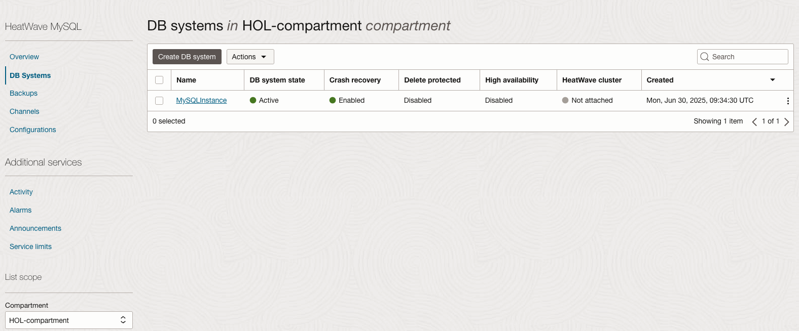
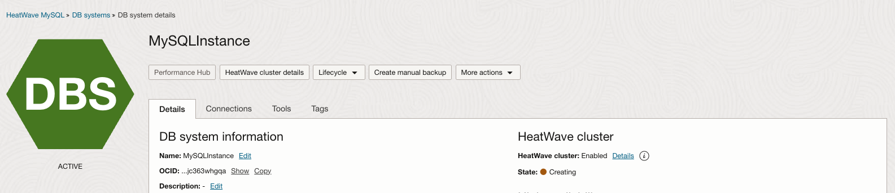
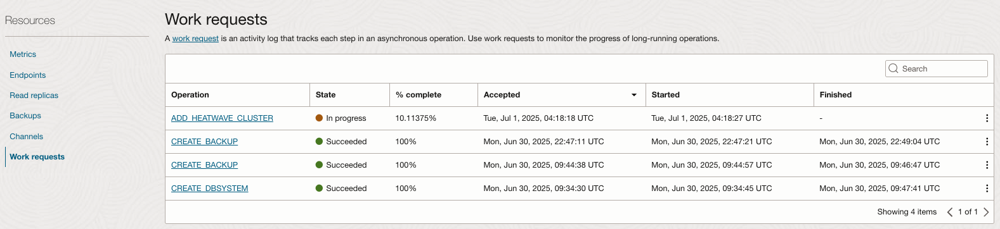

# Enable MySQL HeatWave Cluster

## Introduction

In this lab, we will enable the HeatWave cluster and accelerate your long-running queries. The MySQL DB System and HeatWave cluster must use the same shape, the shape defines the number of CPU cores, the amount of RAM, and so on. The size of the HeatWave cluster needed depends on the tables and columns required to load, and the compression achieved in memory for this data. By enabling HeatWave you will deploy a standalone DB System characterized by a HeatWave-compatible shape (MySQL.HeatWave.VM.Standard.E3) and 1TB of data storage that will accelerate the processing of analytic queries. For more information, check HeatWave Documentation.

Estimated Time: 15 minutes

### Objectives

In this lab, you will:

* Enable **MySQL HeatWave** Cluster to MySQL Database System in Oracle Cloud

### Prerequisites

This lab assumes you have:

* An Oracle account
* You have enough privileges to use Oracle Cloud resources

## Task 1: Add HeatWave Cluster to MySQL Database Service

1. Navigate to MDS console by clicking on the **Hamburger Menu**  select **Databases**, and click on **DB System**

	

2. Select the **MDSInstance**
	

3. From the menu on the bottom on the left, select HeatWave, and click on the button Add HeatWave Cluster located on the right.
	

4. Check that Shape looks as per the picture below and that Node Count is set to 2, and then click the button Add HeatWave Cluster.
	

5. You will be brought back to the main page where you can check for the creation status. You should see the nodes in **Creating** status after a few minutes.

	

6. You can check the HeatWave creation progress by selecting the **Work Request**
	

7. After completion, the node status will switch to Active status. The process will take some time to complete. You can go to the next Task in the meantime.

## Task 2: Accelerate long running queries on HeatWave

1. Before we can explore all the cool features of MySQL HeatWave, we need to load the data from MDS into the HeatWave Cluster so that the data is distributed to the memory of the 2 HeatWave cluster nodes we just added

	```
	<copy>
	mysqlsh --user=admin --password=**PASSWORD** --host=<mysql_private_ip_address> --port=3306 --sql
	</copy>
	```

  We will use this AutoPilot feature, **heatwave_load** function to offload the data from MDS to the HeatWave cluster

	```
	<copy>
	CALL sys.heatwave_load(JSON_ARRAY('airportdb'), NULL);
	</copy>
	```

	

2. We can verify the data offloading from MySQL to HeatWave cluster

	```
	<copy>
	USE performance_schema;
	</copy>
	```
	```
	<copy>
	SELECT NAME, LOAD_STATUS FROM rpd_tables,rpd_table_id WHERE rpd_tables.ID = rpd_table_id.ID;
	</copy>
	```
	

3. By default, MySQL HeatWave will offload SELECT queries to HeatWave. There is a magic switch, **use&#95;secondary&#95;engine** set to enabled.

	```
	<copy>
	SHOW VARIABLES LIKE 'use_secondary_engine%';
	</copy>
	```

4. Now we can test the turbo engine of HeatWave with the SQL query we executed earlier.

	```
	<copy>
	USE airportdb;
	</copy>
	```
	```
	<copy>
	SELECT
	airline.airlinename,
	AVG(datediff(departure,birthdate)/365.25) as avg_age,
	count(*) as nb_people
	FROM
	booking, flight, airline, passengerdetails
	WHERE
	booking.flight_id=flight.flight_id AND
	airline.airline_id=flight.airline_id AND
	booking.passenger_id=passengerdetails.passenger_id AND
	country IN ('GERMANY', 'SPAIN', 'GREECE')
	GROUP BY
	airline.airlinename
	ORDER BY
	airline.airlinename, avg_age
	LIMIT 10;
	</copy>
	```

  You will notice that this query will complete in less than 1s compared to 10s earlier!

  You may now **proceed to the next lab.**

## Acknowledgements

* **Author**
	* Ivan Ma, MySQL Solutions Engineer, MySQL Asia Pacific
	* Ryan Kuan, MySQL Cloud Engineer, MySQL Asia Pacific
* **Contributors**
	* Perside Foster, MySQL Solution Engineering North America
	* Rayes Huang, OCI Solution Specialist, OCI Asia Pacific

* **Last Updated By/Date** - Ryan Kuan, May 2022
