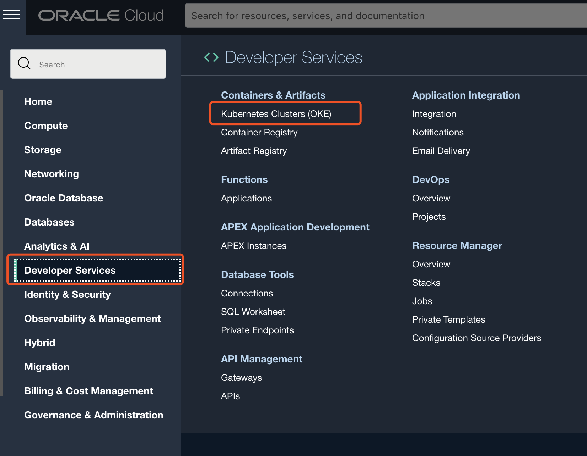
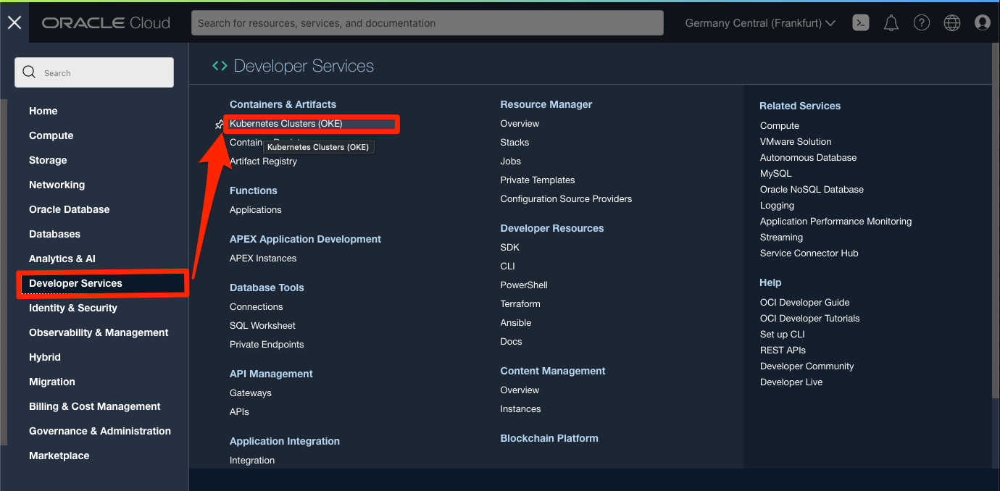
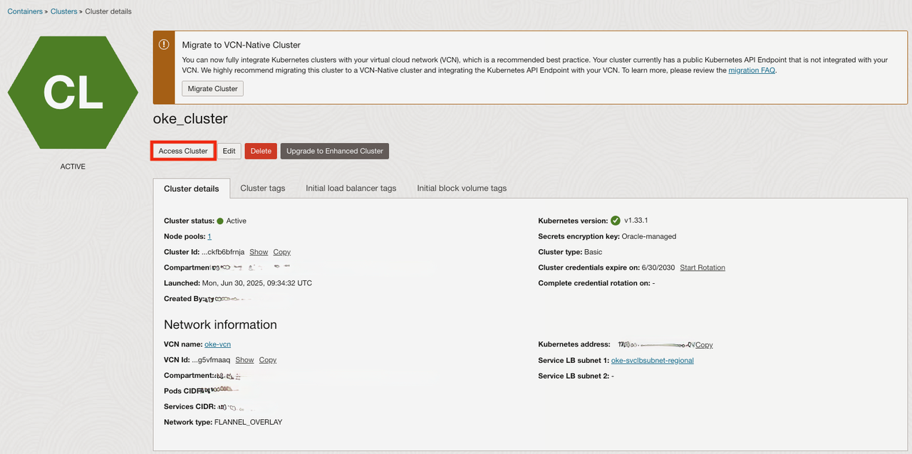
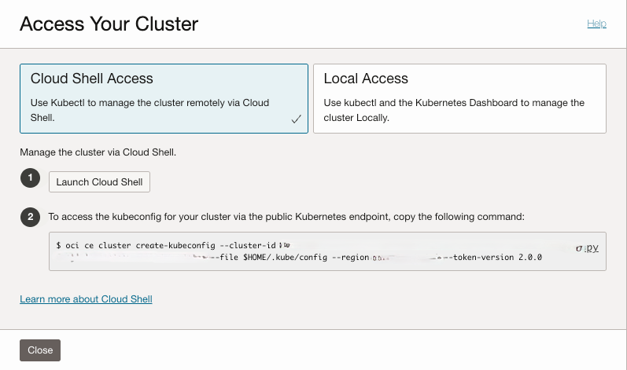
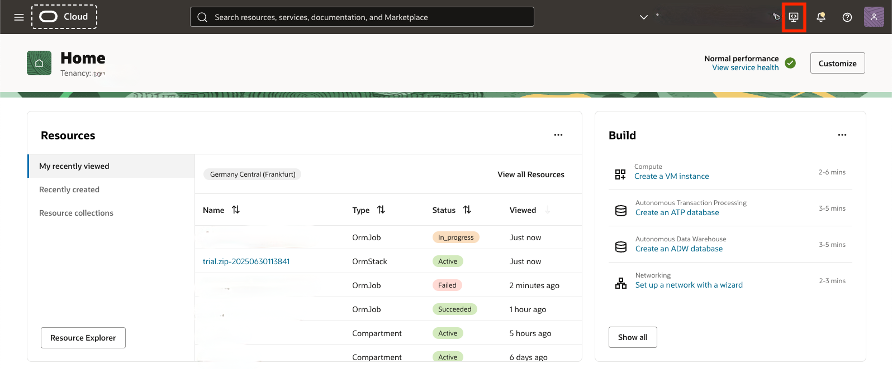
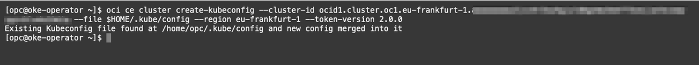
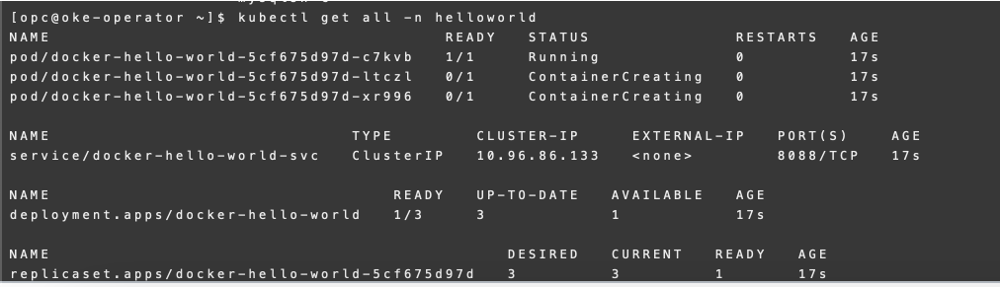
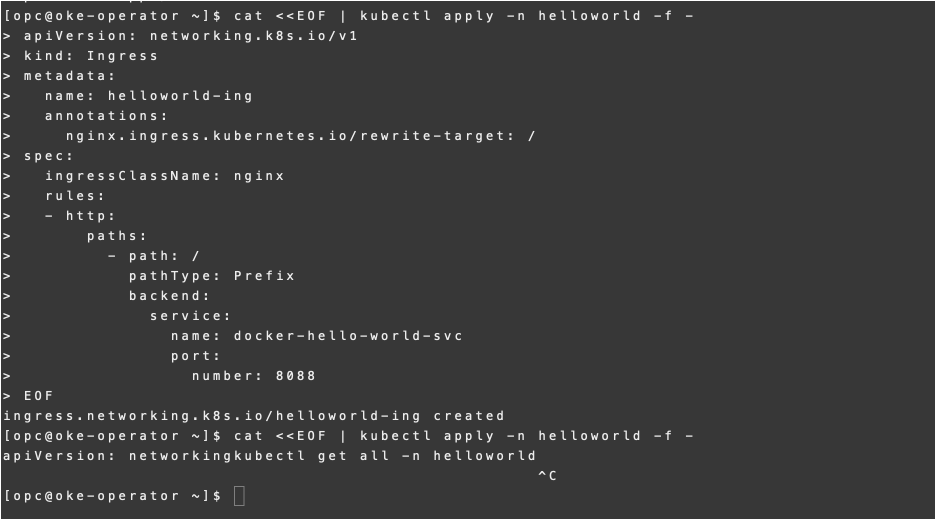
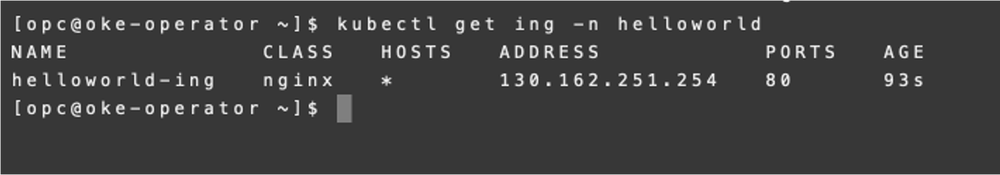
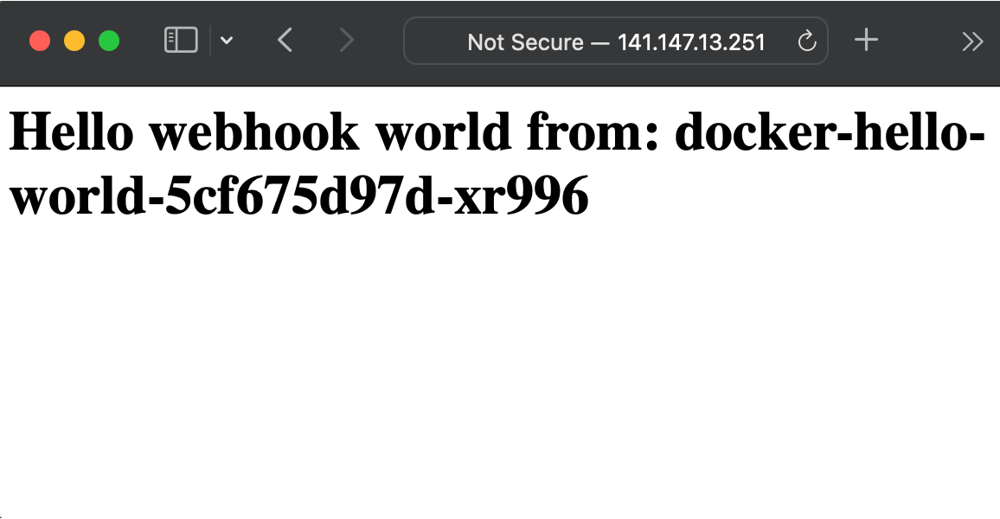

# Deploy ingress-controller

## Introduction

In this lab, you will deploy an ingress-controller on **Oracle Container Engine for Kubernetes (OKE)** to allow public IP access to Kubernetes services (similar to load balancer). We will be using this ingress-controller to route access to Zeppelin deployed on OKE.

**Oracle Container Engine for Kubernetes (OKE)** is an Oracle-managed container orchestration service that can reduce the time and cost to build modern cloud-native applications. Unlike most other vendors, Oracle Cloud Infrastructure provides Container Engine for Kubernetes as a free service that runs on higher-performance, lower-cost compute shapes.

Estimated Time: 5 minutes

### Objectives

In this lab, you will:

* Deploy ingress controller
* Deploy sample **hello world** service for testing
* Test OKE ingress controller by accessing the deployed **hello world** service

### Prerequisites

This lab assumes you have:

* An Oracle account
* You have enough privileges to use OCI
* OCI Resources required: HOL-compartment, OKE cluster

## Task 1: Verify OKE cluster

1. Click the **Hamburger Menu**  in the upper left, navigate to **Developer Services** and select **Kubernetes Cluster (OKE)**

    

2. Select the Compartment (e.g. HOL-Compartment) that you provisioned the OKE cluster, and verify the status of **oke_cluster** is **Active**

    

## Task 2: Access OKE Cluster

1. Log in to **OCI** and select **Developer Services**, and **Kubernetes Clusters (OKE)** to access to your OKE cluster created

    

2. Click on the **oke-cluster**

    

3. Click on the **Access Cluster** to look for the kubectl script to access the cluster

    

4. Copy the kubectl script

    

5. On OCI Console, click on the cloud shell to launch the OCI cloud shell

    

6. Connect to the **oke-operator** compute instance using OCI Cloud Shell

	

7. Paste the command copied in Step 6 in the command line and hit **Enter** to set up the access to OKE
	

## Task 3: Deploy ingress-controller to OKE

1. Apply the ingress controller deployment YAML to **OKE**

    ```
	<copy>
    kubectl apply -f https://raw.githubusercontent.com/kubernetes/ingress-nginx/controller-v1.1.1/deploy/static/provider/cloud/deploy.yaml
	</copy>
    ```

2. Check the status of deployed namespace and services

    ```
	<copy>
    kubectl get all -n ingress-nginx
  </copy>
  ```
3. Retrieve the Public IP of the ingress controller services

	```
<copy>
kubectl get service -n ingress-nginx --watch
</copy>
```

	Once you have the External IP provisioned, you can press CTL+C to terminate the command

## Task 4: Deploy sample 'hello world' application

1. Create 'helloworld' namespace

	```
  <copy>
	kubectl create ns helloworld
  </copy>
	```

2. Deploying hello world application to 'helloworld' namespace

    ```
    <copy>
    cat <<EOF | kubectl apply -n helloworld -f -
    apiVersion: apps/v1
    kind: Deployment
    metadata:
      name: docker-hello-world
      labels:
        app: docker-hello-world
    spec:
      selector:
        matchLabels:
          app: docker-hello-world
      replicas: 3
      template:
        metadata:
          labels:
            app: docker-hello-world
        spec:
          containers:
          - name: docker-hello-world
            image: scottsbaldwin/docker-hello-world:latest
            ports:
            - containerPort: 80
    ---
    apiVersion: v1
    kind: Service
    metadata:
      name: docker-hello-world-svc
    spec:
      selector:
        app: docker-hello-world
      ports:
        - port: 8088
          targetPort: 80
      type: ClusterIP

    EOF
    </copy>

    ```

3. Check the application deployment in 'helloworld' namespace

	```
	<copy>
	kubectl get all -n helloworld
	</copy>
	```

	

4. Deploy Ingress Resource 'helloworld-ing' to 'helloworld' namespace

	```
<copy>
cat <<EOF | kubectl apply -n helloworld -f -
apiVersion: networking.k8s.io/v1
kind: Ingress
metadata:
  name: helloworld-ing
  annotations:
    nginx.ingress.kubernetes.io/rewrite-target: /
spec:
  ingressClassName: nginx
  rules:
  - http:
      paths:
        - path: /helloworld
          pathType: Prefix
          backend:
            service:
              name: docker-hello-world-svc
              port:
                number: 8088
EOF
</copy>
```

    

## Task 5: Test the sample 'hello world' application

1. Check the Public IP and resource

  Take note of the external public IP for the service

	>**Note** The Public IP of the the Ingress Resource **helloworld-ing** will take sometime to be assigned, monitor the creation until the Public IP address is assigned

	```
	<copy>
	kubectl get svc -n ingress-nginx
	</copy>
	```
	```
	<copy>
	kubectl get ing -n helloworld
	</copy>
	```

	

2. Open a browser and access your 'hello world' application using the external IP address. (e.g. http://xxx.xxx.xxx.xxx:/helloworld)

    

## Task 6: Clean up

1. Remove the 'helloworld' namespace (hello world application, ingress)

	```
	<copy>
	kubectl delete ns helloworld
	</copy>
	```

  You may now **proceed to the next lab.**

## Acknowledgements

* **Author**
	* Ivan Ma, MySQL Solutions Engineer, MySQL Asia Pacific
	* Ryan Kuan, MySQL Cloud Engineer, MySQL Asia Pacific
* **Contributors**
	* Perside Foster, MySQL Solution Engineering North America
	* Rayes Huang, OCI Solution Specialist, OCI Asia Pacific

* **Last Updated By/Date** - Ryan Kuan, May 2022
