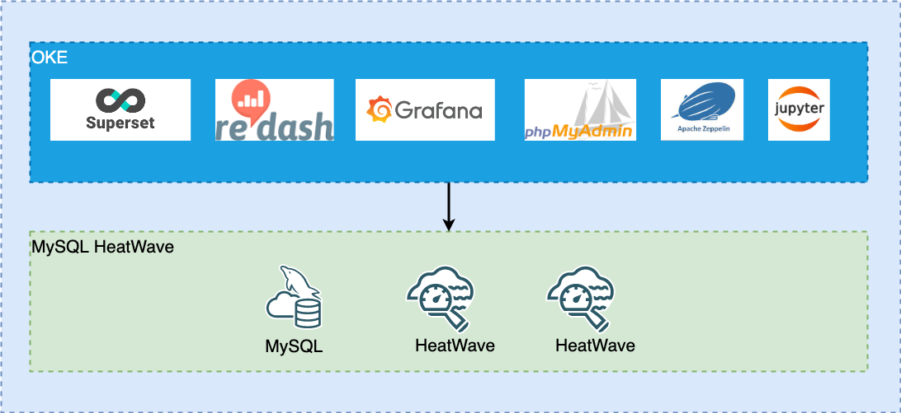

# Introduction

## About this Workshop

The main purpose of this workshop is to teach you how you can implement a cloud-native analytics solution using **MySQL HeatWave** and various popular open-source tools on Oracle Cloud Infrastructure (OCI). MySQL HeatWave is not only proven to accelerate your most complicated SQL queries with in-memory partitioning technology, but it is also enhanced with Oracle AutoML-based machine learning technology lately to add prediction capabilities to your applications.

We have selected a few popular open-source analytics tools such as **Zeppelin, Jupyter, Superset, Redash and Grafana** as part of this workshop to start using these tools with MySQL HeatWave on OCI, for example, build a sales performance dashboard with Superset, or profile your customer data with Zeppelin or Jupyter. Each of the labs is independent of each other, hence you can just pick which tools you like to work with, for example, if you want to build a dashboard, you can choose the Redash, Grafana or Superset labs. Likewise, you can choose to use Zeppelin or Jupyter for data exploration and analysis.

With the combination of your preferred analytics tool and **MySQL HeatWave** engine, you will be able to build a solid cloud native data analytics platform to solve your business problems.

Estimated Time: 135 minutes

### About Oracle MySQL Database Service

**Oracle MySQL Database Service** is a fully managed database service that lets developers quickly develop and deploy secure, cloud native applications using the world’s most popular open source database. MySQL Database Service is the only MySQL cloud service with an integrated, high performance, in-memory query accelerator—
**HeatWave**. It enables customers to run sophisticated analytics directly against their operational MySQL databases—eliminating the need for complex, time-consuming, and expensive data movement and integration with a separate analytics database. **HeatWave** accelerates MySQL performance by orders of magnitude for analytics and mixed workloads. Optimized for Oracle Cloud Infrastructure (OCI), MySQL Database Service is 100% built, managed, and supported by the OCI and MySQL engineering teams.

### About HeatWave

HeatWave is a distributed, scalable, shared-nothing, in-memory, hybrid columnar, query processing engine designed for extreme performance. It is enabled when you add a HeatWave cluster to a MySQL DB System. To know more about HeatWave Cluster <a href="https://dev.mysql.com/doc/heatwave/en/heatwave-introduction.html" target="\_blank">**Click Here**</a>

### Objectives

In this workshop, you will learn how to:

* Create Oracle Kubernetes Engine and MySQL HeatWave
* Load data into MySQL HeatWave
* Deploy selected analytics tools (Zeppelin, Jupyter, Superset, Redash, Grafana) to accelerate your queries with MySQL HeatWave
* (Optional) Deploy phpMyAdmin tool to manage MySQL HeatWave

The following diagram illustrates all the components deployed on OCI when you completed the workshop

### Prerequisites

* You have an Oracle account
* You have enough privileges to use OCI

## Acknowledgements

* **Author**
	* Ivan Ma, MySQL Solutions Engineer, MySQL Asia Pacific
	* Ryan Kuan, MySQL Cloud Engineer, MySQL Asia Pacific
* **Contributors**
	* Perside Foster, MySQL Solution Engineering North America
	* Rayes Huang, OCI Solution Specialist, OCI Asia Pacific

* **Last Updated By/Date** - Ryan Kuan, May 2022
