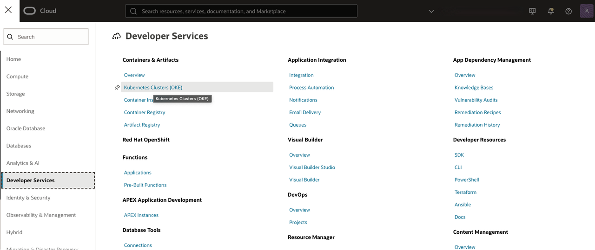
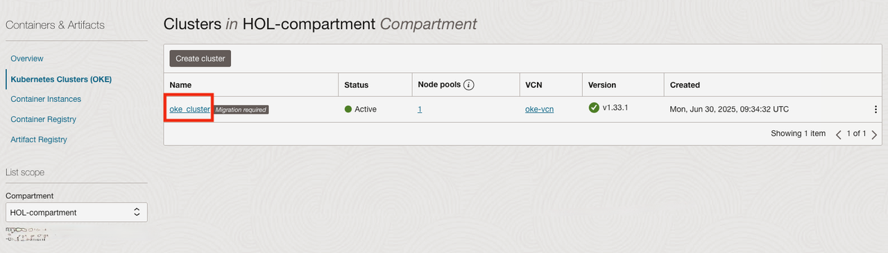
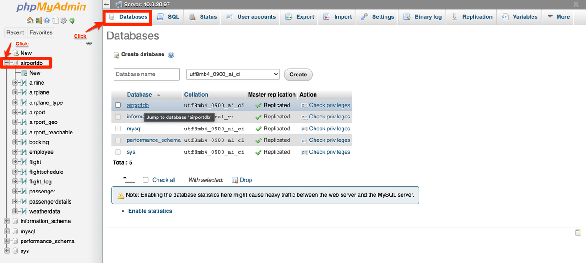

# Deploy phpMyAdmin

## Introduction

<a href="https://www.phpmyadmin.net/", target="\_blank">PhpMyAdmin</a> is a web-based MySQL management tool to help you manage MySQL databases.

In this lab, we will deploy **phpMyAdmin** to Oracle Container Engine for Kubernetes to manage MySQL HeatWave.

**Oracle Container Engine for Kubernetes (OKE)** is an Oracle-managed container orchestration service that can reduce the time and cost to build modern cloud native applications. Unlike most other vendors, Oracle Cloud Infrastructure provides Container Engine for Kubernetes as a free service that runs on higher-performance, lower-cost compute shapes.

Estimated Time: 10 minutes

### Objectives

In this lab, you will:

* Create a Kubernetes namespace for phpMyAdmin
* Deploy phpMyAdmin to OKE
* Manage MySQL using phpMyAdmin

### Prerequisites

* You have an Oracle account
* You have enough privileges to use OCI
* OCI Resource required: HOL-compartment, OKE Cluster, MySQL HeatWave

## Task 1: Verify OKE cluster

1. Click the **Hamburger Menu**  in the upper left, navigate to **Developer Services** and select **Kubernetes Cluster (OKE)**

    

2. Select the Compartment (e.g. HOL-Compartment) that you provisioned the OKE cluster, and verify the status of **oke_cluster** is **Active**

    

## Task 2: Deploy phpMyAdmin to OKE

1. Connect to the **oke-operator** compute instance using OCI Cloud Shell

	  

2. Create the phpMyAdmin YAML deployment script

    ```
<copy>
cat <<EOF >>phpmyadmin.yaml
---
apiVersion: v1
kind: Pod
metadata:
  name: phpmyadmin
  labels:
    app: phpmyadmin
spec:
  containers:
    - name: phpmyadmin
      image: phpmyadmin/phpmyadmin
      env:
        - name: PMA_HOST
          value: MYSQL_HOST
        - name: PMA_PORT
          value: "3306"
      ports:
        - containerPort: 80
          name: phpmyadmin
---
apiVersion: v1
kind: Service
metadata:
  labels:
    app: phpmyadmin-svc
  name: phpmyadmin-svc
spec:
  ports:
  - port: 80
    targetPort: 80
  selector:
    app: phpmyadmin
EOF
</copy>
```

3. Specify your MySQL private IP address in the YAML file, replace **MYSQL&#95;PRIVATE&#95;IP&#95;ADDRESS** with your MySQL Private IP Address. For example, if your MySQL Private IP address is 10.0.30.11, then the sed command will be "sed -i -e 's/MYSQL_HOST/10.0.30.11/g' phpmyadmin.yaml"

    ```
 <copy>
 sed -i -e 's/MYSQL_HOST/<MYSQL_PRIVATE_IP_ADDRESS>/g' phpmyadmin.yaml
 </copy>
 ```

4. Create the **phpmyadmin** namespace in OKE

    ```
 <copy>
 kubectl create ns phpmyadmin
 </copy>
 ```

5. Create the phpmyadmin service

    ```
 <copy>
 kubectl apply -f phpmyadmin.yaml -n phpmyadmin
 </copy>
```

6. Login to the operator VM and start the port-forward service

    ```
<copy>
kubectl port-forward service/phpmyadmin-svc -n phpmyadmin --address 0.0.0.0 8080:80 &
</copy>
```

7. Access the deployed phpMyAdmin application using your browser, **http:://&lt;PUBLIC&#95;IP of Operator VM&gt;:8080/**. Enter MySQL admin user, **admin**, and default password **Oracle#123**

	  

	  Congratulations! You have completed all the labs.

## Acknowledgements

* **Author**
	* Ivan Ma, MySQL Solutions Engineer, MySQL Asia Pacific
	* Ryan Kuan, MySQL Cloud Engineer, MySQL Asia Pacific
* **Contributors**
	* Perside Foster, MySQL Solution Engineering North America
	* Rayes Huang, OCI Solution Specialist, OCI Asia Pacific

* **Last Updated By/Date** - Ryan Kuan, May 2022