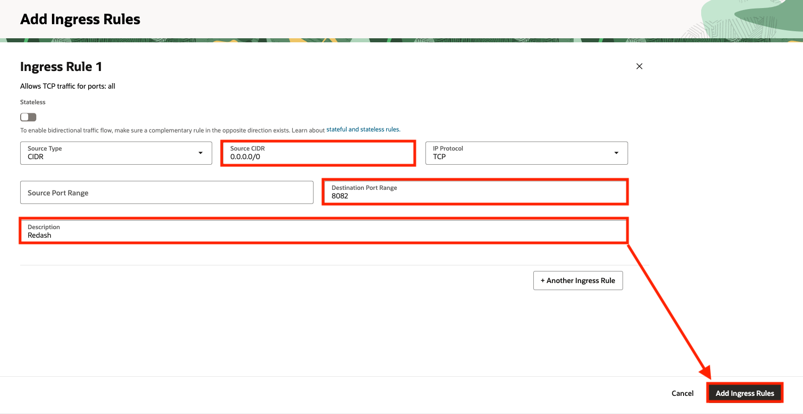
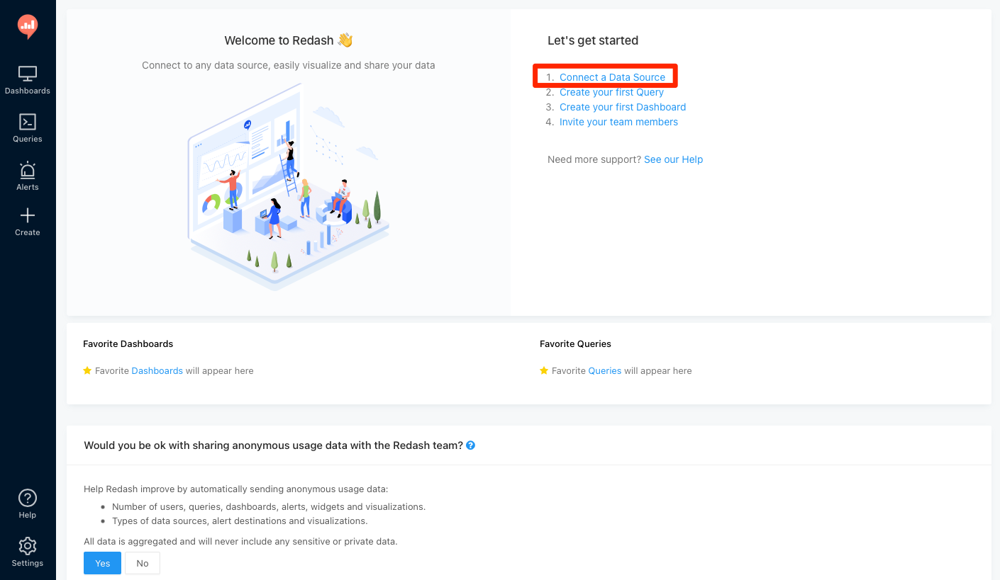
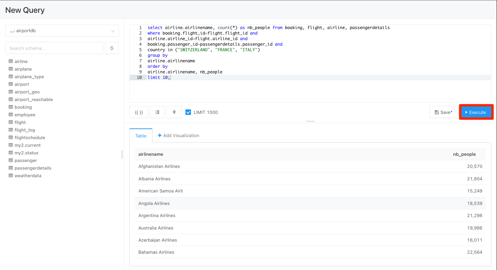

# Deploy Redash dashboard

## Introduction

<a href="https://redash.io/", target="\_blank">Redash</a> provides a dashboard builder to visualize your data and a SQL editor to develop your SQL and reports.

In this lab, we will deploy **Redash** to Oracle Container Engine for Kubernetes infrastructure to analyze data in **MySQL HeatWave**.

**Oracle Container Engine for Kubernetes (OKE)** is an Oracle-managed container orchestration service that can reduce the time and cost to build modern cloud native applications. Unlike most other vendors, Oracle Cloud Infrastructure provides Container Engine for Kubernetes as a free service that runs on higher-performance, lower-cost compute shapes.

Estimated Time: 15 minutes

### Objectives

In this lab, you will:

* Create a Kubernetes namespace for Redash
* Deploy Redash dashboard to OKE
* Analyze data in MySQL HeatWave

### Prerequisites

* You have an Oracle account
* You have enough privileges to use OCI
* OCI Resource required: HOL-compartment, OKE Cluster, MySQL HeatWave

## Task 1: Verify OKE cluster

1. Click the **Hamburger Menu**  in the upper left, navigate to **Developer Services** and select **Kubernetes Cluster (OKE)**

    

2. Select the Compartment (e.g. HOL-Compartment) that you provisioned the OKE cluster, and verify the status of **oke_cluster** is **Active**

    

## Task 2: Deploy Redash to OKE

1. Connect to the **oke-operator** compute instance using OCI Cloud Shell

	

2. Install the helm client

	>**Note** Skip this step if you have installed helm client

	```
<copy>
curl -fsSL https://raw.githubusercontent.com/helm/helm/main/scripts/get-helm-3 |bash -
</copy>
```

3. Add **Redash** repository using helm

	```
<copy>
helm repo add redash https://getredash.github.io/contrib-helm-chart/
</copy>
```

4. Create custom values for installation

	```
<copy>
cat > my-values.yaml <<- EOM
redash:
  cookieSecret: $(openssl rand -base64 32)
  secretKey: $(openssl rand -base64 32)
postgresql:
  postgresqlPassword: $(openssl rand -base64 32)
redis:
  password: $(openssl rand -base64 32)
EOM
</copy>
```

5. Install **Redash** using helm

	```
<copy>
helm upgrade --install -f my-values.yaml my-release redash/redash --namespace redash --create-namespace
</copy>
```

6. Get the pod information of Redash

	```
<copy>
kubectl get pods --namespace redash -l "app.kubernetes.io/name=redash,app.kubernetes.io/instance=my-release" -o jsonpath="{.items[0].metadata.name}"
</copy>
```
	>Note: the installation of Redash may take a while, please be patient

7. Create port-forward to Redash

	Replace &lt;POD&#95;NAME&gt; with the output in step 6, for example, **my-release-redash-6b895d78f8-48n9h**

	```
<copy>
kubectl --namespace redash port-forward <POD_NAME> 8082:5000 --address 0.0.0.0 &
</copy>
```

8. Navigate to **Virtual Cloud Network**, select **oke-vcn**, select **Security List** on the left panel, and select **operator-seclist**

	

9. Add a new ingress rule to **operator-seclist**

	
	

9. Access the deployed Redash dashboard using your browser, http:://&lt;oke-operator&#95;PUBLIC&#95;IP&gt;:8082/.

	Upon your first login, you need to create an admin user with password (at least 6 characters). For example, you can use **admin** as user, and password of your choice.

	

## Task 3: Connect Redash to MySQL HeatWave

1. Once you login to Redash, clink on the **Connect to a Data Source**

	

2. Specify the connection details of MySQL HeatWave, and click on **Finish** when finished

	

3. You are now ready to query the MySQL HeatWave

	```
sql
<copy>
select airline.airlinename, count(*) as nb_people from booking, flight, airline, passengerdetails
where booking.flight_id=flight.flight_id and
airline.airline_id=flight.airline_id and
booking.passenger_id=passengerdetails.passenger_id and
country in ("SWITZERLAND", "FRANCE", "ITALY")
group by
airline.airlinename
order by
airline.airlinename, nb_people
limit 10;
</copy>
```

	

  You may now **proceed to the next lab.**

## Acknowledgements

* **Author**
	* Ivan Ma, MySQL Solutions Engineer, MySQL Asia Pacific
	* Ryan Kuan, MySQL Cloud Engineer, MySQL Asia Pacific
* **Contributors**
	* Perside Foster, MySQL Solution Engineering North America
	* Rayes Huang, OCI Solution Specialist, OCI Asia Pacific

* **Last Updated By/Date** - Ryan Kuan, May 2022
