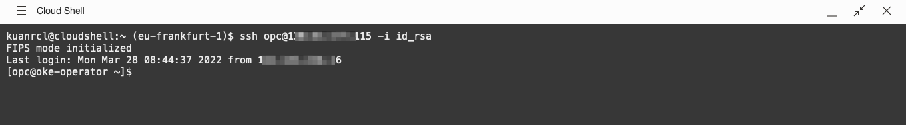
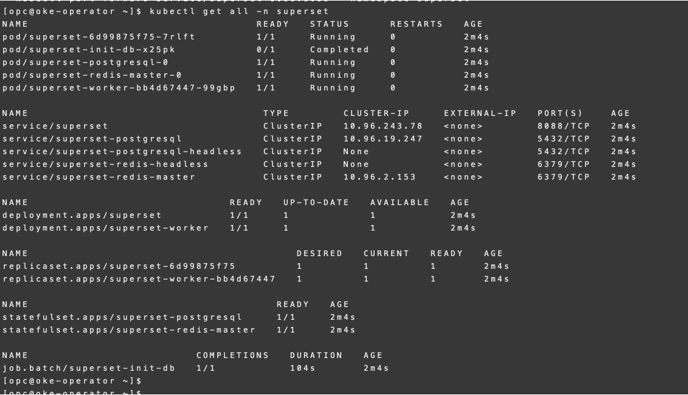
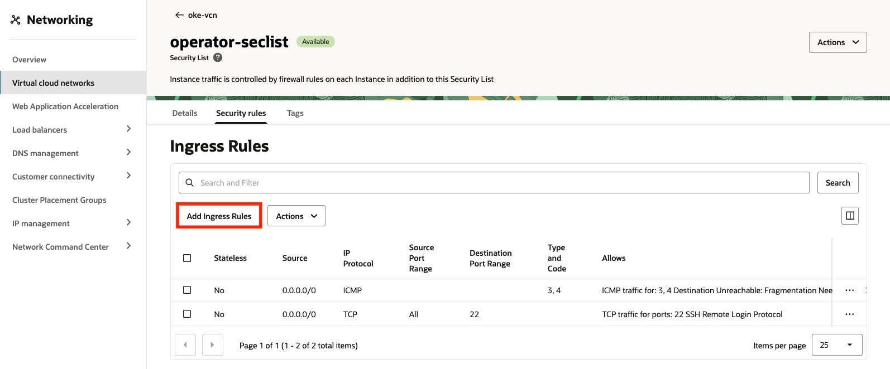
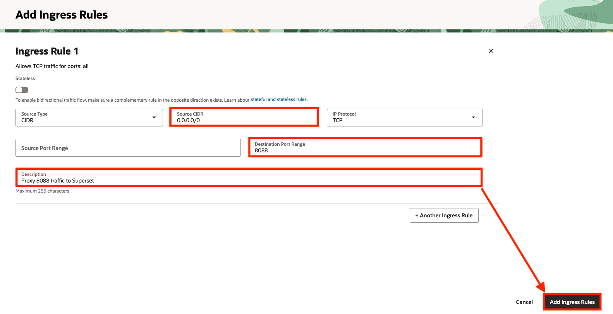
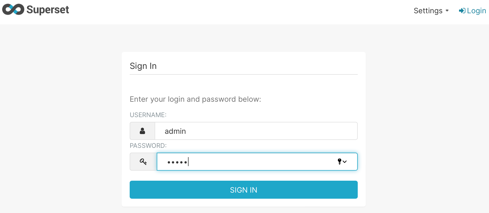
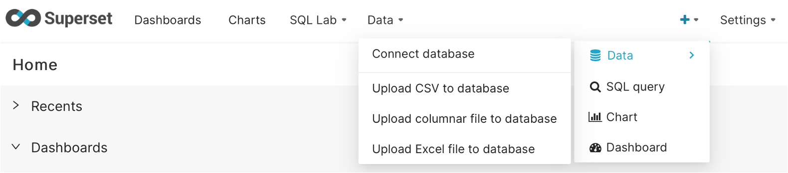
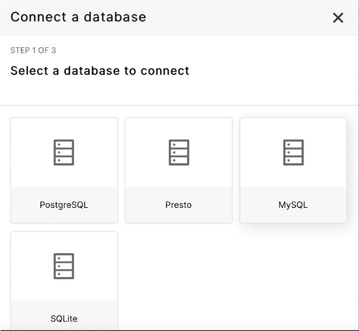
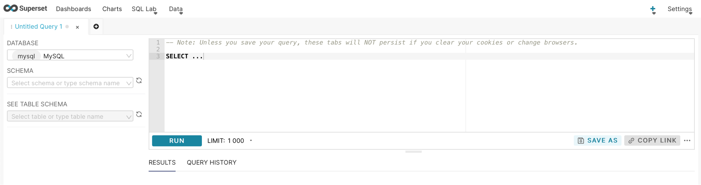

# Deploy Superset dashboard

## Introduction

<a href="https://superset.apache.org/", target="\_blank">Superset</a> is one of the top Apache projects that offers a set of tools to build dashboards to visualize data stored in your database.

In this lab, you will deploy **Superset** using Helm to Oracle Container Engine for Kubernetes infrastructure, and create a simple dashboard for **MySQL HeatWave**.

**Oracle Container Engine for Kubernetes (OKE)** is an Oracle-managed container orchestration service that can reduce the time and cost to build modern cloud-native applications. Unlike most other vendors, Oracle Cloud Infrastructure provides Container Engine for Kubernetes as a free service that runs on higher-performance, lower-cost compute shapes.

Estimated Time: 15 minutes

### Objectives

In this lab, you will:

* Install helm CLI client and Superset repo for k8s package installation
* Deploy Superset package to the OKE cluster using helm CLI client
* Use port-forward in oke-operator VM to route 8088 port traffic to superset service
* Change VCN security list to open 8088
* Define MySQL Database in Superset
* Test MySQL Database connection with SQL Editor in Superset
* Create a simple Dashboard

### Prerequisites

This lab assumes you have:

* An Oracle account
* You have enough privileges to use OCI
* OCI Resources required: HOL-compartment, OKE cluster, MySQL HeatWave

## Task 1: Verify OKE cluster

1. Click the **Hamburger Menu**  in the upper left, navigate to **Developer Services** and select **Kubernetes Cluster (OKE)**

    

2. 2. Select the Compartment (e.g. HOL-Compartment) that you provisioned the OKE cluster, and verify the status of **oke_cluster** is **Active**

    

## Task 2: Deploy Superset to OKE

1. Connect to the **oke-operator** compute instance using OCI Cloud Shell

	

2. Install **helm** CLI client to **oke-operator** compute instance

    >**Note** Skip this step if you have helm client installed already

    ```
    <copy>
    curl -fsSL https://raw.githubusercontent.com/helm/helm/main/scripts/get-helm-3 |bash -
    </copy>
    ```

    

3. Add **Superset** to helm repository

    ```
    <copy>
    helm repo add superset https://apache.github.io/superset
    </copy>
    ```

    

4. Generate **superset-custom-values.yaml** (update any specific variables if required) and install Superset package

    ```
    <copy>
    helm show values superset/superset  > superset-custom-values.yaml
    kubectl create ns superset
    helm upgrade --install --values superset-custom-values.yaml superset superset/superset -n superset
    </copy>
    ```

    

5. Verify the deployment status of Superset application

    ```
    <copy>
    helm list -n superset
    kubectl get all -n superset
    </copy>
    ```

    

6. Disable the **firewalld** service in **oke-operator** compute instance

    ```
    <copy>
    sudo systemctl stop firewalld
    sudo systemctl disable firewalld
    </copy>
    ```
    > **Note** The purpose of this step is to simplify and allow port-forwarding service to the **oke-operator** compute instance. You should not disable the firewalld service in production

7. Start port-forwarding to Superset service.

    ```
    <copy>
    kubectl port-forward service/superset --address 0.0.0.0 8088:8088 -n superset &
    </copy>
    ```
    > **Note** This is an alternative way to access OKE services via kubernetes port-forwarding function that is different from using ingress-controller

## Task 3: Edit VCN Security List

1. Click on **Virtual Cloud Network** in OCI Networking, select **oke-vcn**
    

2. Click on **operator-subnet-regional** subnet
    

3. Click on **operator-subnet-regional** security list
    

4. Click on **Add Ingress Rule** to add a new ingress rule

    

5. Specify **0.0.0.0/0** in **Source CIDR**, **8088** in **Destination Port Range**. Click on **Add Ingress Rules** when finish
    

    > **Note** In order to use kubernetes port-forwarding function, we need to allow ingress traffic to TCP port 8888 to oke-operator VM

## Task 4: Test Superset

1. Point your browser to http://&lt;public IP of **oke-operator**&gt;:8088

2. Login using user id and password of **admin/admin**
    

3. You will land on the default Superset **HOME** page
    

## Task 5: Connect Superset to MySQL

1. Login to OCI Console, select the **Hamburger Menu** , type in **mysql** in the seach bar, select **DB System**

2. Click on **MySQLInstance**
    

3. Note down the **Private IP Address** for MySQL HeatWave
    

4. Point your browser to http://&lt;public IP of **oke-operator** &gt;:8088

5. Click on **+**, expand on **Data**, and select **Connect database**
    

6. Select **MySQL**
    

7. Specify details of your MySQL HeatWave (You can get the private ip address of MySQL HeatWave in Lab 2, Task 2). Click on **Connect** to test the connection
    

8. Click **Finish** on successful connection to MySQL
    

## Task 6: Execute SQL

1.  Expand **SQL Lab** in Superset dashboard, and select **SQL Editor**
    
    

2. Select **MySQL** as Database, **airportdb** as schema. You can start executing SQL in the **SQL Editor**
    

  You may now **proceed to the next lab.**

## Acknowledgements

* **Author**
	* Ivan Ma, MySQL Solutions Engineer, MySQL Asia Pacific
	* Ryan Kuan, MySQL Cloud Engineer, MySQL Asia Pacific
* **Contributors**
	* Perside Foster, MySQL Solution Engineering North America
	* Rayes Huang, OCI Solution Specialist, OCI Asia Pacific

* **Last Updated By/Date** - Ryan Kuan, May 2022