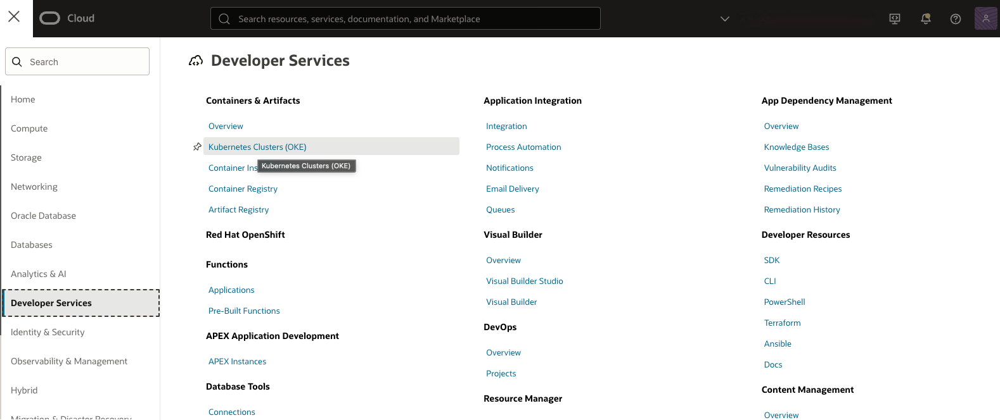
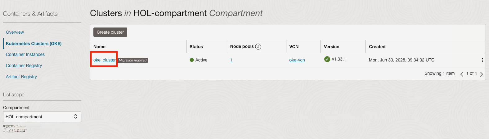
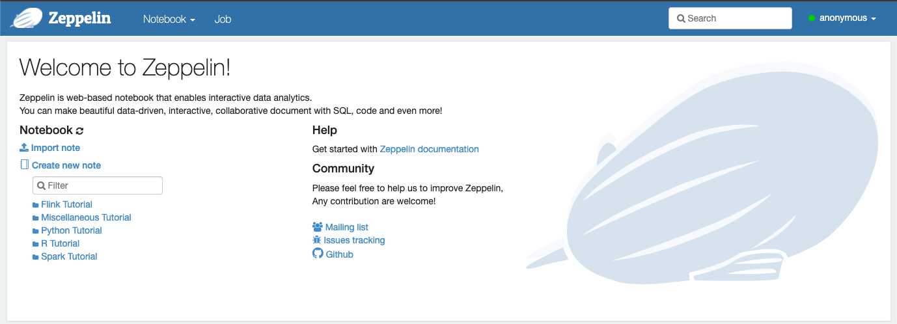

# Deploy Zeppelin notebook

## Introduction

<a href="https://zeppelin.apache.org/" target="\_blank">Zeppelin</a> is a web-based notebook that enables data-driven, interactive data analytics and collaborative documents with SQL, Scala, Python, and R.

In this lab, you will deploy the **Zeppelin** notebook to Oracle Kubernetes infrastructure and create a simple notebook to **MySQL HeatWave**.

**Oracle Container Engine for Kubernetes (OKE)** is an Oracle-managed container orchestration service that can reduce the time and cost to build modern cloud-native applications. Unlike most other vendors, Oracle Cloud Infrastructure provides Container Engine for Kubernetes as a free service that runs on higher-performance, lower-cost compute shapes.

Estimated Time: 10 minutes

### Objectives

In this lab, you will:

* Create a kubernetes namespace for Zeppelin
* Deploy Zeppelin to OKE
* Run interactive analytics using PhpMyAdmin on MySQL HeatWave

### Prerequisites (Optional)

* You have an Oracle account
* You have enough privileges to use OCI
* OCI Resources required: HOL-compartment, OKE cluster, MySQL HeatWave

## Task 1: Access OKE cluster

1. Click the **Hamburger Menu**  in the upper left, navigate to **Developer Services** and select **Kubernetes Cluster (OKE)**

    

2. Select the Compartment (e.g. HOL-Compartment) that you provisioned the OKE cluster, and verify the status of **oke_cluster** is **Active**

    

## Task 2: Deploy Zeppelin to OKE

1. Connect to **oke-operator** using OCI Cloud Shell

    

2. Download the [Zeppelin-Server YAML](files/zeppelin-server.yaml?download=1)

    ```
    <copy>
    wget https://raw.githubusercontent.com/kuanrcl/learning-library/master/data-management-library/mysql/heatwave-cloud-analytics/zeppelin/files/zeppelin-server.yaml
    </copy>
    ```

3. Download the [Zeppelin ingress YAML](files/zeppelin-ing.yaml) 
    ```
    <copy>
    wget https://raw.githubusercontent.com/kuanrcl/learning-library/master/data-management-library/mysql/heatwave-cloud-analytics/zeppelin/files/zeppelin-ing.yaml
    </copy>
    ```

4. Execute the kubectl commands to create a namespace

	```
    <copy>
    kubectl create namespace zeppelin
    </copy>
    ```

4. Deploy Zeppelin

    ```
    <copy>
    kubectl apply -f zeppelin-server.yaml -n zeppelin
    </copy>
    ```
    ```
    <copy>
    kubectl apply -f zeppelin-ing.yaml -n zeppelin
    </copy>
    ```

5. Find out the public IP of OKE Ingress Controller

    ```
    <copy>
    kubectl get all -n ingress-nginx
    </copy>
    ```
	

6. Access the deployed Zeppelin application. Point your browser to **http://&lt;INGRESS&#95;PUBLIC&#95;IP&#95;ADDRESS&gt;/zeppelin/**

    >Note: Please ensure you have the closing **/** in the url, that is, **zeppelin/**

	

Task 3: Connect to MySQL HeatWave

1. Create a JDBC interpreter for MySQL HeatWave in Zeppelin.

	

2. Click on **Create** to create a new JDBC driver for MySQL HeatWave. Fill up the details as indicated in the diagram
    Replace the private ip address of your MySQL instance in the **JDBC URL**, admin user and password

    * default.url: jdbc:mysql://private-ip-address:3306
    * default.user: admin
    * default.password: &lt;your mysql password&gt;
    * default.driver: com.mysql.cj.jdbc.Driver

   

3. Scroll to the bottom of the page and specify the MySQL JDBC driver, **mysql:mysql-connector-java:8.0.28**

	

4. Create a new notebook to start connecting to MySQL HeatWave. Specify the name of the notebook, for example, **airportdb**, and select **mysql** as the JDBC interpreter, click on **Create**

	

5. You can now start working with MySQL HeatWave!

	

    ```
<copy>
%mysql
use airportdb;
select * from airline limit 10;
</copy>
```

    ```
<copy>
%mysql
use airportdb;
select airline.airlinename, count(*) as nb_people from booking, flight, airline, passengerdetails
where booking.flight_id=flight.flight_id and
airline.airline_id=flight.airline_id and
booking.passenger_id=passengerdetails.passenger_id and
country in ("SWITZERLAND", "FRANCE", "ITALY")
group by
airline.airlinename
order by
airline.airlinename, nb_people
limit 10;
</copy>
```

    You may now **proceed to the next lab.**

## Acknowledgements

* **Author**
	* Ivan Ma, MySQL Solution Engineer, MySQL APAC
	* Ryan Kuan, MySQL Cloud Engineer, MySQL APAC
* **Contributors**
	* Perside Foster, MySQL Solution Engineering
	* Rayes Huang, OCI Solution Specialist, OCI APAC

* **Last Updated By/Date** - Ryan Kuan, March 2022