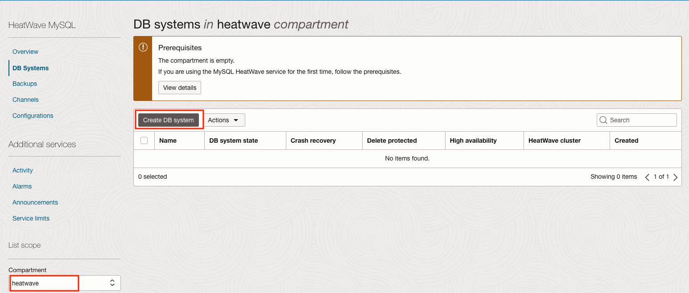
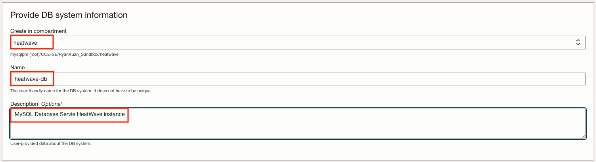
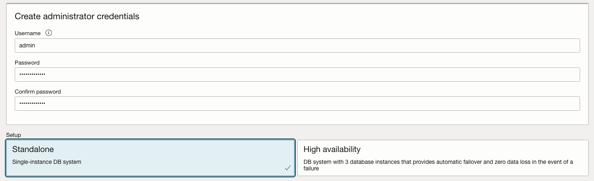
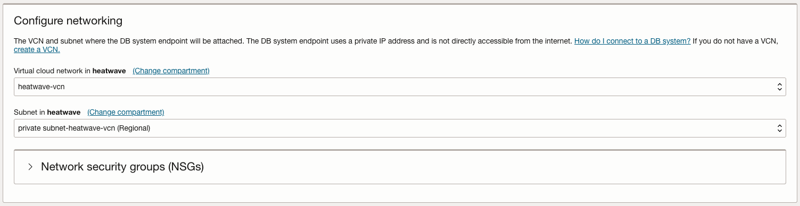
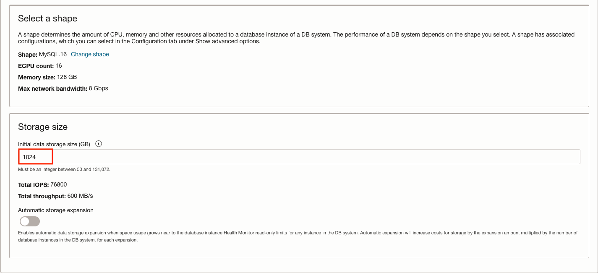
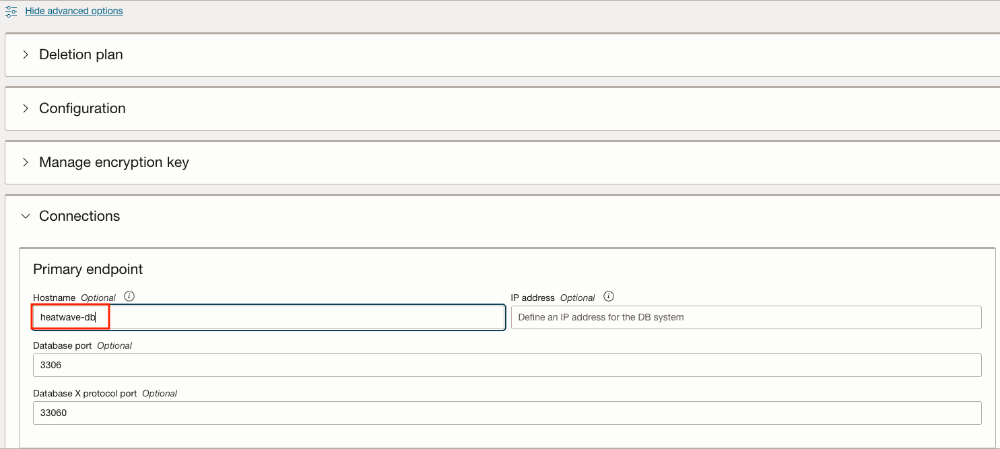
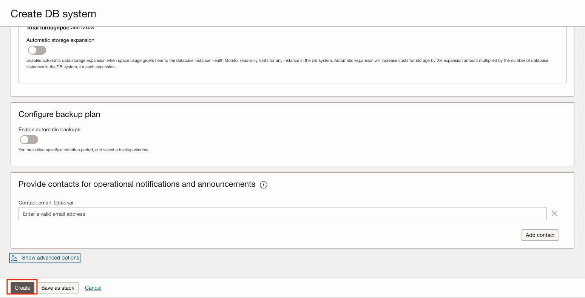
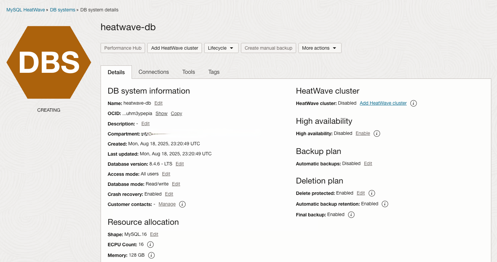

# Create MySQL Database HeatWave

## Introduction

In this lab, you will create and configure a MySQL DB System

_Estimated Time:_ 10 minutes

### Objectives

In this lab, you will be guided through the following tasks:

- Create MySQL Database for HeatWave (DB System)
- Add a HeatWave Cluster to MySQL Database System

### Prerequisites

- An Oracle Trial or Paid Cloud Account
- Some Experience with MySQL Shell
- Completed Lab1

## Task 1: Create MySQL Database for HeatWave (DB System)

1. Go to Navigation Menu
         Databases
         MySQL
         DB Systems
    

2. Click 'Create MySQL DB System'
    

3. Select the Development or Testing Option
    

4. Create MySQL DB System dialog complete the fields in each section

    - Provide basic information for the DB System
    - Setup your required DB System
    - Create Administrator credentials
    - Configure Networking
    - Configure placement
    - Configure hardware
    - Exclude Backups
    - Advanced Options - NetWorking

5. Provide basic information for the DB System:

    Select Compartment **heatwave**

    Enter Name

    ```bash
    <copy>heatwave-db</copy>
    ```

    Enter Description

    ```bash
    <copy>MySQL Database Service HeatWave Instance</copy>
   ```

    

6. Select **Standalone** for the DB System
    

7. Create Administrator Credentials

    **Enter Username** (write username to notepad for later use)

    **Enter Password** (write password to notepad for later use)

    **Confirm Password** (value should match password for later use)

    

8. On Configure networking, keep the default values

    Virtual Cloud Network: **heatwave-vcn**

    Subnet: **Private Subnet-heatwave-vcn (Regional)**

    

9. On Configure placement under 'Availability Domain'

    Select AD-1

    Do not check 'Choose an Availability Domain' for this DB System.

    

10. On Configure hardware, ensure **Enable HeatWave Cluster** is unchecked
    

    Change the default shape **MySQL.2** to **MySQL.16**
    

    Data Storage Size (GB) Set value to:  **1024**

    ```bash
    <copy>1024</copy>
    ```

    

11. On Configure Backups, disable 'Enable Automatic Backup'

    

12. Click on Show Advanced Options

13. Go to the Networking tab, in the Hostname field enter  (same as DB System Name):

    ```bash
        <copy>heatwave-db</copy> 
    ```

    

14. Review **Create MySQL DB System**  Screen

    

    Click the '**Create**' button

15. The New MySQL DB System will be ready to use after a few minutes

    The state will be shown as 'Creating' during the creation
    

16. The state 'Active' indicates that the DB System is ready for use

    On DB System details Page, navigate to the "Connections" tab, check the Primary Endpoint (Private IP Address)

    

You may now **proceed to the next lab**

## Acknowledgements

- **Author** - Perside Foster, MySQL Solution Engineering

- **Contributors** - Salil Pradhan, Principal Product Manager, Nick Mader, MySQL Global Channel Enablement & Strategy Manager
- **Last Updated By/Date** - Perside Foster, MySQL Solution Engineering, March 2023
