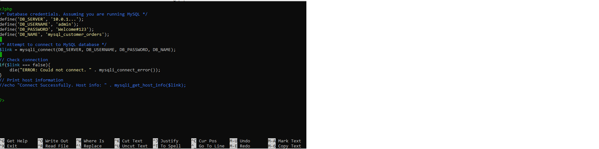
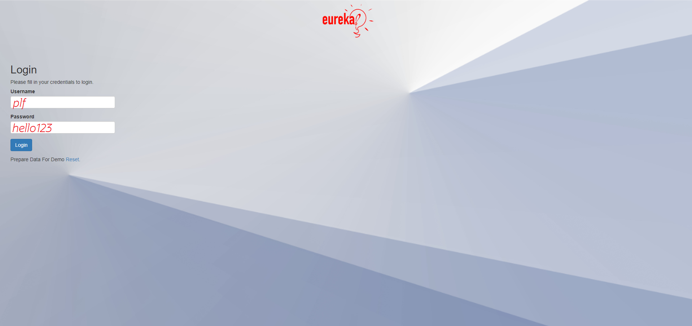
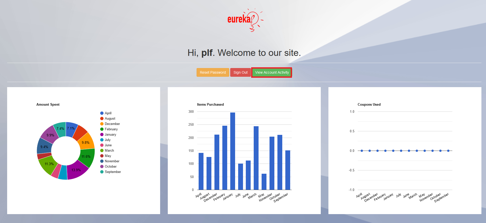
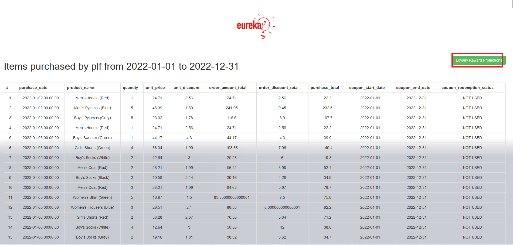
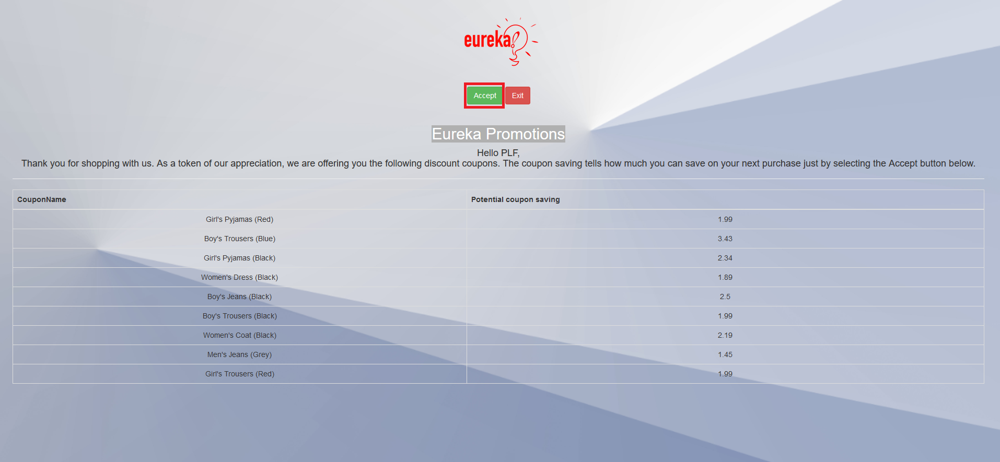
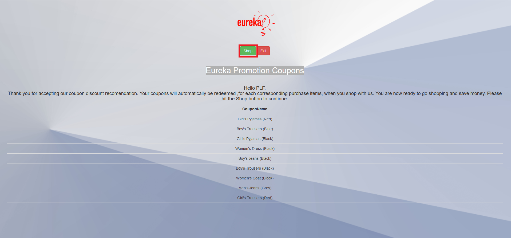
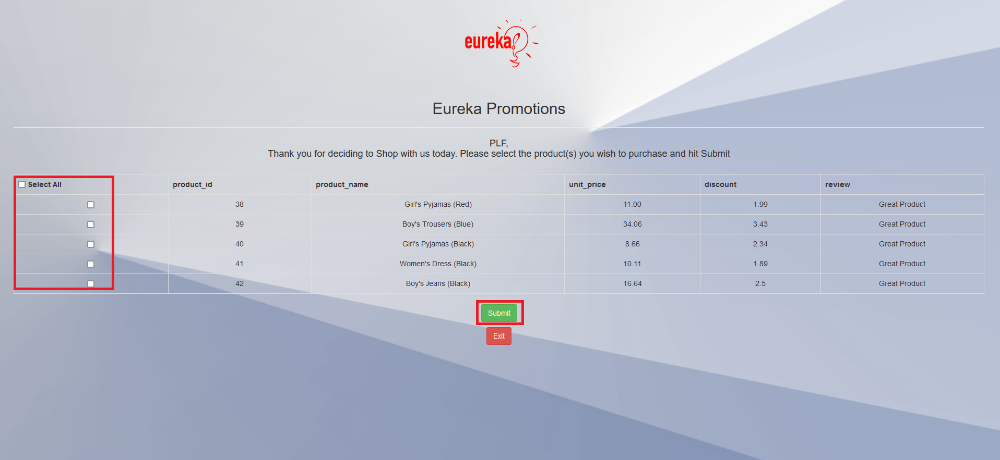
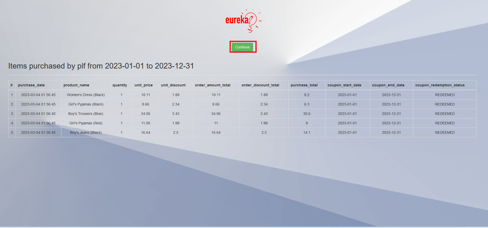
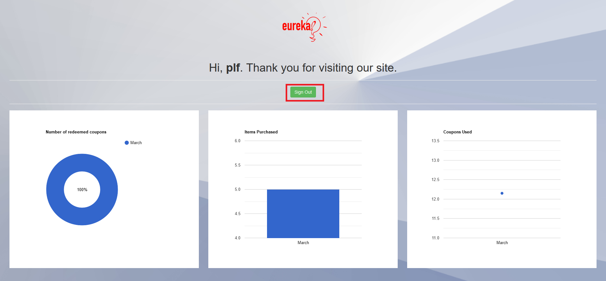

# Use MySQL HeatWave For Development  

## Introduction

MySQL HeatWave can easily be used for development tasks with existing Oracle services, such as Oracle Cloud Analytics. New applications can also be created with the LAMP or other software stacks.

**Note:** This application code is intended for educational purposes only. It is designed to help developers learn and practice application development skills with MySQL HeatWave on OCI. The code is not designed to be used in a production environment

_Estimated Lab Time:_ 20 minutes

### Objectives

In this lab, you will be guided through the following tasks:

- Install Apache and PHP
- Create PHP / MYSQL Connect Application
- Create Marketing Analytic Application 

### Prerequisites

- An Oracle Trial or Paid Cloud Account
- Some Experience with MySQL SQL and  PHP
- Completed Lab 5

## Task 1: Install App Server (APACHE)

1. If not already connected with SSH, on Command Line, connect to the Compute instance using SSH ... be sure replace the  "private key file"  and the "new compute instance ip"

     ```bash
    <copy>ssh -i private_key_file opc@new_compute_instance_ip</copy>
     ```

2. Install app server

    a. Install Apache

    ```bash
    <copy>sudo yum install httpd -y </copy>
    ```

    b. Enable Apache

    ```bash
    <copy>sudo systemctl enable httpd</copy>
    ```

    c. Start Apache

    ```bash
    <copy>sudo systemctl restart httpd</copy>
    ```

    d. Setup firewall

    ```bash
    <copy>sudo firewall-cmd --permanent --add-port=80/tcp</copy>
    ```

    e. Reload firewall

    ```bash
    <copy>sudo firewall-cmd --reload</copy>
    ```

3. From a browser test apache from your loacal machine using the Public IP Address of your Compute Instance

    **Example: http://129.213....**

## Task 2: Install PHP

1. Install php:

    a. Install php:7.4

    ```bash
    <copy> sudo dnf module install php:7.4 -y</copy>
    ```

    b. Install associated php libraries

    ```bash
    <copy>sudo yum install php-cli php-mysqlnd php-zip php-gd php-mbstring php-xml php-json -y</copy>
    ```

    c. View  php / mysql libraries

    ```bash
    <copy>php -m |grep mysql</copy>
    ```

    d. View php version

    ```bash
    <copy>php -v</copy>
    ```

    e. Restart Apache

    ```bash
    <copy>sudo systemctl restart httpd</copy>
    ```

2. Create test php file (info.php)

    ```bash
    <copy>sudo nano /var/www/html/info.php</copy>
    ```

3. Add the following code to the editor and save the file (ctr + o) (ctl + x)

    ```bash
    <copy><?php
    phpinfo();
    ?></copy>
    ```

4. From your local machine, browse the page info.php

   Example: http://129.213.167.../info.php

## Task 3: Create MySQl HeatWave / PHP connect app

1. Security update"   set SELinux to allow Apache to connect to MySQL

    ```bash
    <copy> sudo setsebool -P httpd_can_network_connect 1 </copy>
    ```

2. Create config.php

    ```bash
    <copy>cd /var/www/html</copy>
    ```

    ```bash
    <copy>sudo nano config.php</copy>
    ```

3. Add the following code to the editor and save the file (ctr + o) (ctl + x)

     ```bash
        <copy><?php
    // Database credentials
    define('DB_SERVER', '10.0.1...');// MDS server IP address
    define('DB_USERNAME', 'admin');
    define('DB_PASSWORD', 'Welcome#12345');
    define('DB_NAME', 'mysql_customer_orders');
    //Attempt to connect to MySQL database
    $link = mysqli_connect(DB_SERVER, DB_USERNAME, DB_PASSWORD, DB_NAME);
    // Check connection
    if($link === false){
        die("ERROR: Could not connect. " . mysqli_connect_error());
    }
    // Print host information
    echo 'Successfull Connect.';
    echo 'Host info: ' . mysqli_get_host_info($link);
    ?>
    </copy>
    ```

    - Test Config.php on Web sever http://150.230..../config.php

4. Create dbtest.php

    ```bash
    <copy>cd /var/www/html</copy>
    ```

    ```bash
    <copy>sudo nano dbtest.php</copy>
    ```

5. Add the following code to the editor and save the file (ctr + o) (ctl + x)

    ```bash
    <copy>
    <?php
require_once "config.php";
$query = "SELECT id, username  FROM mysql_customer_orders.users;";
if ($stmt = $link->prepare($query)) {
   $stmt->execute();
   $stmt->bind_result($id,$username);
   echo "<table>";
        echo "<tr>";
        echo "<th>ID</th>";
        echo "<th>UserName</th>";
    echo "</tr>";

    while ($stmt->fetch()) {
        echo "<tr>";
           echo "<td>" . $id ."</td>";
           echo "<td>" . $username. "</td>";
        echo "</tr>";
     }

    $stmt->close();
}
?>
</copy>
    ```

6. From your local  machine connect to dbhwtest.php

    Example: http://129.213.167..../dbtest.php  

## Task 4: Create Marketing Analytic Application

1. Go to the development folder

    ```bash
    <copy>cd /var/www/html</copy>
    ```

2. Get Eureka Application files  from Storage Object Stogage

    ```bash
    <copy>sudo wget https://objectstorage.us-ashburn-1.oraclecloud.com/p/mrb4Qw1WdDoNxUqRBMr3qMF3HDLkDQB-LnzeJl5dBrTIk2mJQrNO41xPZ_7caXNj/n/mysqlpm/b/mysql_customer_orders/o/eureka_sales/eurekaweb.zip</copy>
    ```

3. Unnzip eurekaweb.zip file 

    ```bash
    <copy>sudo unzip eurekaweb.zip </copy>
    ```

4. Open the config.php file 

    ```bash
    <copy>sudo nano eurekaweb/config.php </copy>
    ```

    Change config.php by replacing the mysql\_customer\_orders schema 'localhost' with heatwave-db IP address,username, and password;

    - Save the eurekaweb/config.php
    

## Task 5: Run the Marketing Analytic Application 

1. From your local machine connect to heatwave-client IP Address/eurekaweb/login.php 

    Example: http://999.999.999/eurekaweb/login.php

2. Login with the following information

    a. username: 

    ```bash
    <copy>plf </copy>
    ```

    b. password:

    ```bash
    <copy>hello123</copy>

    ```

    

3. From the Welcome Page click the "View Account Activity" button

    

4. From the Items purchased Page click the "Loyalty Reward Promotion" button

    

5. From the Eureka Promotions Page click the "Accept" button

    

6. From the Eureka Promotion Coupons  Page click the "Shop" button

    

7. From the Promotion Shop  Page select Items to purchase and click the "Submitt" button

    

8. From the Items Purchase Page   click the "Continue" button

    

9. From the Thank You  Page   click the "Signout" button

    

## Acknowledgements

* **Author** - Perside Foster, MySQL Solution Engineering, Harsh Nayak , MySQL Solution Engineering 
* **Contributors** - Salil Pradhan, MySQL Principal Product Manager,  Nick Mader, MySQL Global Channel Enablement & Strategy Manager
* **Last Updated By/Date** - Perside Foster, MySQL Solution Engineering, March 2023