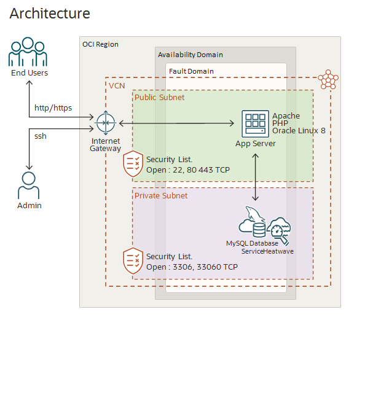

# Build a Marketing Analytics Application Powered by MySQL HeatWave

## Introduction

MySQL HeatWave is a fully managed database service that lets developers quickly develop and deploy secure cloud-native applications using the world’s most popular open-source database. MySQL HeatWave is the only MySQL service with a massively-scalable, integrated, real-time query accelerator, and a fully automated in-database machine learning engine. This service overcomes the limitations of traditional data warehouse, analytics, and machine learning environments that use periodic long-running ETL batch jobs to refresh the data. MySQL HeatWave provides a unified MySQL database platform for OLTP, OLAP and machine learning.

In this workshop, you will first learn to deploy and configure MySQL HeatWave, including its built-in in-memory query accelerator. You will then develop an analytics application allowing retail customers to obtain, visualize, and redeem discount coupons based on their previous purchases. You will build this application using the LAMP (Linux, Apache, MySQL, PHP) stack with step-by-step instructions and sample code, and experience the high performance of MySQL HeatWave to run complex analytics queries.

**Note:** This application code is intended for educational purposes only. It is designed to help developers learn and practice application development skills with MySQL HeatWave on OCI. The code is not designed to be used in a production environment

This workshop will show you how easy it is to create and manage MySQL HeatWave and how MySQL HeatWave enables you to make informed business-critical decisions with real-time insights.

**Watch a demo of the application you will build:**

_Estimated Lab Time:_ 3 hours +

### About Product/Technology

**SINGLE MySQL DATABASE FOR OLTP, OLAP, and ML**

MySQL HeatWave is a fully managed database service, powered by the integrated HeatWave in-memory query accelerator. It’s the only cloud database service that combines transactions, analytics, and machine learning services into one MySQL Database, delivering real-time, secure analytics without the complexity, latency, and cost of ETL duplication. It’s available on OCI, AWS, Azure, and in your data center with Oracle Dedicated Region Cloud@Customer.

MySQL HeatWave is 6.5X faster than Amazon Redshift at half the cost, 7X faster than Snowflake at one-fifth the cost, and 1,400X faster than Amazon Aurora at half the cost.

**Lab Setup**
  

### Objectives

In this lab, you will be guided through the following steps:

- Create MySQL Database for HeatWave (DB System) instance
- Create SSH Key on Oracle Cloud Infrastructure Cloud Shell 
- Create Compute instance
- Connect to DB System using MySQL Shell through Compute Instance and Cloud Shell 
- Load  schema(mysql\_customer\_orders) and data  into  MySQL HeatWave 
- Add HeatWave cluster to DB System
- Load mysql\_customer\_orders data to HeatWave Cluster
- Run queries in HeatWave and MySQL and see the performance improvement in HeatWave!
- Use Bastion to access MySQL Shell for PHP development with VS Code
- Perform development tasks
  - Build LAMP System
  - Load Application from Object Storage
  - Ubnzip application configure and test

### Prerequisites

- An Oracle Free Tier, Paid or LiveLabs Cloud Account
- Some Experience with MySQL Shell - [MySQL Site](https://dev.MySQL.com/doc/MySQL-shell/8.0/en/).

## Task 1: You may now **proceed to the next lab**

## Acknowledgements

- **Author** - Perside Foster, MySQL Solution Engineering

- **Contributors** - Salil Pradhan, Principal Product Manager, Nick Mader, MySQL Global Channel Enablement & Strategy Manager
- **Last Updated By/Date** - Perside Foster, MySQL Solution Engineering, March 2023
