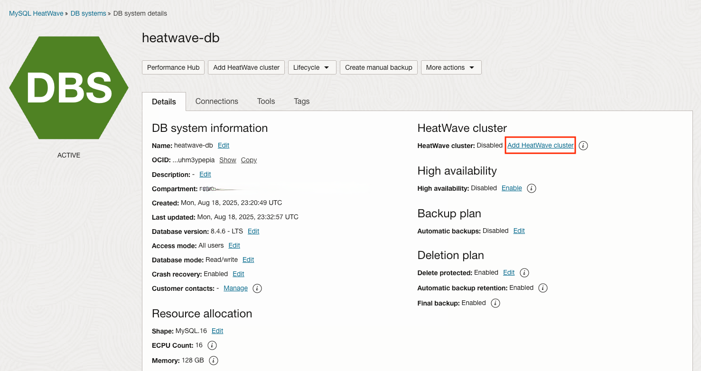
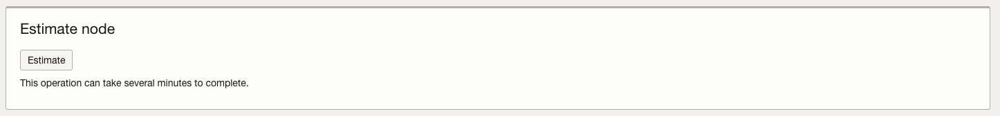
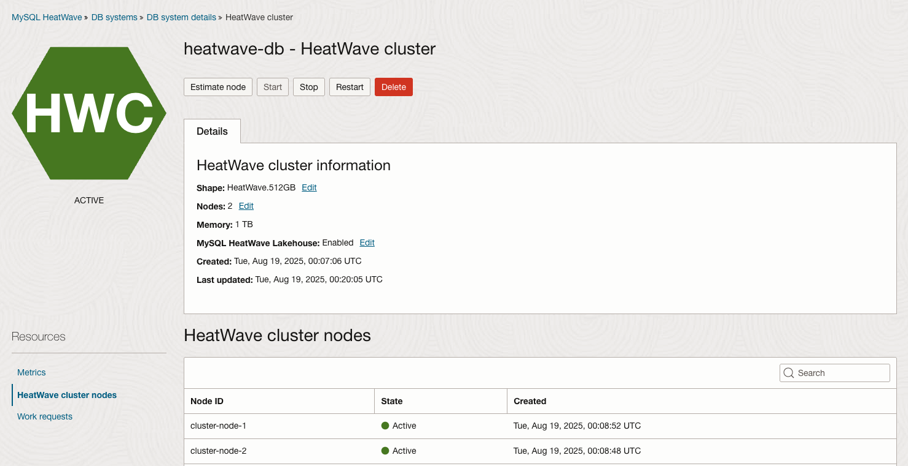
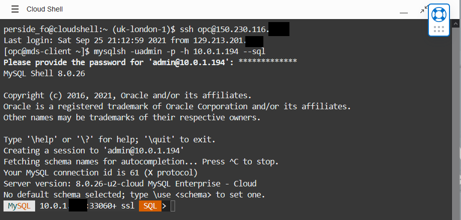

# Load Mysql HeatWave Cluster 

## Introduction

A HeatWave cluster comprise of a MySQL DB System node and two or more HeatWave nodes. The MySQL DB System node includes a plugin that is responsible for cluster management, loading data into the HeatWave cluster, query scheduling, and returning query result.


_Estimated Time:_ 15 minutes


### Objectives

In this lab, you will be guided through the following task:

- Add a HeatWave Cluster to **heatwave-db** MySQL Database System
- Load mysql\_customer\_orders Data into HeatWave
- Completed Lab 3

### Prerequisites

- An Oracle Trial or Paid Cloud Account
- Some Experience with MySQL Shell
- Completed Lab 3


## Task 1: Add a HeatWave Cluster to MDS-HW MySQL Database System

1. Go to Navigation Menu
    Databases
        MySQL

    

2. Click the `heatwave-db` Database System link

    

3. Click on the **Add HeatWave Cluster**.
    

4. Click on the **Select Shape** to select the HeatWave 512GB node shape
    

4. If there is data loaded in the MySQL DB System, you can click on the **Estimate** button to let the system recommend how many HeatWave nodes are needed for your data
    

5. Since we haven't loaded any data to the MySQL DB System, the system won't be able to estimate the number of nodes for us
    

   Here is a sample output of the estimation if there is data loaded in the DB System:
    
   

6. **Set Node Count to 2 for this Lab Click** “Add HeatWave Cluster” to create the HeatWave cluster

    

7. HeatWave creation will take about 10 minutes. From the DB display page scroll down to the Resources section. 

8. Click the **HeatWave** link. Your completed HeatWave Cluster Information section will look like this:
    

## Task 2: Load Schema Data into HeatWave Cluster

1. If not already connected with SSH, connect to Compute instance using Cloud Shell

    (Example: **ssh -i ~/.ssh/id_rsa opc@132.145.17....**)

2. On command Line, connect to MySQL using the MySQL Shell client tool with the following command:

    ```bash
    <copy>mysqlsh -uadmin -p -h 10.0.1... --sql </copy>
    ```

3. Run the following Auto Parallel Load command to load the airportdb tables into HeatWave..

    

    ```bash
    <copy>CALL sys.heatwave_load(JSON_ARRAY('mysql_customer_orders'), NULL);</copy>
    ```

4. The completed load cluster screen should look like this:

    

    

5. Verify that the tables are loaded in the HeatWave cluster. Loaded tables have an AVAIL_RPDGSTABSTATE load status.

    ```bash
    <copy>USE performance_schema;</copy>
    ```

    ```bash
    <copy>SELECT NAME, LOAD_STATUS FROM rpd_tables,rpd_table_id WHERE rpd_tables.ID = rpd_table_id.ID;</copy>
    ```

    

You may now **proceed to the next lab**

## Acknowledgements

- **Author** - Perside Foster, MySQL Solution Engineering

- **Contributors** - Salil Pradhan, Principal Product Manager, Nick Mader, MySQL Global Channel Enablement & Strategy Manager
- **Last Updated By/Date** - Perside Foster, MySQL Solution Engineering, May 2022

