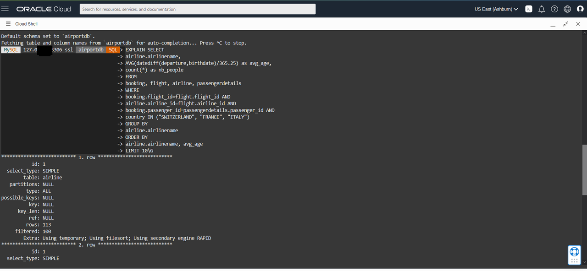
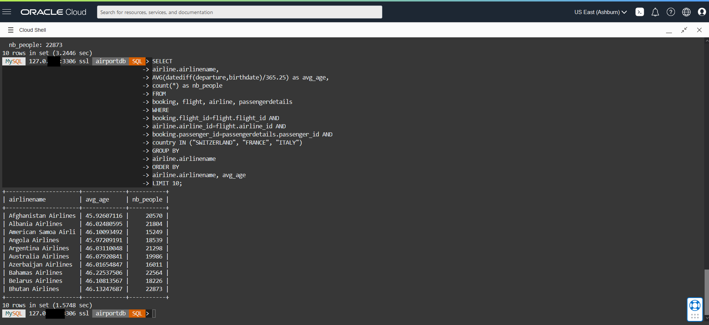
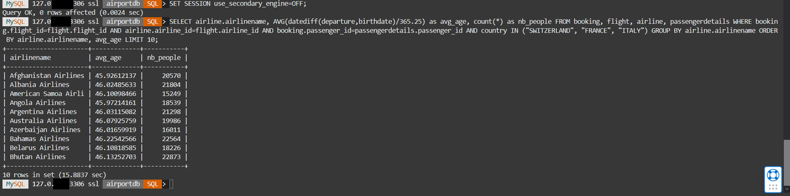

# Run Queries with MySQL Shell

## Introduction

In this lab, you will run queries in HeatWave and in MySQL. You will see the query performance improvements on HeatWave compare to MySQL.

_Estimated Time:_ 10 minutes

### Objectives

In this lab, you will be guided through the following tasks:

- Run Queries with MySQL Shell

### Prerequisites

- An Oracle Trial or Paid Cloud Account
- Some Experience with MySQL Shell
- Completed Lab 4

## Task 1: Run Queries in HeatWave

1. If not already connected with SSH, connect to Compute instance using Cloud Shell

    (Example: **ssh -i ~/.ssh/id_rsa opc@132.145.170...**)

2. On command Line, connect to MySQL using the MySQL Shell client tool with the following command:

    ```bash
    <copy>mysqlsh -uadmin -p -h 10.0.1... --sql </copy>
    ```

3. Change to the mysql\_customer\_orders database

    Enter the following command at the prompt

    ```bash
    <copy>USE mysql_customer_orders;</copy>
    ```

4. **Query 1** - List Custeomer total purchase for the year by month

5. Before running a query, use EXPLAIN to verify that the query can be offloaded to the HeatWave cluster. You should see "Use secondary engine RAPID" in the explain plan. For example:

    ```bash
    <copy>EXPLAIN SELECT
    customer_id,order_datetime purchase_date
        ,unit_price,discount,quantity,order_amount_total,order_discount_total
        ,ROUND((order_amount_total - order_discount_total),1) purchase_total
        ,start_date,end_date,coupon_redemption_status,product_name product_title
        FROM customer_order_product_coupon_view 
        where customer_id=1 and promotion_id =99
        order by order_datetime; 
    </copy>
    ```

    

6. After verifying that the query can be offloaded, run the query and note the execution time. Enter the following command at the prompt:

     ```bash
    <copy>select customer_id,order_datetime purchase_date
        ,unit_price,discount,quantity,order_amount_total,order_discount_total
        ,ROUND((order_amount_total - order_discount_total),1) purchase_total
        ,start_date,end_date,coupon_redemption_status,product_name product_title
        FROM customer_order_product_coupon_view 
        where customer_id=1 and promotion_id =99
        order by order_datetime;
    </copy>
    ```

    

7. To compare the HeatWave execution time with MySQL DB System execution time, disable the `use_secondary_engine` variable to see how long it takes to run the same query on the MySQL DB System. For example:

    Enter the following command at the prompt:

     ```bash
    <copy>SET SESSION use_secondary_engine=OFF;</copy>
    ```

8. Enter the following command at the prompt:

     ```bash
    <copy>select customer_id,order_datetime purchase_date
            ,unit_price,discount,quantity,order_amount_total,order_discount_total
            ,ROUND((order_amount_total - order_discount_total),1) purchase_total
            ,start_date,end_date,coupon_redemption_status,product_name product_title
            FROM customer_order_product_coupon_view 
            where customer_id=1 and promotion_id =99
            order by order_datetime;
    </copy>
    ```

    

9. Keep HeatWave processing enabled

    ```bash
    <copy>SET SESSION use_secondary_engine=ON;</copy>
    ```

You may now **proceed to the next lab**

## Learn More

- [Oracle Cloud Infrastructure MySQL Database Service Documentation](https://docs.cloud.oracle.com/en-us/iaas/MySQL-database)
- [MySQL Database Documentation](https://www.MySQL.com)

## Acknowledgements

- **Author** - Perside Foster, MySQL Solution Engineering

- **Contributors** - Mndy Pang, Principal Product Manager, Salil Pradhan, Principal Product Manager, Nick Mader, MySQL Global Channel Enablement & Strategy Manager
- **Last Updated By/Date** - Perside Foster, MySQL Solution Engineering, March 2023
