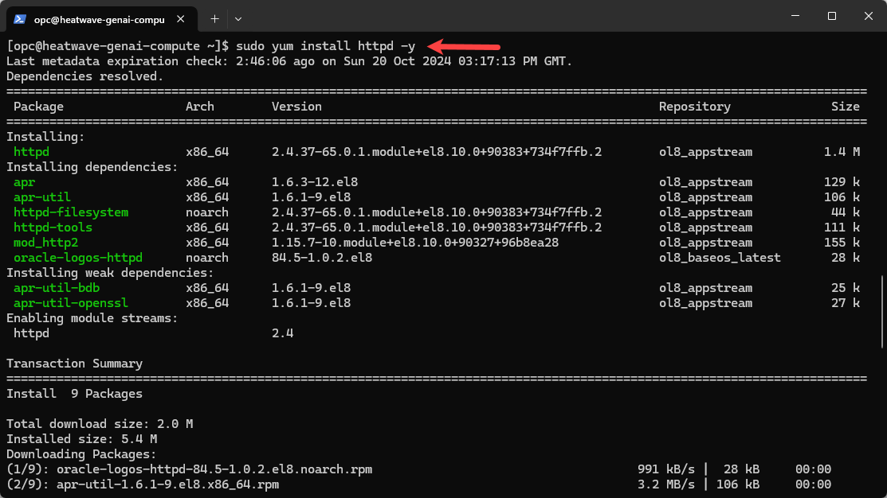
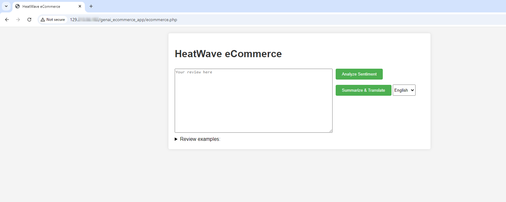
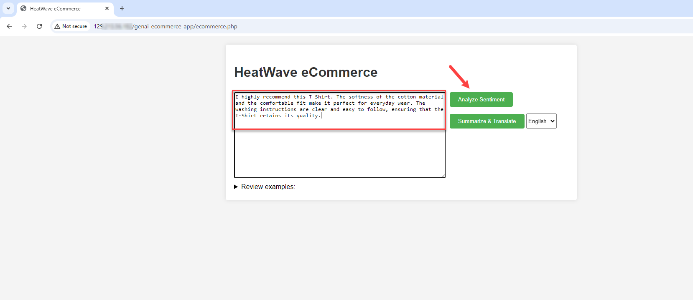
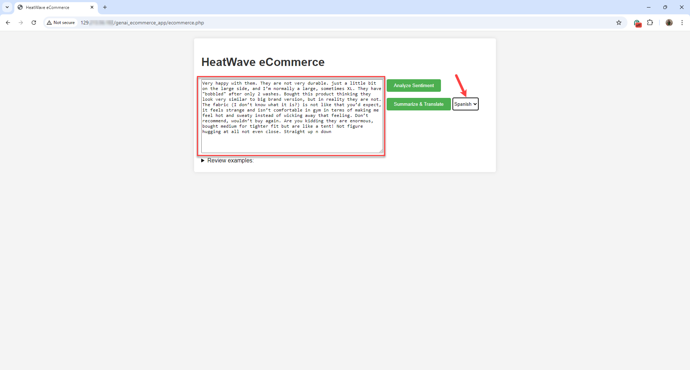

# Build an E-Commerce Application with HeatWave GenAI

## Introduction

You can create new applications by using HeatWave with LAMP stack (Linux, Apache, MySQL, PHP) or any other software stack.

In this lab, you will build a LAMP stack and deploy a prebuilt HeatWave e-commerce application. The in-database LLMs of HeatWave GenAI automatically analyze the sentiment of user-submitted reviews and summarize and translate review summaries into other languages. 

### Objectives

In this lab, you will be guided through the following tasks:

- Connect to the HeatWave instance.
- Set up stored procedures for sentiment analysis.
- Install Apache App Server.
- Install PHP.
- Create HeatWave/PHP connect test app.
- Deploy HeatWave e-commerce application.
- Test HeatWave e-commerce application.

### Prerequisites

- Completed Lab 2.

_Note:_ This application code is intended for educational purposes only. It is designed to help developers learn and practice application development skills with HeatWave on OCI. The code is not designed to be used in a production environment.

_Estimated Time:_ 20 minutes

## Task 1: Connect to the HeatWave Instance

If you are a Linux, Mac, or Windows 10 Powershell user, skip the first step.

1. If you are a Windows user, click the **Start** menu from your windows machine and search **Git Bash**. Select **Git Bash**, which will take you to the Git Bash terminal.

2. From a terminal window on your local system, connect to the compute instance.

    ```bash
    <copy>ssh -i  <PathtoSSHFile> opc@<ComputeIPAddress></copy>
    ```
    Replace the following:

    - PathtoSSHFile: The path where you stored the SSH file in Lab 2, Task 1, Step 10.
    - ComputeIPAddress: The compute IP address that you created in Lab 2, Task 1, Step 13.

    For example: 

    ```bash
    <copy>ssh -i  C:/Users/MyUser/.ssh/ssh-key-2024.key opc@129.198.47.192</copy>
    ```

    

3. Install MySQL Shell on the compute instance.

    ```bash
    <copy>sudo yum install mysql-shell</copy>
    ```

    

4. After MySQL Shell is installed, connect to the endpoint of the DB system.

    ```bash
    <copy>mysqlsh <DBAdminName>@<DBSystemEndpointIPAddress> </copy>
    ```

    Replace the following:
    
    - DBAdminName: The admin name of the DB system that you created in  Lab 1, Task 5, Step 5.
    - DBSystemEndpointIPAddress: The DB system private IP address that you noted in Lab 1, Task 5, Step 19.

    For example:

    ```bash
    <copy>mysqlsh admin@10.0.1.100</copy>
    ``` 

    


## Task 2: Set up Stored Procedures

1. Once you are connected to the HeatWave instance, change to the SQL mode.

    ```bash
    <copy>\sql</copy>
    ```

    

2. Create a new schema and select it.

    ```bash
    <copy>create database ecommerce;</copy>
    ```

    ```bash
    <copy>use ecommerce;</copy>
    ```

    

2. Create a stored procedure for sentiment analysis.

    ```bash
    <copy> delimiter // </copy>
    ```

    ```bash
    <copy>CREATE PROCEDURE SENTIMENT_ANALYSIS_TEXT(
    IN review TEXT,
    OUT processed_sentiment VARCHAR(20)
    ) LANGUAGE JAVASCRIPT AS $$
    let prompt = `Classify the review into NEGATIVE or POSITIVE \n${review}.
    Please provide a single word to describe the sentiment: "POSITIVE" or "NEGATIVE". \nSentiment:`;
    let sentiment = ml.generate(prompt);
    processed_sentiment = sentiment.toUpperCase().search("POSITIVE") != -1 ? "POSITIVE" : "NEGATIVE";
    $$; //
    </copy>
    ```

    

3. Create a stored procedure to summarize and translate reviews.

    ```bash
    <copy>CREATE PROCEDURE SUMMARISE_TRANSLATE_TEXT(
          IN all_reviews TEXT,
          IN language VARCHAR(20),
          OUT processed_summary TEXT
        ) LANGUAGE JAVASCRIPT AS $$
          let summary = ml.generate(all_reviews, {task: "summarization"});
          processed_summary = summary.trim();
           if (language != "english") {  
            let prompt = `Translate the Original Text to ${language}. \n 
                                   - Original Text: "${processed_summary}"\n - ${language} Translation:`;
            let translation = ml.generate(prompt); 
            processed_summary = translation.split('\n')[0];
          }
          $$; //
        </copy>
    ```

    ```bash
    <copy>delimiter ; </copy>
    ```

    


## Task 3: Install Apache App Server

1. Install Apache app server on your compute instance.

    ```bash
    <copy>sudo yum install httpd -y </copy>
    ```
    

2. Enable Apache.

    ```bash
    <copy>sudo systemctl enable httpd</copy>
    ```

3. Start Apache.

    ```bash
    <copy>sudo systemctl restart httpd</copy>
    ```

4. Setup firewall.

    ```bash
    <copy>sudo firewall-cmd --permanent --add-port=80/tcp</copy>
    ```

5. Reload firewall.

    ```bash
    <copy>sudo firewall-cmd --reload</copy>
    ```

    

6. From a web browser, test apache from your local machine using the public IP address of your compute instance. You had noted the public IP address of the compute instance in Lab 2, Task 1, Step 13.

    ```bash
    <copy>http://<ComputePublicIPAddress></copy>
    ```
    For example:

    http://129.153.218.143
    
    

## Task 4: Install PHP

1. Install PHP 7.4 on your compute instance.

    ```bash
    <copy> sudo dnf module install php:7.4 -y</copy>
    ```

    

2. Install associated PHP libraries.

    ```bash
    <copy>sudo yum install php-cli php-mysqlnd php-zip php-gd php-mbstring php-xml php-json -y</copy>
    ```
    
    

3. View  PHP/MySQL libraries.

    ```bash
    <copy>php -m |grep mysql</copy>
    ```

4. View PHP version.

    ```bash
    <copy>php -v</copy>
    ```

5. Restart Apache application server.

    ```bash
    <copy>sudo systemctl restart httpd</copy>
    ```
     
    

6. Create the test PHP file, info.php.

    ```bash
    <copy>sudo nano /var/www/html/info.php</copy>
    ```
    

7. Paste the following code in the info.php file.

    ```bash
    <copy><?php
    phpinfo();
    ?></copy>
    ```

    

8. Click ctrl+O, followed by **Enter** to save the file.

9. Click ctrl+X to exit the editor.

10. From a web browser, test the info.php file.

    ```bash
    <copy>http://<ComputePublicIPAddress>/info.php</copy>
    ```
    For example:

    http://129.153.218.143/info.php
    
    

## Task 5: Create HeatWave/PHP Connect Test App

1. Using Visual Studio Code, allow Apache application server to connect to the HeatWave instance.

    ```bash
    <copy> sudo setsebool -P httpd_can_network_connect 1 </copy>
    ```
    

2. Create config.php file.

    ```bash
    <copy>sudo nano /var/www/html/config.php</copy>
    ```

3. Paste the following code in the config.php file. 

     ```bash
    <copy><?php
    // Database credentials
    define('DB_SERVER', '10.0.1.241');// HeatWave instance IP address
    define('DB_USERNAME', 'admin');
    define('DB_PASSWORD', 'Password123!');
    define('DB_NAME', 'ecommerce');
    //Attempt to connect to HeatWave instance
    $link = mysqli_connect(DB_SERVER, DB_USERNAME, DB_PASSWORD, DB_NAME);
    // Check connection
    if($link === false){
        die("ERROR: Could not connect to the HeatWave instance. " . mysqli_connect_error());
    }
    // Print host information
    echo 'Successfully connected to the HeatWave instance.';
    echo 'Host info: ' . mysqli_get_host_info($link);
    ?>
    </copy>
    ```
    
    

4. Update the following:

    - DB_SERVER: Specify the IP address of the HeatWave instance.
    - DB_USERNAME: Specify administrator username, **admin**, which you had provided in Lab 1, Task 5, Step 5.
    - DB_PASSWORD: Specify the password, which you had provided in Lab 1, Task 5, Step 5.
    - DB_NAME: Specify the schema, **ecommerce**, which you had provided in Lab 4, Task 2, Step 2.

    

5. Click ctrl+O, followed by **Enter** to save the file.

6. Click ctrl+X to exit the editor.

7. From a web browser, test the config.php file. You should be able to connect to the HeatWave instance.

    ```bash
    <copy>http://<ComputePublicIPAddress>/config.php</copy>
    ```
    For example:

    http://129.153.218.143/config.php
    
    

8. Create the dbtest.php file.

    ```bash
    <copy>sudo nano /var/www/html/dbtest.php</copy>
    ```
    

9. Paste the following code in the dbtest.php file. 

    ```bash
    <copy>
    <?php
    require_once "config.php";
    $query = "SELECT user FROM mysql.user;";
    if ($stmt = $link->prepare($query)) {
    $stmt->execute();
    $stmt->bind_result($user);
    echo "<table>";
        echo "<tr>";
        echo "<th>User</th>";
    echo "</tr>";

    while ($stmt->fetch()) {
        echo "<tr>";
        echo "<td>" . $user ."</td>";
        echo "</tr>";
    }

    $stmt->close();
    }
    ?>
    </copy>
    ```
   
    

10. Click ctrl+O, followed by **Enter** to save the file.

11. Click ctrl+X to exit the editor.

12. From a web browser, test the dbtest.php file. You should be able to see the MySQL users in the instance.

    ```bash
    <copy>http://<ComputePublicIPAddress>/dbtest.php</copy>
    ```
    For example:

    http://129.153.218.143/dbtest.php
    
    

## Task 6: Deploy HeatWave E-Commerce Application

1. Go to the development folder.

    ```bash
    <copy>cd /var/www/html</copy>
    ```

2. Download the application code.

    ```bash
    <copy>sudo wget https://objectstorage.us-ashburn-1.oraclecloud.com/p/U-dg-MFHKdTwWwJ2yQhpI7rk2gXqVm_sYr7H-Do6m1dwtVjZo1mwgtudFUXqZDzY/n/mysqlpm/b/heatwave_genai_ecommerce/o/genai_ecommerce_app.zip</copy>
    ```
    

3. Unzip the application code.

    ```bash
    <copy>sudo unzip genai_ecommerce_app.zip</copy>
    ```
4. Go to the app folder.

    ```bash
    <copy>cd genai_ecommerce_app</copy>
    ```

5. View the files in the application folder.

    ```bash
    <copy>ls -l</copy>
    ```

    You should see the following two files:

    - ecommerce.php
    - HeatWaveRAG.php

6. Open the ecommerce.php file.

    ```bash
    <copy>sudo nano ecommerce.php</copy>
    ```

7. Locate the following line in the ecommerce.php file:

    ```bash
    <copy>$rag = new HeatWaveRAG('your_mysql_host', 'your_username', 'your_password', 'ecommerce');</copy>
    ```
    

8.  Replace the following:

    - **your\_mysql\_host**: Specify the IP address of the HeatWave instance, **heatwave-genai-dbs**. For example, 10.0.0.123.
    - **your\_username**: Specify the username you had used for the HeatWave instance. If you arefollowing the lab instructions, specify **admin**.
    - **your\_password**: Specify the pasword you used when creating the HeatWave instance.
    
    Note to not change **ecommerce** as it is the schema name that we had specified for the vector store.

    

9. Click ctrl+O, followed by **Enter** to save the file.

10. Click ctrl+X to exit the editor.

## Task 7: Test HeatWave E-Commerce Application

1. From your web browser, access the ecommerce.php file. 

    ```bash
    <copy>http://<ComputePublicIPAddress>/genai_ecommerce_app/ecommerce.php</copy>
    ```

    For example:
    
    http://129.153.218.143/genai_ecommerce_app/ecommerce.php

2. You'll see a ecommerce page  with a text input field where you can enter reviews. The application will send your review to HeatWave GenAI and analyze the sentiment.

    

3. Enter your review into the input field and click **Analyze Sentiment**. 

    For example:

    ```bash
    <copy>I highly recommend this T-Shirt. The softness of the cotton material and the comfortable fit make it perfect for everyday wear. The washing instructions are clear and easy to follow, ensuring that the T-Shirt retains its quality. </copy>
    ```

    ```bash
    <copy>The T-Shirt is made from high-quality cotton and is perfect for casual outings. However, the lack of bleach instructions may be a concern for some customers. Overall, I would rate it 3 out of 5 stars. </copy>
    ```

    ```bash
    <copy>This T-Shirt is not up to the mark. The material is not durable enough and the washing instructions are not clear. I would not recommend this product to anyone looking for a long-lasting and easy-to-care-for T-Shirt. </copy>
    ```

    

4. HeatWave GenAI analyzes your review and tells you whether the review was positive or negative review.

    

5. If you want to generate a summary of all reviews in any other language, enter the reviews in the input field, select your preferred langauge from the drop down list, and click **Summarize & Translate**.

    ```bash
    <copy>Very happy with them. They are not very durable. just a little bit on the large side, and I’m normally a large, sometimes XL. They have "bobbled" after only 2 washes. Bought this product thinking they look very similar to big brand version, but in reality they are not. The fabric (i don’t know what it is?) is not like that you’d expect, it feels strange and isn’t comfortable in gym in terms of making me feel hot and sweaty instead of wicking away that feeling. Don’t recommend, wouldn’t buy again. Are you kidding they are enormous, bought medium for tighter fit but are like a tent! Not figure hugging at all not even close. Straight up n down.</copy>
    ```

    

6. HeatWave GenAI summarizes and translates your review in your preferred language.

    

You may now **proceed to the next lab**.


## Learn More

- [HeatWave User Guide](https://dev.mysql.com/doc/heatwave/en/)

- [HeatWave GenAI Technical Brief](https://www.oracle.com/a/ocom/docs/heatwave-genai-technical-brief.pdf)

- [HeatWave on OCI User Guide](https://docs.oracle.com/en-us/iaas/mysql-database/index.html)

- [MySQL Documentation](https://dev.mysql.com/)

## Acknowledgements

- **Author** - Aijaz Fatima, Product Manager 
- **Contributors** - Onur Kocberber, Director of Development, HeatWave
- **Last Updated By/Date** - Aijaz Fatima, Product Manager, April 2025