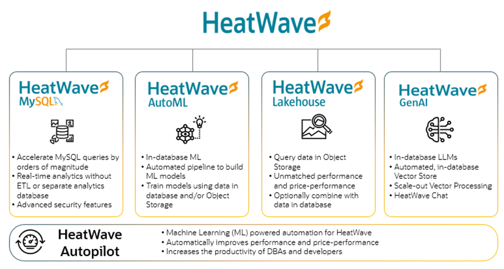

# Introduction

HeatWave GenAI lets organizations easily process and analyze vast amounts of proprietary unstructured documents in Object Storage. They can develop turnkey AI-powered applications with enhanced performance and enterprise-grade data security. HeatWave GenAI supports in-database large language models (LLMs), an automated, in-database vector store, scale-out vector processing, and has the ability to have contextual conversations in natural language. 

HeatWave GenAI is unique because it seamlessly integrates large language models (LLMs) and embedding generation within the database, eliminating the need for external services. This integration enhances performance and security, simplifies application complexity, and reduces costs as it runs on CPUs. HeatWave GenAI integrates seamlessly with other in-database HeatWave capabilities such as machine learning, analytics, and Lakehouse, opening up a new class of applications. With HeatWave GenAI, you can effortlessly generate new content, speed up manual or repetitive tasks like summarizing large documents, and engage in natural language interactions.

### About the HeatWave E-Commerce Application

This application provides a user-friendly web interface for interacting with HeatWave GenAI. It enables you to submit a review and then analyze the sentiment of submitted review. You can also summarize and translate review summaries into other languages.

#### HeatWave E-Commerce Application Architecture

For the e-commerce application, in the front end you need a web browser with HTML and CSS for a responsive interface. From the web browser you can interact with the web server, Apache, on which we will run PHP files. The database is HeatWave, which supports generative AI capabilities, making it easy for users to leverage the power of HeatWave GenAI capabilities through a simple interface.

The following diagram provides details of how the different components of the HeatWave e-commerce application are structured and how they interact with each other. The arrows indicate the flow of data and interactions between the components. For example:

- The web browser interacts with the web server.
- The PHP Runtime manages the ecommerce.php and HeatWave RAG class.
- The HeatWave RAG class interacts with the HeatWave instance.

    
    
## About this Workshop

In this LiveLab, you will create a HeatWave instance and a compute instance. Subsequently, you will use HeatWave GenAI to perform sentiment analysis of product reviews and summarize and translate product review summary in your preferred language.

_Estimated Time:_ 1.5 hours

## About Product/Technology

HeatWave is a fully managed cloud service that enables organizations to efficiently run analytics, transaction processing, machine learning, and generative AI using a single service without the need for ETL. Its scale-out architecture is designed to process data stored in Object Storage and MySQL databases, delivering industry-leading performance and price-performance. HeatWave can process structured, semi-structured, and unstructured data in Object Storage. It provides the capability to create a vector store from Object Storage files and enables enterprises to utilize LLMs and generative AI on their internal content. This opens the door to a new class of applications built with HeatWave, including the ability to interact with HeatWave using natural language. HeatWave is available on OCI, AWS, and Azure.

The following diagram illustrates HeatWave components at a glance.

## Objectives

In this lab, you will be guided through the following steps:

1. Create a HeatWave instance.
2. Create a Compute instance.
3. Build an e-commerce application with HeatWave GenAI.

## Prerequisites

Please make sure you can sign in to your Oracle Cloud Paid Account.

## Learn More

- [HeatWave User Guide](https://dev.mysql.com/doc/heatwave/en/)

- [HeatWave GenAI Technical Brief](https://www.oracle.com/a/ocom/docs/heatwave-genai-technical-brief.pdf)

- [HeatWave on OCI User Guide](https://docs.oracle.com/en-us/iaas/mysql-database/index.html)

- [MySQL Documentation](https://dev.mysql.com/)

## Acknowledgements

- **Author** - Aijaz Fatima, Product Manager
- **Contributors** - Mandy Pang, Senior Principal Product Manager
- **Last Updated By/Date** - Aijaz Fatima, Product Manager, April 2025
