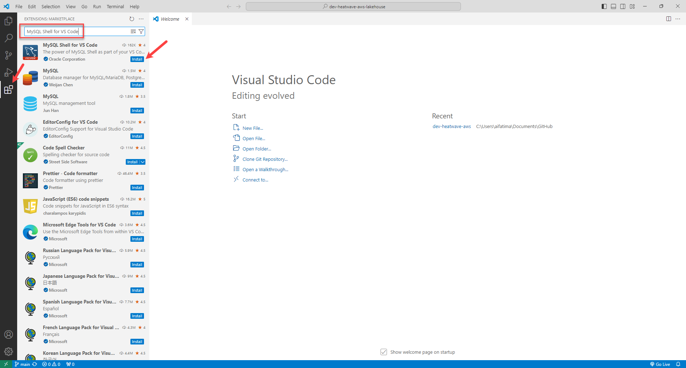
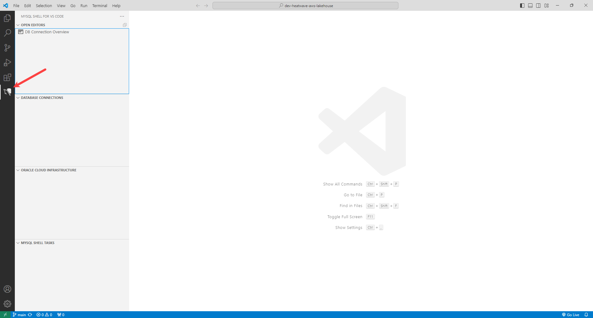
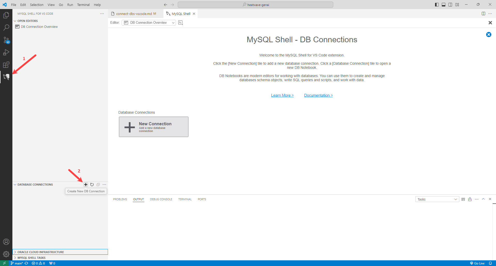
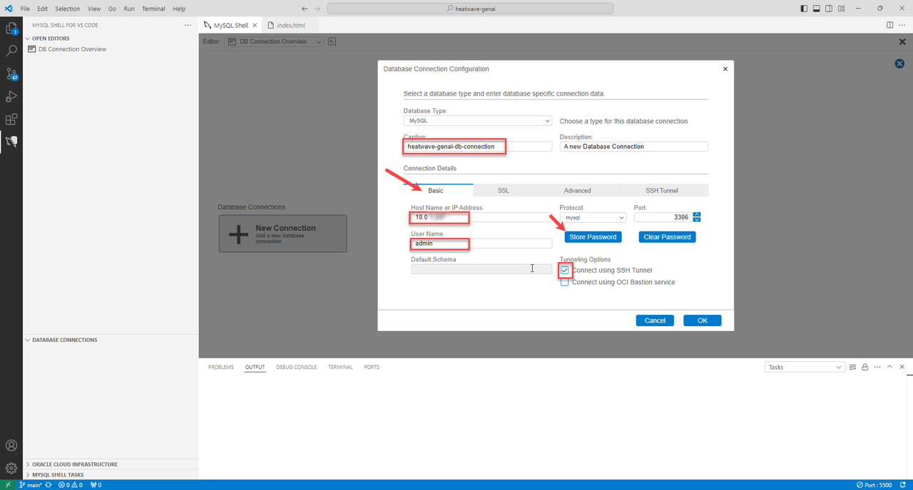
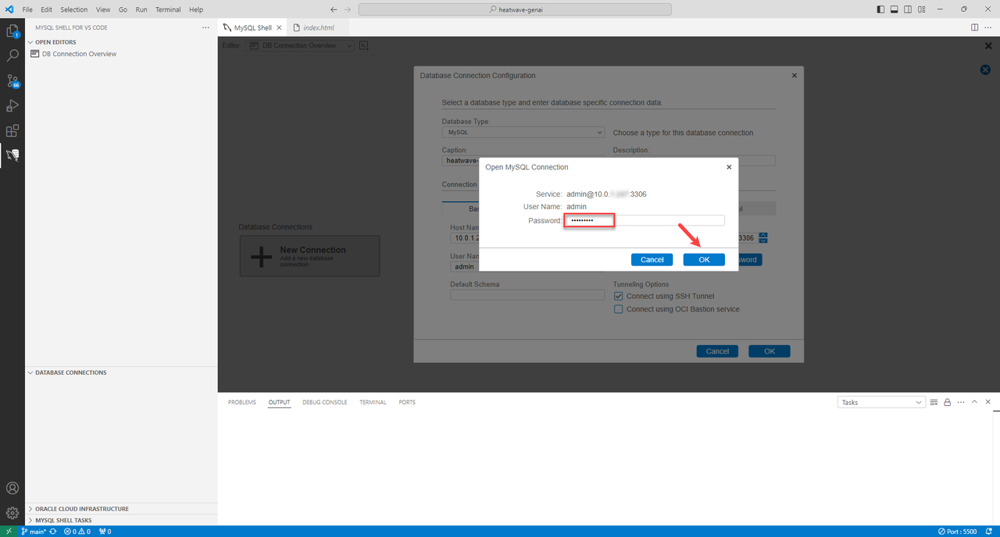
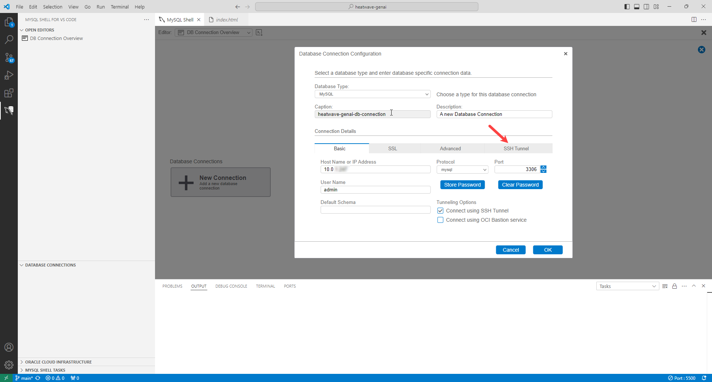
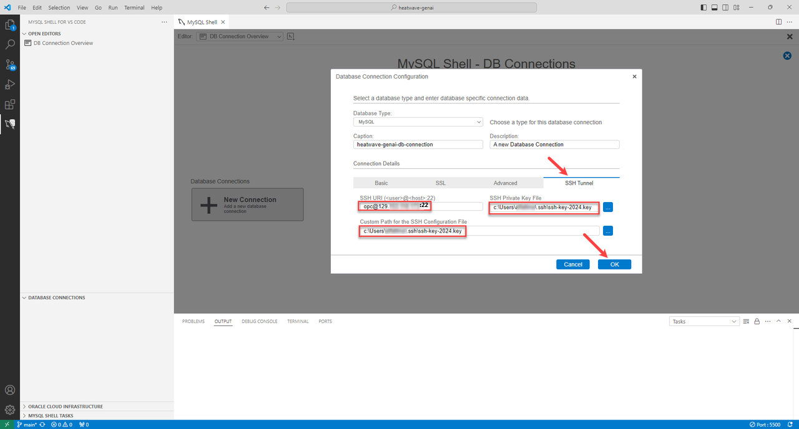
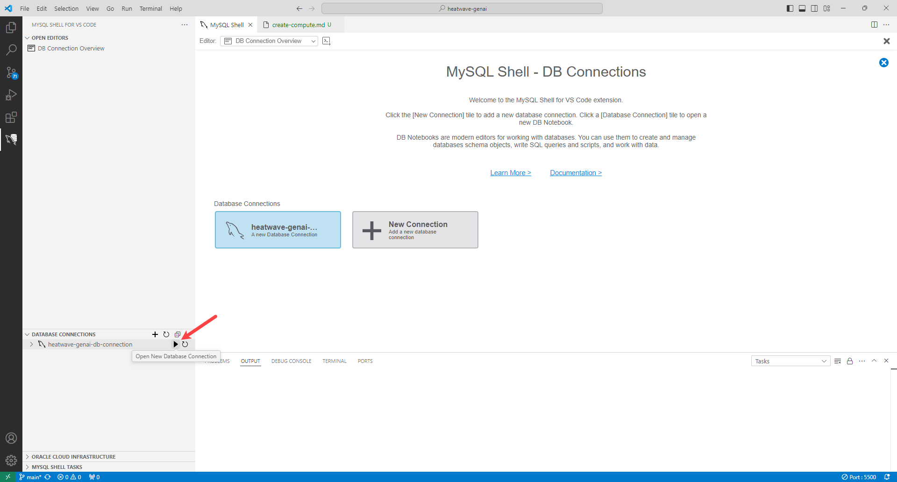
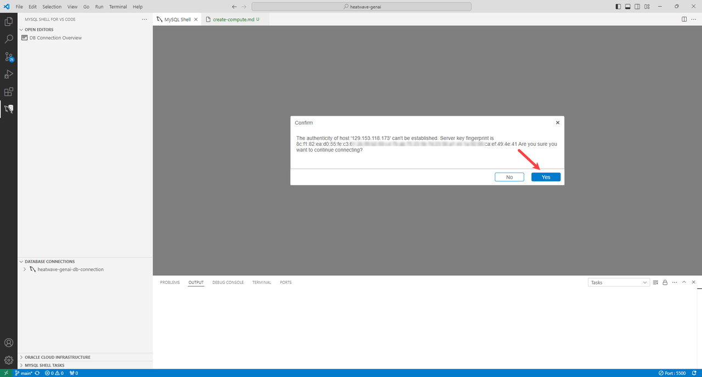
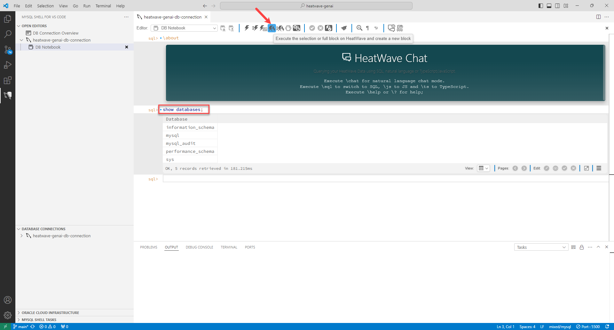

# Connect to the HeatWave Instance

## Introduction

In this lab you will setup MySQL Shell for Visual Studio Code, and connect to the HeatWave instance you created in Lab 1 from VS Code.

_Estimated Time:_ 30 minutes

### Objectives

In this lab, you will be guided through the following tasks:

- Setup MySQL Shell for Visual Studio Code.
- Connect to the OCI tenancy.
- Connect to the HeatWave instance.

### Prerequisites

- Your  HeatWave instance  and Compute instance exist.
- Visual Studio Code is installed. If you do not have it installed, download and install from [here](https://code.visualstudio.com/download).

## Task 1: Setup MySQL Shell for Visual Studio Code

1. Launch **Visual Studio Code**.

2. Click **Extensions** and search for **MySQL Shell for VS Code**.

3. Click **Install**.
    

4. After MySQL Shell for VS Code is installed, you can see the following icon:
    


## Task 2: Connect to the HeatWave instance

1. In Visual Studio Code, click the **MySQL Shell for VS Code** icon in the activity bar.

2. Click **Create New DB Connection**.

    

3. In the **Database Connection Configuration** dialog, enter/select the following:

    - **Database Type**: **MySQL**

    - **Caption**:

        ```bash
          <copy>heatwave-genai-db-connection</copy>
         ```

4. Under **Connection Details**, in the **Basic** tab, enter the following:

    - **Hostname or IP Address**: Private IP address of the DB system. Provided  in the Sandbox Reservation information.

    - **User Name**: 

        ```bash
        <copy>admin</copy>
        ```

    - **Tunneling Options**: Select **Connect Using SSH Tunnel**.

        

5. Click **Store Passsword**, and enter the password.

    

6. Under **Connection Details**, click **SSH Tunnel**.

    

7. Enter the following details:

    - **SSH URI**: opc@ComputeIPAddress:22 . Replace ComputeIPAddress with the Compute public IP address from the Sandbox Reservation information.    
        - **opc** is the default username for Oracle Cloud Infrastructure (OCI) compute instances
        - **ComputeIPAddress** is the Compute public IP address from the Sandbox Reservation information
        - **:22** is the standard SSH port

    - **SSH Private Key File**: Browse to the SSH folder and select the SSH key you created when you reserved workshop

    - **Custom Path for the SSH Configuration File**: Browse to the SSH folder and select the SSH key you created when you reserved workshop

        

8. Click **OK**.

9. Under **DATABASE CONNECTIONS**, click **Open New Database Connection** icon next to your HeatWave instance to connect to it. 

    

10. Click **Yes** to confirm your connection request. 

    

11. Check whether you are connected to the HeatWave instance by entering the following command and clicking **Execute the selection or full block on HeatWave and create a new block**.

    ```bash
    <copy>show databases;</copy>
    ```

    

    You may now **proceed to the next lab**.

## Learn More

- [HeatWave User Guide](https://dev.mysql.com/doc/heatwave/en/)

- [HeatWave on OCI User Guide](https://docs.oracle.com/en-us/iaas/mysql-database/index.html)

- [MySQL Documentation](https://dev.mysql.com/)

## Acknowledgements

- **Author** - Aijaz Fatima, Product Manager
- **Contributors** - Mandy Pang, Senior Principal Product Manager
- ***Last Updated By/Date** - Perside Lafrance Foster, Open Source Principal Partner Solution Engineer, December 2025