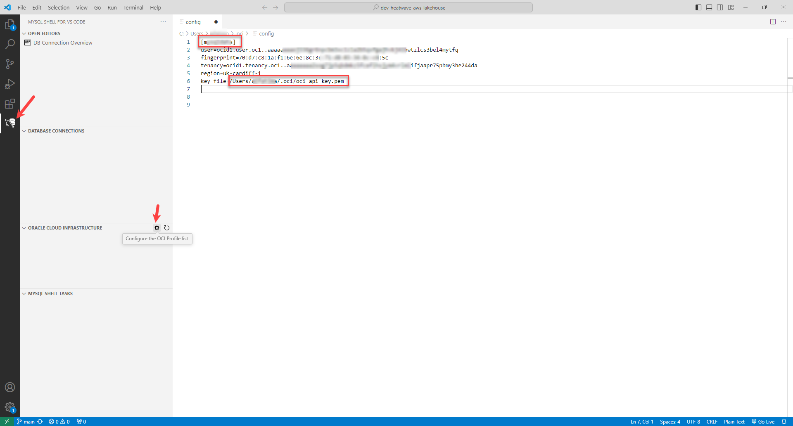
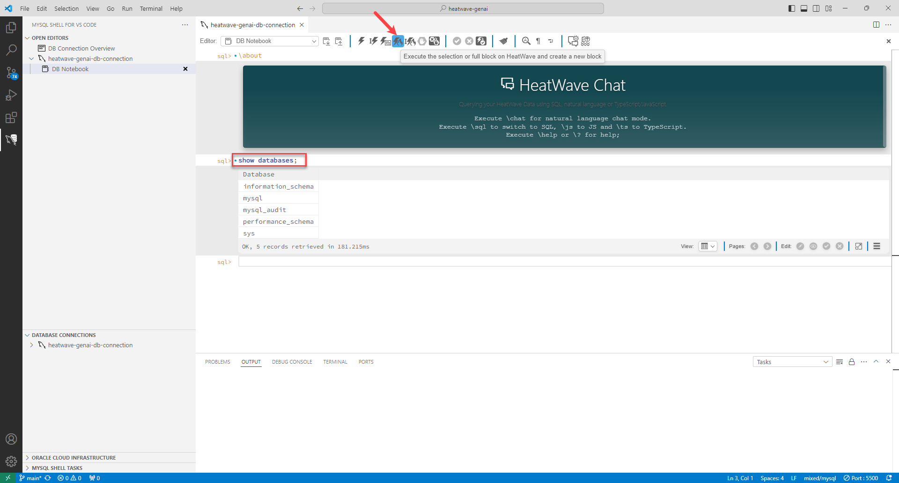

# Connect to the HeatWave Instance

## Introduction

In this lab you will setup MySQL Shell for Visual Studio Code, and connect to the HeatWave instance you created in Lab 1 from VS Code.

_Estimated Time:_ 30 minutes

### Objectives

In this lab, you will be guided through the following tasks:

- Setup MySQL Shell for Visual Studio Code.
- Connect to the OCI tenancy.
- Connect to the HeatWave instance.

### Prerequisites

- Your  HeatWave instance  and Compute instance exist.
- Visual Studio Code is installed. If you do not have it installed, download and install from [here](https://code.visualstudio.com/download).

## Task 1: Setup MySQL Shell for Visual Studio Code

1. Launch **Visual Studio Code**.

2. Click **Extensions** and search for **MySQL Shell for VS Code**.

3. Click **Install**.
    

4. After MySQL Shell for VS Code is installed, you can see the following icon:
    


<!-- ## Task 2:  Connect to the OCI tenancy

Before you can get started, you must set up a DB Connection to the HeatWave instance on the Oracle Cloud Infrastructure (OCI). This has to be done once since MySQL Shell for VS Code will store all registered DB connections.

1. On the right side of the OCI Console, click **Profile**, and select **My Profile**.

    

2.  Under **Resources**, click **API keys**, and click **Add API key**.

3. Click **Download private key**.
    
    1. Store the API key in a .oci folder inside your home directory.

    2. Rename the API key to oci\_api\_key.pem.

        ```bash
        <copy>oci_api_key.pem</copy>
        ```

        

4. Switch to OCI Console, and in the **Add API key** panel, click **Add**.
    
    

5. Copy the configuration file text and switch to VS Code.

    

6. In VS Code, select the **MySQL Shell for VS Code** extension.

7. Click **Configure the OCI Profile List** in the **ORACLE CLOUD INFRASTRUCTURE** view, and paste the configuration file text into the config file.

    - Rename the top section from [DEFAULT] to the name of the tenancy, [TenancyName]

    - Update the path to the API Key you had stored in your home directory.

    

8. Close the file and reload the **ORACLE CLOUD INFRASTRUCTURE** view. Within a couple of minutes, you can browse the resources of your OCI tenancy.

     -->

## Task 2: Connect to the HeatWave instance

1. In Visual Studio Code, click the **MySQL Shell for VS Code** icon in the activity bar.

2. Click **Create New DB Connection**.

    

3. In the **Database Connection Configuration** dialog, enter/select the following:

    - **Database Type**: **MySQL**

    - **Caption**:

        ```bash
          <copy>heatwave-genai-db-connection</copy>
         ```

4. Under **Connection Details**, in the **Basic** tab, enter the following:

    - **Hostname or IP Address**: Private IP address of the DB system that you had noted in Lab 1, Task 5, Step 19.

    - **User Name**: 

        ```bash
        <copy>admin</copy>
        ```

    - **Tunneling Options**: Select **Connect Using SSH Tunnel**.

        

5. Click **Store Passsword**, and enter the password.

    

6. Under **Connection Details**, click **SSH Tunnel**.

    

7. Enter the following details:

    - **SSH URI**: opc@ComputeIPAddress. Replace ComputeIPAddress with the IP address of the compute that you had noted in Lab 2, Task 1, Step 13.

    - **SSH Private Key File**: Browse to the SSH folder and select the SSH key

    - **Custom Path for the SSH Configuration File**: Browse to the SSH folder and select the SSH key

        

8. Click **OK**.

9. Under **DATABASE CONNECTIONS**, click **Open New Database Connection** icon next to your HeatWave instance to connect to it. 

    

10. Click **Yes** to confirm your connection request. 

    

11. Check whether you are connected to the HeatWave instance by entering the following command and clicking **Execute the selection or full block on HeatWave and create a new block**.

    ```bash
    <copy>show databases;</copy>
    ```

    

You may now **proceed to the next lab**.

## Learn More

- [HeatWave User Guide](https://dev.mysql.com/doc/heatwave/en/)

- [HeatWave on OCI User Guide](https://docs.oracle.com/en-us/iaas/mysql-database/index.html)

- [MySQL Documentation](https://dev.mysql.com/)

## Acknowledgements

- **Author** - Aijaz Fatima, Product Manager
- **Contributors** - Mandy Pang, Senior Principal Product Manager
- ***Last Updated By/Date** - Perside Lafrance Foster, Open Source Principal Partner Solution Engineer, December 2025