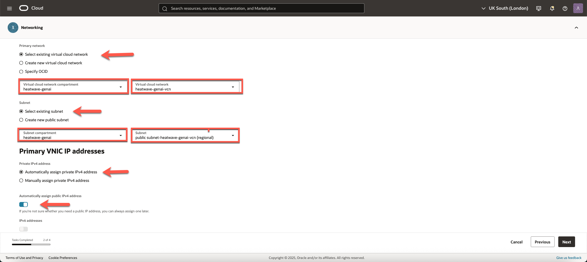
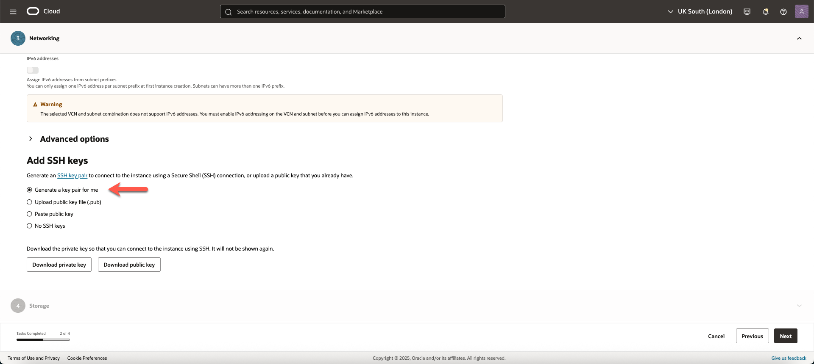

# Create Linux Compute Instance


## Introduction

Oracle Cloud Infrastructure Compute lets you provision and manage compute hosts, known as instances . You can create instances as needed to meet your compute and application requirements. After you create an instance, you can access it securely from your computer or cloud shell.


**Create Linux Compute Instance**

In this lab, you use Oracle Cloud Infrastructure to create an Oracle Linux instance. 

_Estimated Time:_ 10 minutes

### Objectives

In this lab, you will be guided through the following tasks:

- Create Compute Instance

### Prerequisites

- An Oracle Free Tier or Paid Cloud Account
- You have completed Lab 2.

## Task 1: Create Compute Instance

You need a compute instance to connect to the Heatwave instance. 

1. Click the **Navigation menu** in the upper left, navigate to **Compute**, and under **Compute**, select **Instances**.
  
    

2. Ensure **heatwave-genai** compartment is selected, and click click  **Create instance**. 

     

3. On **Create compute instance** page, enter the name of the compute instance.

    ```bash
    <copy>heatwave-genai-compute</copy>
    ```

4. Ensure **heatwave-genai** compartment is selected.

    

5. In the **Placement** field, keep the selected **Availability Domain**.

6. In the **Image and Shape** field, keep the selected image, **Oracle Linux 8**, and the default shape. 

    

7. In **Primary VNIC information** field, ensure the following settings are selected:

    - **Primary Network**: **heatwave-genai-vcn**

    - **Subnet**: **public-subnet-heatwave-genai-vcn**

8. In **Primary VNIC IP addresses** field, ensure the following settings are selected:

    - **Private IPv4 address**: **Automatically assign private IPv4 address**

    - **Public IPv4 address**: Selected

    

9. In **Add SSH keys** field, click **Generate a key pair for me**.
  
    

10.  Save the downloaded SSH keys in your .ssh folder. and rename the key. For example:

    ```bash
    <copy>ssh-key-2024</copy>
    ```

     

11. Click '**Create**' to create your compute instance. 

12. The compute instance will be ready to use after a few minutes. The state is shown as **Provisioning** while the instance is creating.

13. When the compute instance is ready to use, the state is shown as **Running**. *Note* the **Public IP address** and the **Username**.

    

You may now **proceed to the next lab**.

## Acknowledgements

- **Author** - Aijaz Fatima, Product Manager
- **Contributors** - Mandy Pang, Senior Principal Product Manager
- **Last Updated By/Date** - Aijaz Fatima, Product Manager, September 2024
