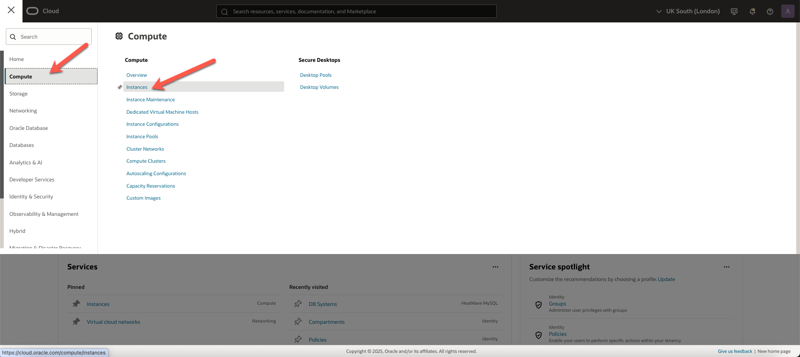
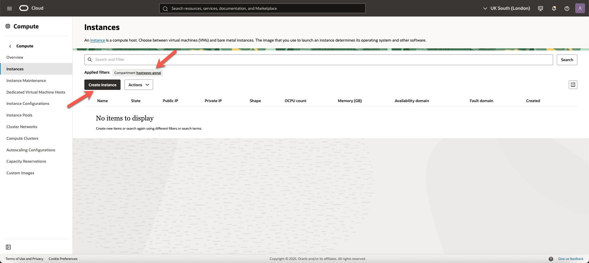

# Create a Compute Instance


## Introduction

Oracle Cloud Infrastructure Compute lets you provision and manage compute hosts, known as instances. You can create instances as needed to meet your compute and application requirements. After you create an instance, you can access it securely from your computer or cloud shell.


**Create Linux Compute Instance**

In this lab, you use Oracle Cloud Infrastructure to create an Oracle Linux instance. 

_Estimated Time:_ 10 minutes

### Objectives

In this lab, you will be guided through the following tasks:

- Create Compute Instance

### Prerequisites

- You have completed Lab **Create a HeatWave instance** .

## Task 1: Create a Compute Instance

You need a compute instance to connect to the HeatWave instance. 

1. Click the **Navigation menu** in the upper left, navigate to **Compute**, and under **Compute**, select **Instances**.
  
    

2. Ensure **heatwave-genai** compartment is selected, and click **Create instance**. 

     

3. On **Create compute instance** page, enter the name of the compute instance.

    ```bash
    <copy>heatwave-genai-compute</copy>
    ```

4. Ensure **heatwave-genai** compartment is selected.

    

5. In the **Placement** field, keep the selected **Availability domain**.

6. In the **Image and Shape** field, keep the selected image, **Oracle Linux 9**, and the default shape, and click **Next**.

    

7. Under **Security** panel, click **Next**.

8. Under **Networking** panel, in **Primary network** field, select **Select existing virtual cloud network**, and ensure the following settings are selected:

    - **Virtual cloud network compartment**: **heatwave-genai**

    - **Virtual cloud network**: **heatwave-genai-vcn**

9. Under **Subnet**, ensure the following are selected:

    - **Subnet compartment**: **heatwave-genai**

    - **Subnet**: **public-subnet-heatwave-genai-vcn**

10. In **Primary VNIC IP addresses** field, ensure the following settings are selected:

    - **Private IPv4 address**: **Automatically assign private IPv4 address**

    - **Automatically assign public IPv4 address**: Enabled

    

11. In **Add SSH keys** field, select **Generate a key pair for me**.
  
    

12.  Click **Download private key** and save in your ssh folder, and rename the key. For example:

    ```bash
    <copy>ssh-key-2025</copy>
    ```

     

13. Click **Next**, and then **Next**.

14. Click **Create** to create your compute instance. 

13. The compute instance will be ready to use after a few minutes. The state is shown as **Provisioning** while the instance is creating.

14. When the compute instance is ready to use, the state is shown as **Running**. *Note* the **Public IP address** and the **Username**.

    

You may now **proceed to the next lab**.

## Learn More

- [HeatWave User Guide](https://dev.mysql.com/doc/heatwave/en/)

- [HeatWave GenAI Technical Brief](https://www.oracle.com/a/ocom/docs/heatwave-genai-technical-brief.pdf)

- [HeatWave on OCI User Guide](https://docs.oracle.com/en-us/iaas/mysql-database/index.html)

- [MySQL Documentation](https://dev.mysql.com/)

## Acknowledgements

- **Author** - Aijaz Fatima, Product Manager
- **Contributors** - Mandy Pang, Senior Principal Product Manager
- ***Last Updated By/Date** - Perside Lafrance Foster, Open Source Principal Partner Solution Engineer, December 2025
