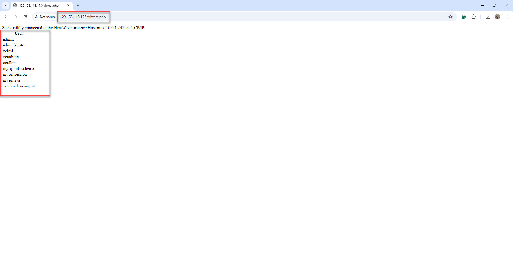
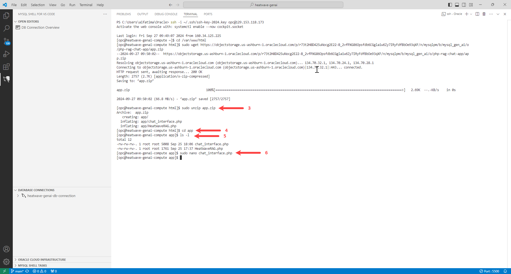

# Build HeatWave RAG Chat Application

## Introduction

HeatWave seamlessly integrates with existing Oracle services, such as Oracle Analytics Cloud, making it ideal for development tasks. Additionally, you can use HeatWave to create new applications using the LAMP stack (Linux, Apache, MySQL, PHP) or other software stacks.

In this lab you will build a LAMP stack and deploy a prebuilt  HeatWave RAG Chat Application. The application  is designed to make interacting with HeatWave GenAI Retrieval-Augmented Generation (RAG) capabilities straightforward and user-friendly.

**Note:** The application code in this lab is intended for educational purposes only. It is designed to help developers learn and practice application development skills with HeatWave. The code is not designed to be used in a production environment

### Objectives

In this lab, you will be guided through the following tasks:

- Connect to compute instance using VS Code and SSH
- Install Apache Server.
- Install PHP.
- Create HeatWave/PHP connect test app.
- Deploy HeatWave RAG chat application.
- Test HeatWave RAG chat application.

### Prerequisites

- Completed Lab **Perform Retrieval Augmented Generation**.

### About the HeatWave RAG Chat Application

This application provides a user-friendly web interface for interacting with HeatWave GenAI Retrieval-Augmented Generation (RAG) capabilities. It enables you to ask questions and receive AI-generated responses based on the information stored in HeatWave.

#### HeatWave RAG Chat Application Architecture Diagram

The following diagram provides details of how the different components of the HeatWave RAG chat application are structured and how they interact with each other. The arrows indicate the flow of data and interactions between the components. For example:

- The web browser interacts with the web server.
- The PHP Runtime manages the chat interface and HeatWave RAG class.
- The HeatWave RAG class interacts with the HeatWave instance.
- The chat interface interacts with the PHP session for storing chat history.

    

#### Key Features

- Simple Web Interface: Easy-to-use chat interface for asking questions and viewing responses.
- RAG Integration: Utilizes MySQL HeatWave's RAG functionality to generate informed responses.
- Chat History: Maintains a session-based chat history for continuous conversations.
- Citation Display: Shows relevant citations for the AI's responses, enhancing transparency and trustworthiness.
- Clear History Option: Allows users to reset the chat history as needed.

#### Overview

- Backend: Linux, Apache, PHP, and HeatWave integration
- Frontend: HTML and CSS for a responsive design
- Data Storage: HeatWave Lakehouse and HeatWave for vector embeddings and RAG processing

This solution bridges the gap between complex database operations and user-friendly interaction, making it easy for users to leverage the power of HeatWave GenAI capabilities through a simple chat interface.

_Note:_ This application code is intended for educational purposes only. It is designed to help developers learn and practice application development skills with HeatWave on OCI. The code is not designed to be used in a production environment.

_Estimated Time:_ 20 minutes

## Task 1: Connect to Compute instance using VS Code and SSH

1. In Visual Studio Code, in the menu bar, click **Terminal**, and then **New Terminal**.

    

2. Click **Maximize Panel Size** to set the terminal to full screen.

    

3. Connect to the compute instance from the terminal using SSH. 

    ```bash
    <copy>ssh -i ~/.ssh/<SSHKeys> opc@<ComputePublicIPAddress></copy>
    ```
    - You had stored the ssh keys in Lab 2, Task 1, Step 10.
    - You had noted the public IP address o the compute instance in Lab 2, Task 1, Step 13.

    For example:

    ```bash
    <copy>ssh -i ~/.ssh/ssh-key-2024.key opc@129.153.218.143</copy>
    ```
    

## Task 2: Install Apache App Server

1. Using Visual Studio Code, install Apache app server.

    ```bash
    <copy>sudo yum install httpd -y </copy>
    ```
    

2. Enable Apache.

    ```bash
    <copy>sudo systemctl enable httpd</copy>
    ```

3. Start Apache.

    ```bash
    <copy>sudo systemctl restart httpd</copy>
    ```

4. Setup firewall.

    ```bash
    <copy>sudo firewall-cmd --permanent --add-port=80/tcp</copy>
    ```

5. Reload firewall.

    ```bash
    <copy>sudo firewall-cmd --reload</copy>
    ```

    

6. From a web browser, test apache from your local machine using the public IP address of your compute instance. You had noted the public IP address of the compute instance in Lab 2, Task 1, Step 13.

    ```bash
    <copy>http://<ComputePublicIPAddress></copy>
    ```
    For example:

    http://129.153.218.143
    
    

## Task 3: Install PHP

1. Using Visual Studio Code, install PHP 8.2.

    ```bash
    <copy> sudo dnf install @php:8.2 -y</copy>
    ```

    

2. Install associated PHP libraries.

    ```bash
    <copy>sudo yum install php-cli php-mysqlnd php-zip php-gd php-mbstring php-xml php-json -y</copy>
    ```
    
    

3. View  PHP/MySQL libraries.

    ```bash
    <copy>php -m |grep mysql</copy>
    ```

4. View PHP version.

    ```bash
    <copy>php -v</copy>
    ```

5. Restart Apache application server.

    ```bash
    <copy>sudo systemctl restart httpd</copy>
    ```
     
    

6. Create the test PHP file, info.php.

    ```bash
    <copy>sudo nano /var/www/html/info.php</copy>
    ```
    

7. Paste the following code in the info.php file.

    ```bash
    <copy><?php
    phpinfo();
    ?></copy>
    ```

    

8. Click ctrl+O, followed by **Enter** to save the file.

9. Click ctrl+X to exit the editor.

10. From a web browser, test the info.php file.

    ```bash
    <copy>http://<ComputePublicIPAddress>/info.php</copy>
    ```
    For example:

    http://129.153.218.143/info.php
    
    

## Task 4: Create HeatWave/PHP Connect Test App

1. Using Visual Studio Code, allow Apache application server to connect to the HeatWave instance.

    ```bash
    <copy> sudo setsebool -P httpd_can_network_connect 1 </copy>
    ```
    

2. Create config.php file.

    ```bash
    <copy>sudo nano /var/www/html/config.php</copy>
    ```

3. Paste the following code in the config.php file. 

     ```bash
    <copy>
    <?php
    // Database credentials
    define('DB_SERVER', '10.0..');// HeatWave instance IP address
    define('DB_USERNAME', 'admin');
    define('DB_PASSWORD', 'Pass...');
    define('DB_NAME', 'mysql');
    //Attempt to connect to HeatWave instance
    $link = mysqli_connect(DB_SERVER, DB_USERNAME, DB_PASSWORD, DB_NAME);
    // Check connection
    if($link === false){
        die("ERROR: Could not connect to the HeatWave instance. " . mysqli_connect_error());
    }
    // Print host information
    echo 'Successfully connected to the HeatWave instance.';
    echo 'Host info: ' . mysqli_get_host_info($link);
    ?>
    </copy>
    ```
    
    

5. Update the following:

    - DB_SERVER: Specify the IP address of the HeatWave instance.
    - DB_USERNAME: Specify administrator username, **admin**, which you had provided in Lab 1, Task 5, Step 5.
    - DB_PASSWORD: Specify the password, which you had provided in Lab 1, Task 5, Step 5.
    - DB_NAME: Specify the schema, **mysql**, the testing database.

    

6. Click ctrl+O, followed by **Enter** to save the file.

7. Click ctrl+X to exit the editor.

8. From a web browser, test the config.php file. You should be able to connect to the HeatWave instance.

    ```bash
    <copy>http://<ComputePublicIPAddress>/config.php</copy>
    ```
    For example:

    http://129.153.218.143/config.php
    
    

9. Create the dbtest.php file.

    ```bash
    <copy>sudo nano /var/www/html/dbtest.php</copy>
    ```
    

10. Paste the following code in the dbtest.php file. 

    ```bash
    <copy>
    <?php
    require_once "config.php";
    $query = "SELECT user FROM mysql.user;";
    if ($stmt = $link->prepare($query)) {
    $stmt->execute();
    $stmt->bind_result($user);
    echo "<table>";
        echo "<tr>";
        echo "<th>User</th>";
    echo "</tr>";

    while ($stmt->fetch()) {
        echo "<tr>";
        echo "<td>" . $user ."</td>";
        echo "</tr>";
    }

    $stmt->close();
    }
    ?>
    </copy>
    ```
   
    

11. Click ctrl+O, followed by **Enter** to save the file.

12. Click ctrl+X to exit the editor.

13. From a web browser, test the dbtest.php file. You should be able to see the MySQL users in the instance.

    ```bash
    <copy>http://<ComputePublicIPAddress>/dbtest.php</copy>
    ```
    For example:

    http://129.153.218.143/dbtest.php
    
    

## Task 5: Deploy HeatWave RAG Chat Application

1. Go to the development folder.

    ```bash
    <copy>cd /var/www/html</copy>
    ```
<!--
The application source files are in this workshop developHEATWAVE-GENAI/delop-app/files folder
The PAR bucket is at Tenancy mysqlpm  compartment mysqlpm/livelabs/mysql_gen_ai/php-rag-chat-app/app.zip
Contact perside.foster@oracle.com for more details
-->

2. Download the application code.

    ```bash
    <copy>sudo wget https://objectstorage.us-ashburn-1.oraclecloud.com/p/r73t2H8D425uNocg2E22-B_2vfPXG86Opsfdb6CGglaiw6Zy7IRyFdfBbOe93qXF/n/mysqlpm/b/mysql_gen_ai/o/php-rag-chat-app/app.zip</copy>
    ```
    

3. Unzip the application code.

    ```bash
    <copy>sudo unzip app.zip</copy>
    ```
4. Go to the app folder.

    ```bash
    <copy>cd app</copy>
    ```

5. View the files in the application folder.

    ```bash
    <copy>ls -l</copy>
    ```

    You should see the following two files:

    - chat_interface.php
    - HeatWaveRAG.php

6. Open the chat_interface.php file.

    ```bash
    <copy>sudo nano chat_interface.php</copy>
    ```

    

7. Locate the following line in the chat_interface.php file:

    ```bash
    <copy>"$rag = new HeatWaveRAG('your_mysql_host', 'your_username', 'your_password', 'genai_db');"</copy>
    ```
    

8.  Replace the following:

    - **your\_mysql\_host**: Specify the IP address of the HeatWave instance, **heatwave-genai-db**. For example, 10.0.0.123.
    - **your\_username**: Specify the username you had used for the Heatwave instance. If you arefollowing the lab instructions, specify **admin**.
    - **your\_password**: Specify the pasword you used when creating the HeatWave instance.
    
    Note to not change **genai\_db** as it is the schema name that we had specified for the vector store.

    

## Task 6: Test HeatWave RAG Chat Application

1. From your web browser, access the chat_interface.php. 

    ```bash
    <copy>http://<ComputePublicIPAddress>/app/chat_interface.php)</copy>
    ```

    For example:
    
    http://129.153.218.143/app/chat_interface.php

2. You'll see a chat interface with a text input field.

    

3. Type your question into the input field and click **Send** or **Enter**. 

    For example:

    - What is HeatWave AutoML?
    - What is MySQL?
    - Is HeatWave available on AWS?

    The application will send your query to the HeatWave RAG system and display the response along with any relevant citations. Your chat history will be maintained across page reloads using PHP sessions.

    

5. To clear the chat history, click **Clear Chat History**.

You may now **proceed to the next lab**.

## Learn More

- [HeatWave User Guide](https://dev.mysql.com/doc/heatwave/en/)

- [HeatWave on OCI User Guide](https://docs.oracle.com/en-us/iaas/mysql-database/index.html)

- [MySQL Documentation](https://dev.mysql.com/)

You may now **proceed to the next lab**.

## Acknowledgements

- **Author** - Aijaz Fatima, Product Manager 
- **Contributors** - Perside Foster, MySQL Principal Solution Engineer
- ***Last Updated By/Date** - Perside Lafrance Foster, Open Source Principal Partner Solution Engineer, December 2025