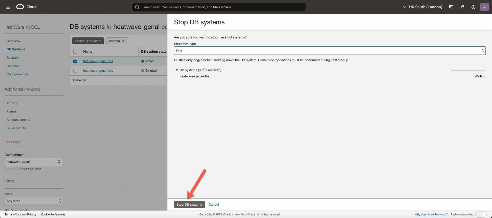
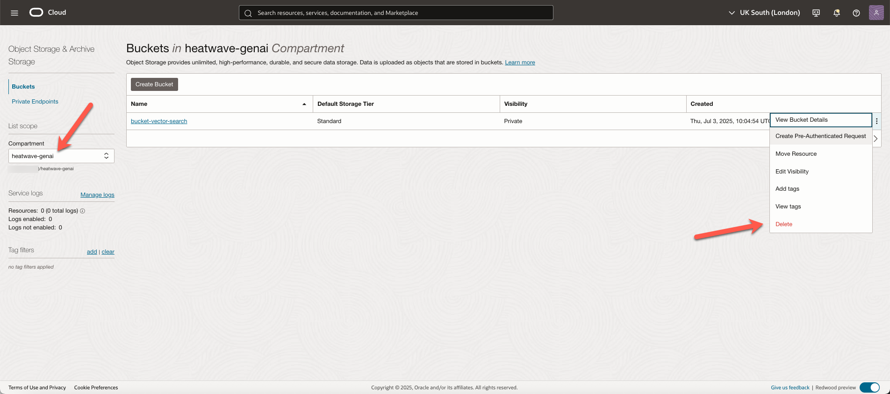
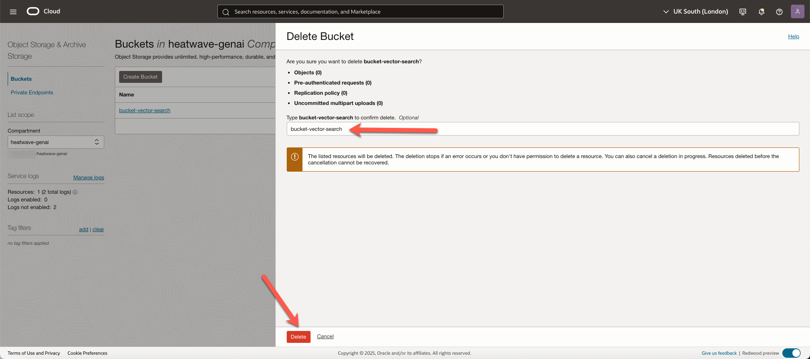

# Stop Services
 
## Introduction

In this lab you will use the Console to stop all of the Services you created in this workshop.

_Estimated Time:_ 5 min

### Objectives

In this lab, you will be guided through the following task:

- Stop the HeatWave instance.
- Delete the bucket. 

### Prerequisites

- An Oracle Trial or Paid Cloud Account
- Some Experience with MySQL Shell
- HeatWave instance and Compute instance exist

## Task 1: Stop the HeatWave instance

1. Click the **Navigation menu** in the upper left, navigate to **Databases**, and under **HeatWave MySQL**, select **DB Systems**.

2. In the **heatwave-geni** compartment, select the **heatwave-genai-dbs**, under **Actions**, click **Stop**.

    

3. In the **Stop DB systems** dialog box, click **Stop DB Systems**.

    

## Task 2: Delete the bucket

1. Open the **Navigation menu** and click **Storage**. Under **Object Storage & Archive Storage**, click **Buckets**.

2. Select the compartment from the list under List Scope.

3. Click the **More Actions** menu besides your bucket, **bucket-vector-search**, and click **Delete**.

    

4. In the **Delete Bucket** panel, confirm the bucket name, **bucket-vector-search**, and click **Delete**.

    

**Congratulations! You have successfully finished the Workshop.**

## Learn More

- [HeatWave User Guide](https://dev.mysql.com/doc/heatwave/en/)

- [HeatWave GenAI Technical Brief](https://www.oracle.com/a/ocom/docs/heatwave-genai-technical-brief.pdf)

- [HeatWave on OCI User Guide](https://docs.oracle.com/en-us/iaas/mysql-database/index.html)

- [MySQL Documentation](https://dev.mysql.com/)

## Acknowledgements

- **Author** - Aijaz Fatima, Product Manager
- **Contributors** - Mandy Pang, Senior Principal Product Manager
- **Last Updated By/Date** - Perside Lafrance Foster, Open Source Principal Partner Solution Engineer, December 2025
