# CREATE MYSQL DATABASE SYSTEM AND HEATWAVE CLUSTER
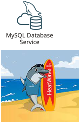

## Introduction

The required Virtual Cloud Network has been created and configured for this system. You are ready to start the MySQL DB system creation process. You will use a provided object storage link to create the airportdb schema and load data into the new Database.  Finally, you will add a HeatWave Cluster comprise of two or more HeatWave nodes.   

_Estimated Time:_ 20 minutes

Watch the video below for a quick walk through of the lab.

[](youtube:pqjN8UpoGnj8)

### Objectives

In this lab, you will be guided through the following tasks:

- Locate Virtual Cloud Network
- Create MySQL Database for HeatWave (DB System) instance with sample data (airportdb)
- Add a HeatWave Cluster to MySQL Database System

### Prerequisites

- A LiveLab environment
- Some Experience with MySQL Shell

## Task 1: Locate Virtual Cloud Network

1. Go back to the Launch page and copy the assigned Compartment value:

    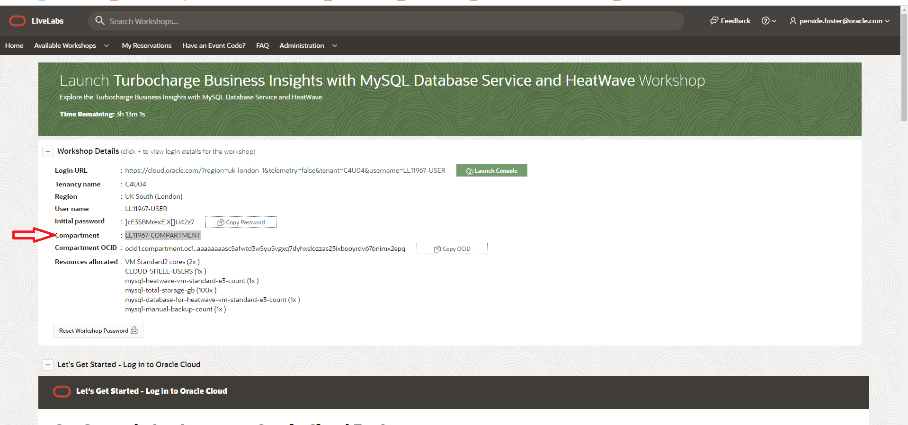

2. Go to Navigation Menu   
    Networking  
    Virtual Cloud Networks
    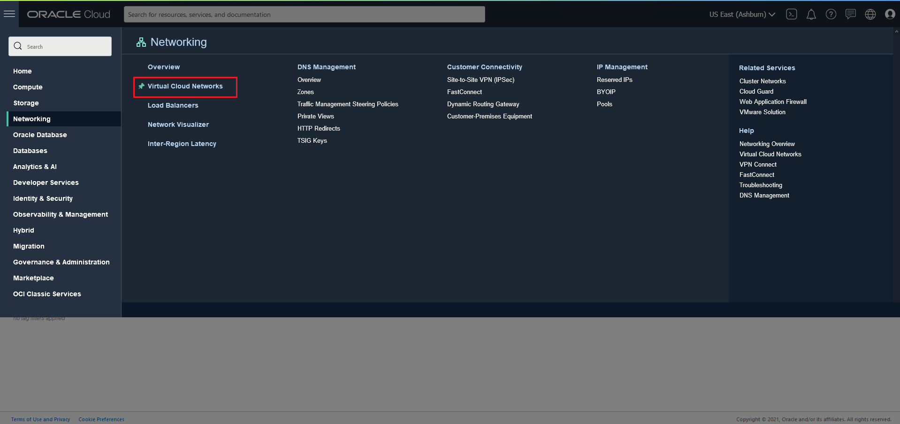
3. Click the Compartment dropdown list.

4. Paste the compartment value in the search box and select the matching  compartment value.
    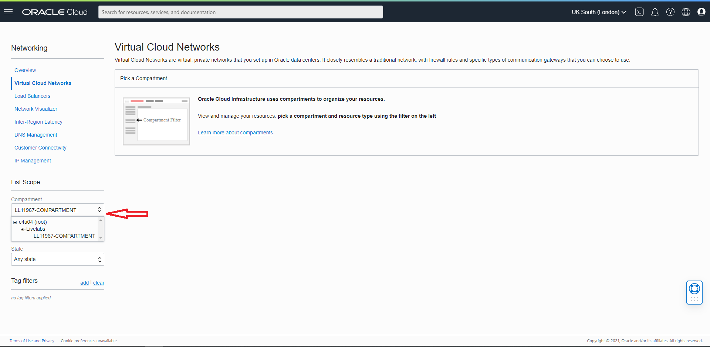

5. Click the existing VCN
    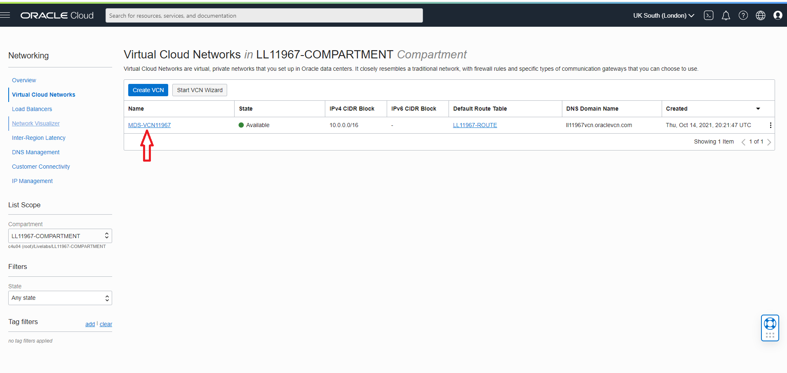

6. Your VCN should look like this

    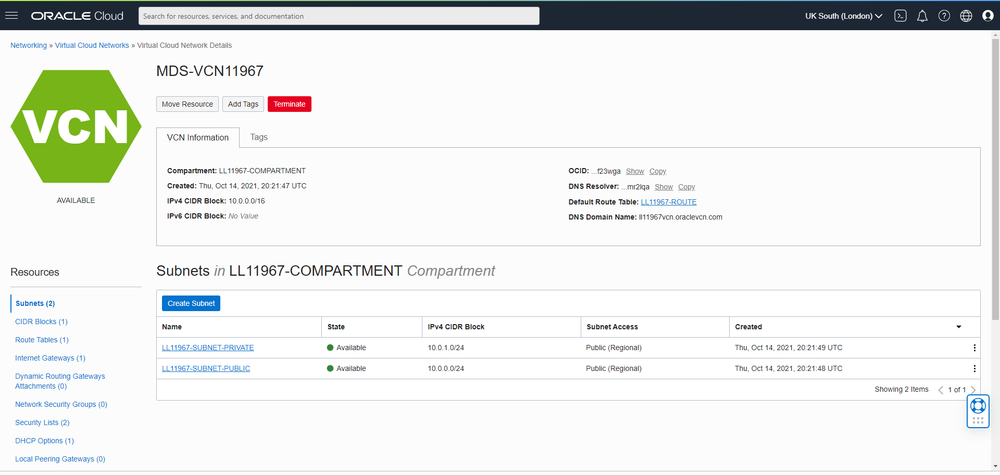

## Task 2: Create MySQL Database for HeatWave (DB System) instance with sample data (airportdb)

1. Go to Navigation Menu
         Databases
         MySQL
         DB Systems
    

2. Click 'Create MySQL DB System'
    

3. Create MySQL DB System dialog complete the fields in each section

    - Provide basic information for the DB System
    - Setup your required DB System
    - Create Administrator credentials
    - Configure Networking
    - Configure placement
    - Configure hardware
    - Exclude Backups
    - Advanced Options - Data Import

4. Provide basic information for the DB System:

 Select Compartment **(...-COMPARTMENT)**

 Enter Name
    ```
    <copy>MDS-HW</copy>
    ```
 Enter Description
    ```
    <copy>MySQL Database Service HeatWave instance</copy>
    ```

 Select **HeatWave** to specify a HeatWave DB System
    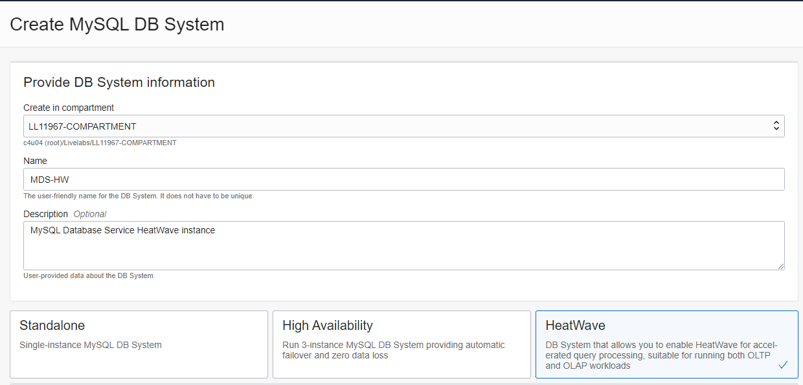

5. Create Administrator Credentials

 Enter Username
    ```
    <copy>admin</copy>
    ```

 Enter Password
    ```
    <copy>Welcome#12345</copy>
    ```   
 Confirm Password
    ```
    <copy>Welcome#12345</copy>
    ```
    

6. On Configure networking, keep the default values

    Virtual Cloud Network: **MDS-VCN...**

    Subnet: **Private Subnet-MDS-VCN... (Regional)**

    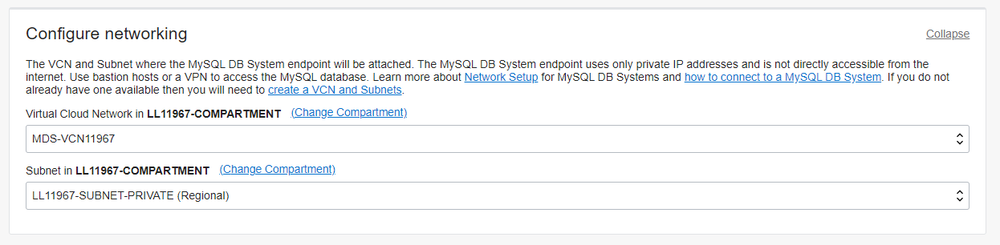

7. On Configure placement under 'Availability Domain'

    Select AD-3

    Do not check 'Choose a Fault Domain' for this DB System.

    

8. On Configure hardware, keep default shape as **MySQL.HeatWave.VM.Standard.E3**

    Data Storage Size (GB) Set value to:  **100**

    ```
    <copy>100</copy>
    ```
    

9. On Configure Backups, disable 'Enable Automatic Backup'

    

10. Click on Show Advanced Options

11. Select the Data Import tab.

12. Since your database was created in the **London OCI Region**, copy and paste the following link to the PAR Source URL</summary>

    ```
    <copy>
    https://objectstorage.uk-london-1.oraclecloud.com/p/l0jITzinEWEiAQmFNorC8s-4PAv-jwAMU97aEDjmTSfzlte-VUhJ7zPIYGXJMZh9/n/idazzjlcjqzj/b/airportdb-bucket-10282022/o/airportdb/@.manifest.json
    </copy>
    ```

 13. Your PAR Source URL entry should look like this:
    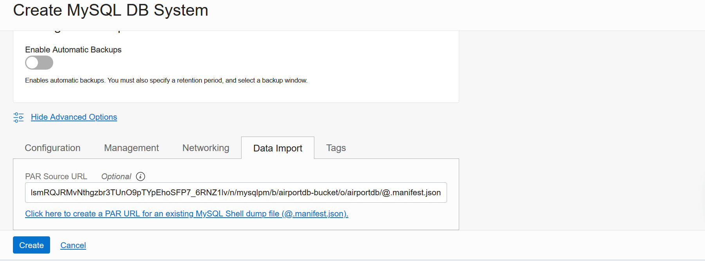

14. Review **Create MySQL DB System**  Screen

    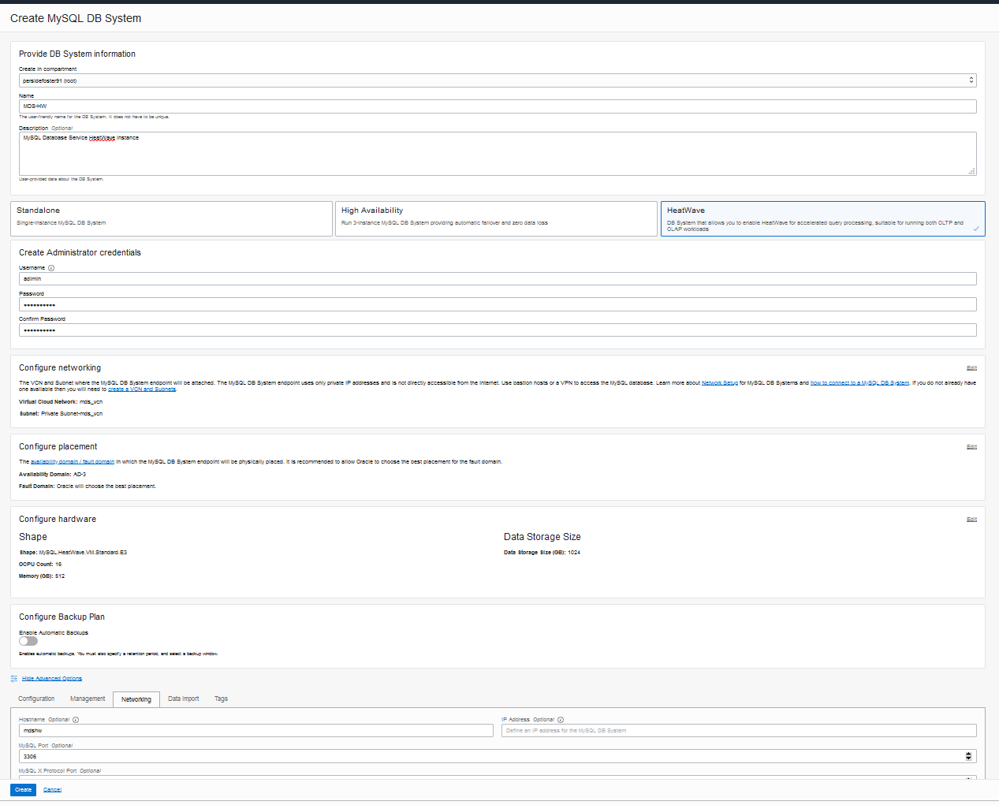

    Click the '**Create**' button

15. The New MySQL DB System will be ready to use after a few minutes

    The state will be shown as 'Creating' during the creation
    

16. The state 'Active' indicates that the DB System is ready for use

    On MDS-HW Page, check the MySQL Endpoint (Private IP Address)

    

## Task 3: Add a HeatWave Cluster to MDS-HW MySQL Database System

1. Open the navigation menu  
    Databases
    MySQL
    DB Systems
2. Choose the ...-COMPARTMENT.. Compartment. A list of DB Systems is displayed.
    
3. In the list of DB Systems, click the **MDS-HW** system. Click **More Action ->  Add HeatWave Cluster**.
    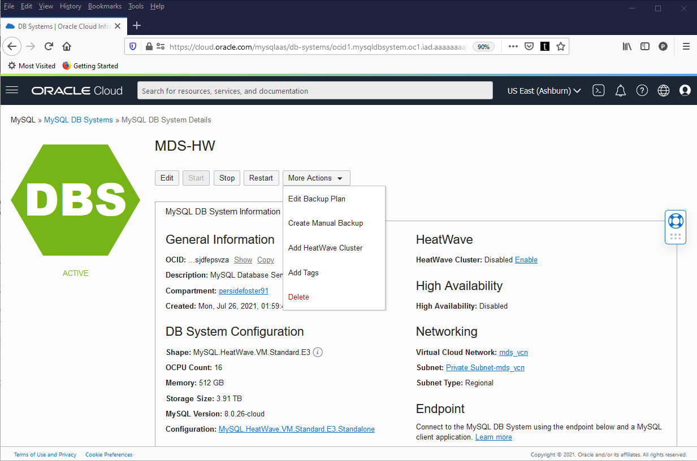
4. On the “Add HeatWave Cluster” dialog, select “MySQL.HeatWave.VM.Standard.E3” shape
5. Click “Estimate Node Count” button
    
6. On the “Estimate Node Count” page, click “Generate Estimate”. This will trigger the auto
provisioning advisor to sample the data stored in InnoDB and based on machine learning
algorithm, it will predict the number of nodes needed.
    
7. Once the estimations are calculated, it shows list of database schemas in MySQL node. If you expand the schema and select different tables, you will see the estimated memory required in the Summary box, There is a Load Command (heatwave_load) generated in the text box window, which will change based on the selection of databases/tables
8. Select the airportdb schema and click “Apply Node Count Estimate” to apply the node count
    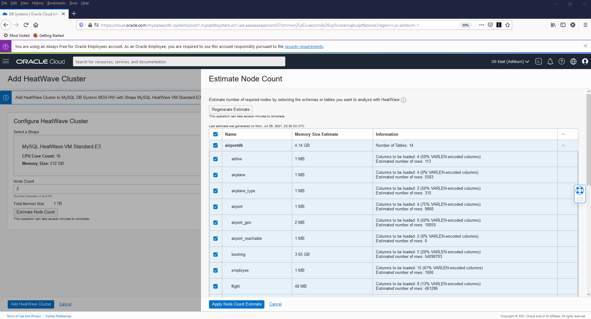
9. Click “Add HeatWave Cluster” to create the HeatWave cluster
    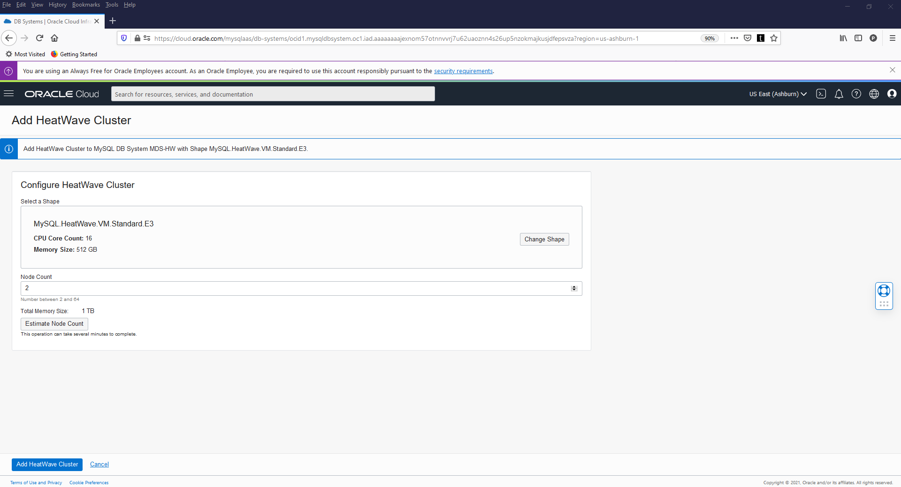
10. HeatWave creation will take about 10 minutes. From the DB display page scroll down to the Resources section. Click the **HeatWave** link. Your completed HeatWave Cluster Information section will look like this:
    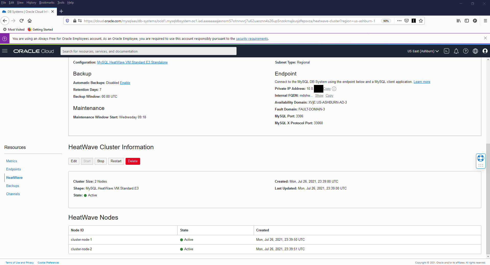

## Acknowledgements

* **Author** - Perside Foster, MySQL Solution Engineering
* **Contributors** - Mandy Pang, MySQL Principal Product Manager,  Priscila Galvao, MySQL Solution Engineering, Nick Mader, MySQL Global Channel Enablement & Strategy Manager, Frédéric Descamps, MySQL Community Manager
* **Last Updated By/Date** - Perside Foster, MySQL Solution Engineering, September 2021
