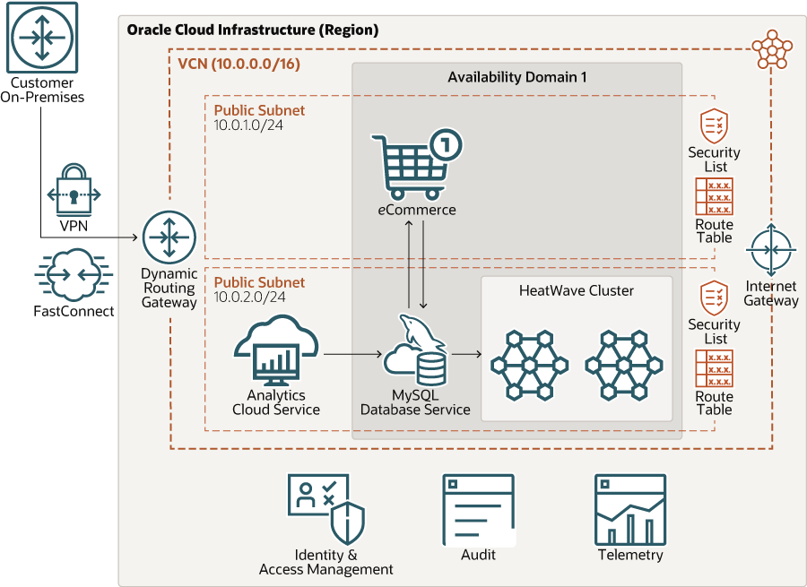
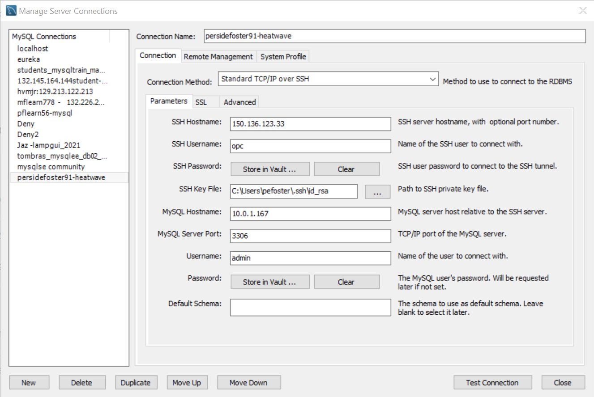
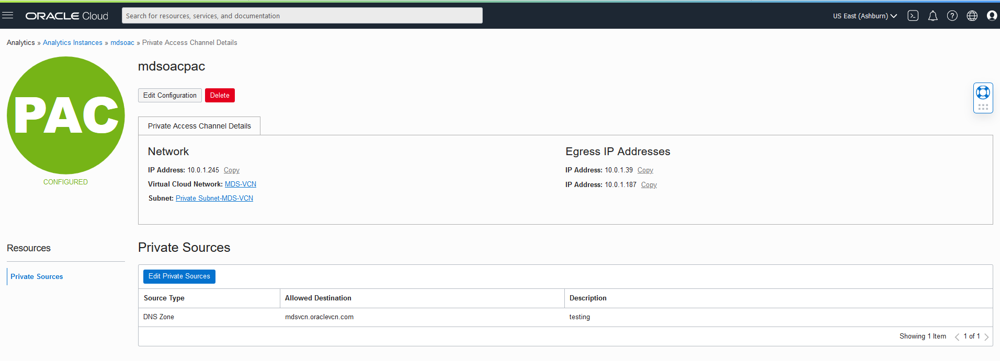
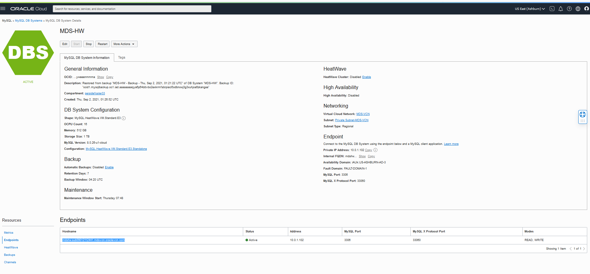
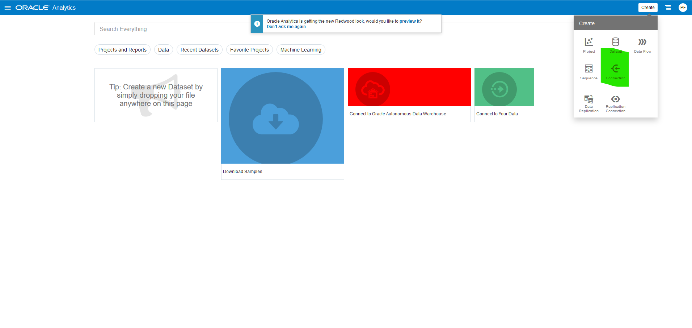

# Use MySQL HeatWave For Development  

## Introduction

MySQL HeatWave can easily be used for development tasks with existing Oracle services, such as Oracle Cloud Analytics. New applications can also be created with the LAMP or other software stacks.



_Estimated Lab Time:_ 40 minutes

### Objectives

In this lab, you will be guided through the following tasks:

- Connect to HeatWave using Workbench
- Install Apache and PHP and create PHP / MYSQL Connect Application
- Create Oracle Analytics Cloud and connect to MySQL HeatWave

### Prerequisites

- An Oracle Trial or Paid Cloud Account
- Some Experience with MySQL Shell
- Completed Lab 5

## **TASK 1:**  Connect to HeatWave using Workbench

Estimated Time: 5 minutes

1. At this point, you can also use MySQL Workbench from your local machine to connect to the MySQL endpoint using your new Compute instance as a jump box.

2. In your pre-installed MySQL Workbench, configure a connection using the method "Standard TCP/IP over SSH" and use the credentials of the Compute instance for SSH.

    **MySQL Workbench Configuration for MDS HeatWAve**
    

    **MySQL Workbench Use  for MDS HeatWAve**
    

## **TASK 2:** Install and test PHP MySQL Application

Estimated Time: 20 minutes

**Subtask 1 – Install App Server (APACHE)**

1.	If not already connected with SSH, on Command Line, connect to the Compute instance using SSH ... be sure replace the  "private key file"  and the "new compute instance ip"

     ````
    <copy>ssh -i private_key_file opc@new_compute_instance_ip</copy>
     ````
2.	Install app server

    a. Install Apache
    
    ````
    <copy>sudo yum install httpd -y </copy>
    ````
    b. Enable Apache

    ````
    <copy>sudo systemctl enable httpd</copy>
    ````
    c. Start Apache

    ````
    <copy>sudo systemctl restart httpd</copy>
    ````
    d. Setup firewall

    ````
    <copy>sudo firewall-cmd --permanent --add-port=80/tcp</copy>
    ````
    
    e. Reload firewall

    ````
    <copy>sudo firewall-cmd --reload</copy>
    ````

3.	From a browser test apache from your loacal machine using the Public IP Address of your Compute Instance

    **Example: http://129.213....**

**Subtask 2 – Install PHP**   

1.	Install php:

    a. Install php:7.4

    ````
    <copy> sudo dnf module install php:7.4 -y</copy>
    ````
     
    b. Install associated php libraries

    ````
    <copy>sudo yum install php-cli php-mysqlnd php-zip php-gd php-mbstring php-xml php-json -y</copy>
    ````

    c. View  php / mysql libraries

    ````
    <copy>php -m |grep mysql</copy>
    ````
    d. View php version

    ````
    <copy>php -v</copy>
    ````
    e. Restart Apache

    ````
    <copy>sudo systemctl restart httpd</copy>
    ````

2.	Create test php file (info.php)

    ````
    <copy>sudo nano /var/www/html/info.php</copy>
    ````
3. Add the following code to the editor and save the file (ctr + o) (ctl + x)

    ````
    <copy><?php
phpinfo();
?></copy>
    ````
4. From your local machine, browse the page info.php

   Example: http://129.213.167.../info.php

**Subtask 3 – Create MDS / PHP connect app**

1.	Security update"   set SELinux to allow Apache to connect to MySQL

    ````
    <copy> sudo setsebool -P httpd_can_network_connect 1 </copy>
    ````

2.	Create config.php

    ````
    <copy>cd /var/www/html</copy>
    ````

    ````
    <copy>sudo nano config.php</copy>
    ````
3. Add the following code to the editor and save the file (ctr + o) (ctl + x)

    ````
    <copy><?php
// Database credentials
define('DB_SERVER', '10.0.1...');// MDS server IP address
define('DB_USERNAME', 'admin');
define('DB_PASSWORD', 'Welcome#12345');
define('DB_NAME', 'airportdb');
//Attempt to connect to MySQL database
$link = mysqli_connect(DB_SERVER, DB_USERNAME, DB_PASSWORD, DB_NAME);
// Check connection
if($link === false){
    die("ERROR: Could not connect. " . mysqli_connect_error());
}
// Print host information
echo 'Successfull Connect.';
echo 'Host info: ' . mysqli_get_host_info($link);
?>
</copy>
    ````

    - Test Config.php on Web sever http://150.230..../config.php

4.	Create dbtest.php

    ````
    <copy>cd /var/www/html</copy>
    ````

    ````
    <copy>sudo nano dbtest.php</copy>
    ````

5. Add the following code to the editor and save the file (ctr + o) (ctl + x)

    ````
    <copy><?php
require_once "config.php";
$query = "select firstname, lastname, count(booking.passenger_id) as count_bookings from passenger, booking
where booking.passenger_id = passenger.passenger_id
and passenger.lastname = 'Aldrin' or (passenger.firstname = 'Neil' and passenger.lastname = 'Armstrong')
and booking.price > 400.00 group by firstname, lastname;";
if ($stmt = $link->prepare($query)) {
   $stmt->execute();
   $stmt->bind_result($firstname,$lastname,$count_bookings);
   echo "<table>";
        echo "<tr>";
        echo "<th>Firstname</th>";
        echo "<th>Lastname</th>";
        echo "<th>Count</th>";
    echo "</tr>";

    while ($stmt->fetch()) {
        echo "<tr>";
           echo "<td>" . $firstname ."</td>";
           echo "<td>" . $lastname . "</td>";
           echo "<td>" . $count_bookings . "</td>";
        echo "</tr>";
     }

    $stmt->close();
}
?>

</copy>
    ````

6.	From your local  machine connect to dbhwtest.php

    Example: http://129.213.167..../dbtest.php  

## **TASK 3:** Create Google Chart Application

1. Go to the development folder

    ````
    <copy>cd /var/www/html</copy>
    ````
2. Create mydbchart.php file

    ````
    <copy>sudo nano mydbchart.php</copy>
    ````
3. Click on this link to **Download file [dbchart.php](files/dbchart.php)**  to your local machine
2. Open dbchart.php from your local machine

    

4. copy all of the content of dbchart.php file from your local machine
    - add the content to the mydbchart.php file that you are  creating
    
        
    - Remember to replace the IP daadress,username, and password (lines 2 and 98 )
        - $con = mysqli_connect('30.0...','admin','Welcome#123','airportdb');
        - $link = mysqli_connect('30.0...','admin','Welcome#123','airportdb');
        
    - Save the mydbchart.php 


3.	From your local  machine connect to dbhwtest.php

    Example: http://129.213.167..../mydbchart.php
    

## **TASK 4:**  Create an Oracle Analytic Cloud

Estimated Time: 40 minutes minutes intallation time

NOTE:   the following exercise is quite complicated. To learn how to use OAC go to the following document:
Analytics - https://docs.oracle.com/en/cloud/paas/analytics-cloud/tutorials.html

In order to build analytics dashboard using OAC on MDS HeatWave, we need to do the following
1.	Create a user account for OAC to MDS
2.	Provision an OAC instance
3.	Build OAC project

**Subtask 1 - Create a user account for OAC to MDS**
1.	If not already connected with SSH, on Command Line, connect to the Compute instance using SSH

    ````
    <copy>ssh -i <private_key_file> opc@<new_compute_instance_ip></copy>
    ````
2.	On command Line, connect to MySQL using the MySQL Shell client tool

    ````
    <copy>mysqlsh -uadmin -p -h10.0.1..</copy>
    ````
3.	Change the MySQL Shell execution mode to SQL

    ````
    <copy>\sql</copy>
    ````
4. Create user oacadmin

    ````
    <copy>CREATE USER 'oacadmin'@'%' IDENTIFIED WITH mysql_native_password BY 'Welcome#123';</copy>
    ````
    ````
    <copy>GRANT all privileges on airportdb.* to oacadmin;</copy>
    ````
    ````
    <copy>exit;</copy>
    ````

**Subtask 2 - Provision an OAC instance**
1.	From the OCI console, navigate to Analytics & AI-> Analytics Clouds
 

2. Click Create Instance
 

3.	On the Create Analytics Instance enter the required information as shown below

Name:

````
    <copy>mdsoac</copy>
````

Description:

````
    <copy>Oracle Analytics Cloud HeatWave Test</copy>
````
Capacity: select **OCPU** and select **4**

License Type: select **License Included**

Click the **Create** button

 

4.	Wait 30 minutes for OAC instance creation to complete.


5.	Go down to the resources page and click on the **Configure Private Access Channel**  button

6.	Click the create Private Access Channel button

7.	On the create Private Access Channel page enter the following:

Name:

````
    <copy>mdsoacpac</copy>
````
DNS Zones:
**Check Virtual Cloud Network's domain name as DNS zone (mdsvcn.oraclevcn.com)**

Description:

````
    <copy>Testing</copy>
````
**Remove second  DNS Zone entry**

8.	Click the **Create** button


9.	Wait 30 minutes for the process to finish, then continue to Subtask 3



**Subtask 3 - Get HeatWave DB Hostname **

1. Before starting go to Menu Databases > DB Systems

2. Select HeatWave database: MDS-HW  

3. Go to Resources and click on the Endpoinst Link


4. Save the Hostname for use with OAC

Example : **mdshw.sub09012.....mdsvcn.oraclevcn.com**

5. Continue to Subtask 4

**Subtask 4 - Build OAC Dashboard**
1.	Navigate to hamburger->Analytics->Analytics Clouds

2.	Select the OAC instance you provisioned to access the OAC console by clicking on Analytics Home Page


3.	Create a Connection to HeatWave to build a dashboard


4.	Search for mysql and select mysql as the database


5.	Specify the connections details
Specify the hostname of MDS in FQDN such as mysql-xxx.oraclevpn.com and be sure to use the oacadmin mysql user and password Welcome#123
6.	Next build the dashboard on MDS HeatWave by selecting Create->Data Set
7.	Select the MySQL Connection created earlier
8.	For Add Data Set name to customer_nations
9.	Select airportdb database
10. Find per-company average age of passengers from Switzerland, Italy and France. Click on the “Enter SQL and type in the following sql statement:

    ````
    <copy> SELECT
    airline.airlinename,
    AVG(datediff(departure,birthdate)/365.25) as avg_age,
    count(*) as nbpeople
FROM
    booking, flight, airline, passengerdetails
WHERE
    booking.flight_id=flight.flight_id AND
    airline.airline_id=flight.airline_id AND
    booking.passenger_id=passengerdetails.passenger_id AND
    country IN ("SWITZERLAND", "FRANCE", "ITALY")
GROUP BY
    airline.airlinename
ORDER BY
    airline.airlinename, avg_age
LIMIT 10;</copy>
    ````

11.	Click the blue Add button
12.	On new display page click on the Create Project button
13.	On new display page  click on the graph icon, go down the side and select the map icon. Drag the icon to the middle of the page.
14.	Click the dataset icon and move the nbpeople field to size and airlinename field to Category
15.	Click on the bottom + sign to add Canvas 2 and drag the bar icon to the middle of the page
16.	Click the dataset icon and move the nbpeople field to Y-axis and airlinename field to Category
17.	Set project name to customernationsbargraph

## TASK 5: Create HeatWave ML Web App

1. Go to the development folder

    ```bash
    <copy>cd /var/www/html</copy>
    ```

2. Download the airport application zip file

    ```bash
    <copy> sudo wget https://objectstorage.us-phoenix-1.oraclecloud.com/p/fsulOSjXwCWISwMMXL6Hkv46FfgXvDyMs74tb0jFKIZH3UGAKft7hfAGoQUOSpCy/n/idazzjlcjqzj/b/bucket_apps/o/airport_web_01_eureka_ml_web_prod_version.zip</copy>
    ```

    ```bash
    <copy>sudo unzip airport_web_01_eureka_ml_web_prod_version.zip</copy>
    ```

    ```bash
    <copy>cd /var/www/html/airport</copy>
    ```

    Replace the database IP in config.php file with your heatwave database IP and save the file.

    ```bash
    <copy>sudo nano config.php</copy>
    ```

    run the application as follows:

    computeIP//web/airport_web.php

    

## Acknowledgements
* **Author** - Perside Foster, MySQL Solution Engineering, Harsh Nayak , MySQL Solution Engineering 
* **Contributors** - Mandy Pang, MySQL Principal Product Manager,  Priscila Galvao, MySQL Solution Engineering, Nick Mader, MySQL Global Channel Enablement & Strategy Manager
* **Last Updated By/Date** - Perside Foster, MySQL Solution Engineering, May 2022