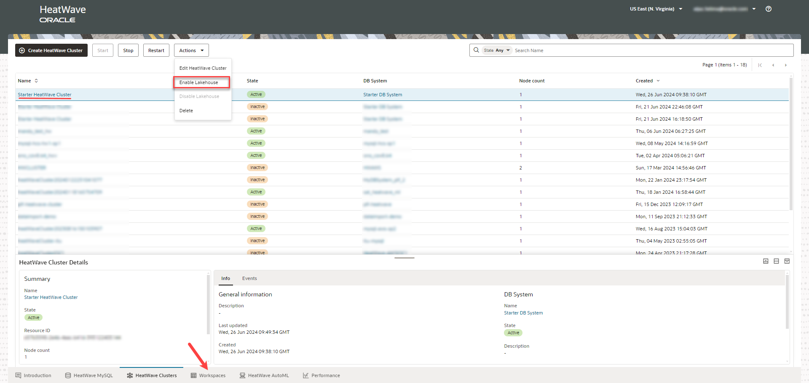
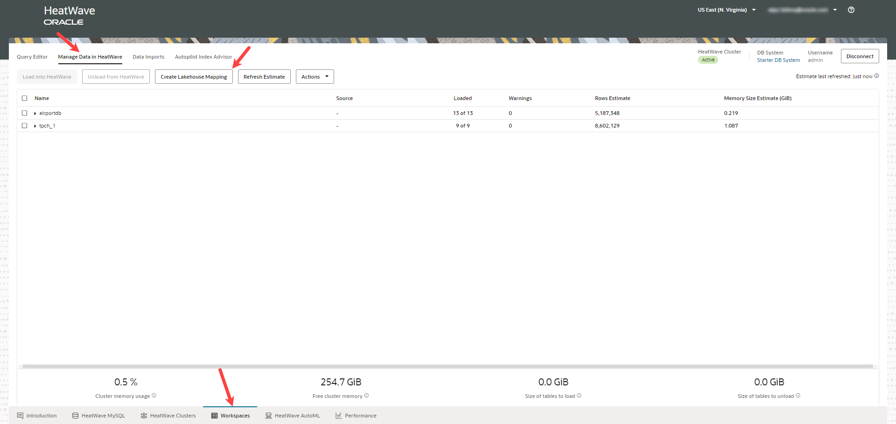
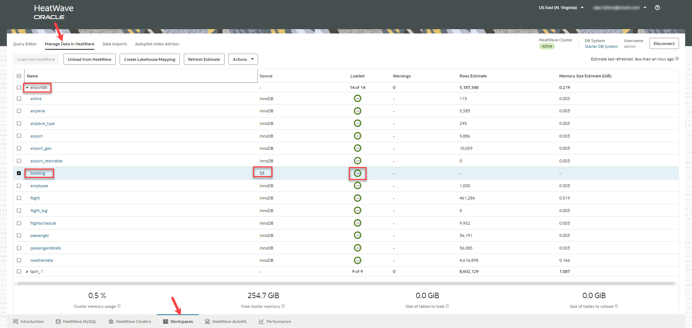

# Create Lakehouse Mapping

## Introduction

In this lab you will map a table from the sample schema, <i>airportdb</i>, present in an Oracle-managed S3 bucket to HeatWave. Lakehouse mappings enable seamless and efficient data analysis directly on the data present in an Amazon S3 bucket. You don’t need to define the schema of the files in Amazon S3.  

_Estimated Time:_ 15 minutes

### Objectives

In this lab, you will be guided through the following tasks:

- Enable Lakehouse on the HeatWave cluster.
- Create Lakehouse mapping.

### Prerequisites

- Must complete Lab 2.

## Task 1:  Enable Lakehouse on the HeatWave cluster

1. Go to the **HeatWave Clusters** tab in the [Heatwave Console](https://cloud.mysql.com).

2. Select your HeatWave Cluster, and under **Actions**, Click **Enable Lakehouse**. 
    
    

3. In the **Enable HeatWave Lakehouse** dialog, click **Enable**.

    

4. Under **HeatWave Cluster Details**, you can see that Lakehouse is enabled.
    
    

## Task 2: Create Lakehouse mapping

Lakehouse mappings enable you to perform analytics on the data in Amazon S3. 

1. In the **Workspaces** tab, click **Manage Data in HeatWave**.

2. Click **Create Lakehouse Mapping**.

    

3. In the **Create Lakehouse Mapping** panel, under **Source**, select **Use sample data**. This enables you to map sample tables present in the Oracle-managed S3 bucket to HeatWave. 

4. Select the table, <i>booking</i>, from the drop down list, and click **Next**. The details are populated automatically. 

    

5. Select the **Load into HeatWave after creating Lakehouse mapping** checkbox to load data into HeatWave directly from the Amazon S3 bucket, and click **Create Lakehouse Mapping**.  
Autopilot schema inference, a machine learning-powered automation, adaptively samples a small fraction of data in Amazon S3 and infers the number of columns, their data types, and their precision, creates the table definition, and also the script needed to load the table into HeatWave. This works on files that contain some metadata, like Parquet and Avro, and also on files that contain no metadata, like CSV.

    

6. You can see the table, <i>booking</i>, loaded into HeatWave directly from S3.

    

You may now **proceed to the next lab**.

## Learn More

- [Heatwave on AWS Service Guide](https://dev.mysql.com/doc/heatwave-aws/en/)

- [HeatWave Lakehouse Documentation](https://dev.mysql.com/doc/heatwave/en/mys-hw-lakehouse.html)

- [MySQL Documentation](https://dev.mysql.com/)

## Acknowledgements

- **Author** - Aijaz Fatima, Product Manager
- **Contributors** - Mandy Pang, Senior Principal Product Manager
- **Last Updated By/Date** - Aijaz Fatima, Product Manager, June 2024