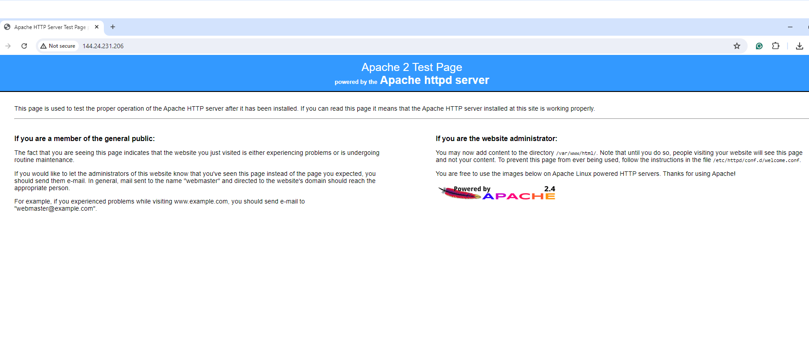
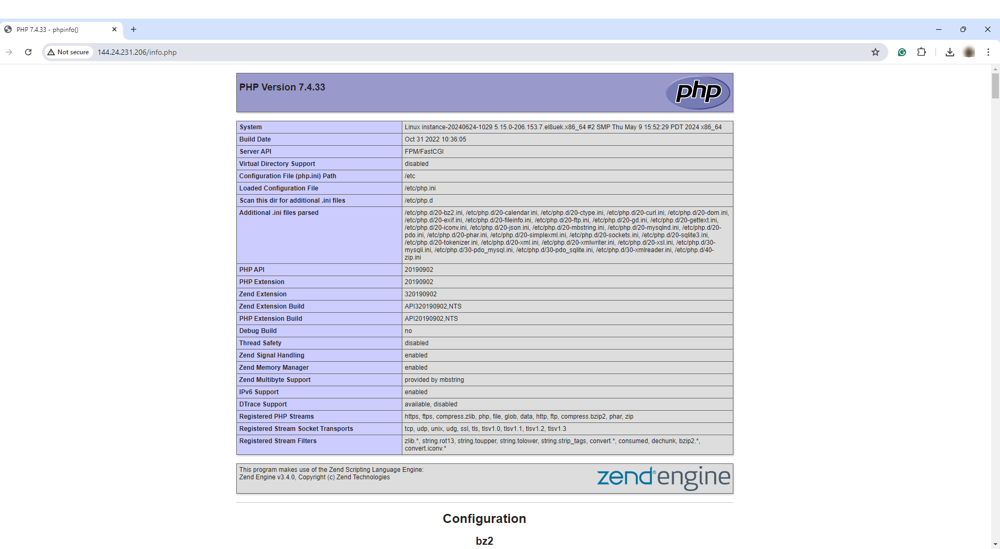

# Develop HeatWave App with LAMP

## Introduction

HeatWave can easily be used for developing new applications with LAMP or other software stacks.

**Note:** This application code is intended for educational purposes only. It is designed to help developers learn and practice application development skills with HeatWave on AWS. The code is not designed to be used in a production environment.

_Estimated Lab Time:_ 20 minutes

### Objectives

In this lab, you will be guided through the following tasks:

- Install Apache.
- Install PHP.
- Create PHP/HeatWave connect application.
- Create LAMP WEB application.

### Prerequisites

- Some experience with MySQL SQL and PHP.
- Completed Lab 5.
- A compute instance. See [Launching Your First Linux Instance](https://docs.oracle.com/en-us/iaas/Content/GSG/Reference/overviewworkflow.htm). 

## Task 1: Install Apache (App Server)

1. Connect to your compute instance. See [Connecting to Your Instance](https://docs.oracle.com/en-us/iaas/Content/GSG/Tasks/testingconnection.htm).

2. Install app server.

    a. Install Apache.

    ```bash
    <copy>sudo yum install httpd -y </copy>
    ```

    b. Enable Apache.

    ```bash
    <copy>sudo systemctl enable httpd</copy>
    ```

    c. Start Apache.

    ```bash
    <copy>sudo systemctl restart httpd</copy>
    ```

    d. Setup firewall.

    ```bash
    <copy>sudo firewall-cmd --permanent --add-port=80/tcp</copy>
    ```

    e. Reload firewall.

    ```bash
    <copy>sudo firewall-cmd --reload</copy>
    ```

3. From a browser, test Apache from your local machine using the Public IP Address of your compute instance. Ensure that the compute instance settings allows traffic from your local machine.

    **Example: http://129.213...**

4. On a successful connection, you should see a page similar to the following:

    

## Task 2: Install PHP

1. Install PHP.

    a. Install PHP:7.4.

    ```bash
    <copy> sudo dnf module install php:7.4 -y</copy>
    ```

    b. Install associated PHP libraries.

    ```bash
    <copy>sudo yum install php-cli php-mysqlnd php-zip php-gd php-mbstring php-xml php-json -y</copy>
    ```

    c. View  PHP/MySQL libraries.

    ```bash
    <copy>php -m |grep mysql</copy>
    ```

    d. View PHP version.

    ```bash
    <copy>php -v</copy>
    ```

    e. Restart Apache.

    ```bash
    <copy>sudo systemctl restart httpd</copy>
    ```

2. Create test PHP file (info.php).

    ```bash
    <copy>sudo nano /var/www/html/info.php</copy>
    ```

3. Add the following code to the editor and save the file (ctr + O) (ctl + X).

    ```bash
    <copy><?php
    phpinfo();
    ?></copy>
    ```

4. From your local machine, browse the page info.php.

   Example: http://129.213.../info.php

    You should see a page similar to the following:

    

## Task 3: Create PHP/HeatWave connect application

1. Set SELinux to allow Apache to connect to HeatWave.

    ```bash
    <copy> sudo setsebool -P httpd_can_network_connect 1 </copy>
    ```

2. Create config.php

    ```bash
    <copy>cd /var/www/html</copy>
    ```

    ```bash
    <copy>sudo nano config.php</copy>
    ```

3. Add the following code to the editor and save the file (ctr + O) (ctl + X).

     ```bash
        <copy><?php
    // Database credentials
    define('DB_SERVER', '100.0.1...');// MySQL IP address
    define('DB_USERNAME', 'admin');
    define('DB_PASSWORD', 'Welcome#12345');
    define('DB_NAME', 'mysql_customer_orders');
    //Attempt to connect to MySQL Server
    $link = mysqli_connect(DB_SERVER, DB_USERNAME, DB_PASSWORD, DB_NAME);
    // Check connection
    if($link === false){
        die("ERROR: Could not connect. " . mysqli_connect_error());
    }
    // Print host information
    echo 'Successfull Connect.';
    echo 'Host info: ' . mysqli_get_host_info($link);
    ?>
    </copy>
    ```

    - Test Config.php on Web sever http://150.230..../config.php

4. Create dbtest.php.

    ```bash
    <copy>cd /var/www/html</copy>
    ```

    ```bash
    <copy>sudo nano dbtest.php</copy>
    ```

5. Add the following code to the editor and save the file (ctr + o) (ctl + x).

    ```bash
    <copy>
    <?php
    require_once "config.php";
    $query = "select id, vendor_name from DELIVERY_VENDOR limit 5;";
    if ($stmt = $link->prepare($query)) {
    $stmt->execute();
    $stmt->bind_result($id,$vendor_name);
    echo "<table>";
        echo "<tr>";
        echo "<th>ID</th>";
        echo "<th>VendorName</th>";
    echo "</tr>";

    while ($stmt->fetch()) {
        echo "<tr>";
        echo "<td>" . $id ."</td>";
        echo "<td>" . $vendor_name. "</td>";
        echo "</tr>";
    }

    $stmt->close();
    }
    ?>
    </copy>
    ```

6. From your local  machine connect to dbtest.php.

    Example: http://129.213.167..../dbtest.php  

    

## Learn More

- [Heatwave on AWS Service Guide](https://dev.mysql.com/doc/heatwave-aws/en/)

- [HeatWave Lakehouse Documentation](https://dev.mysql.com/doc/heatwave/en/mys-hw-lakehouse.html)

- [MySQL Documentation](https://dev.mysql.com/)

## Acknowledgements

- **Author** - Aijaz Fatima, Product Manager
- **Contributors** - Mandy Pang, Senior Principal Product Manager
- **Last Updated By/Date** - Aijaz Fatima, Product Manager, June 2024