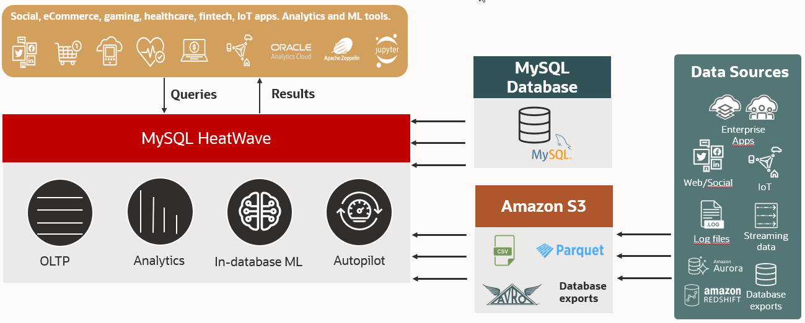

# Introduction

HeatWave Lakehouse on AWS brings industry-leading query performance on semi-structured data to AWS. With HeatWave Lakehouse you can now query up to a quarter of a petabyte of data in Amazon S3 in various file formats, such as CSV, Parquet, Avro, JSON (Newline delimited), and exports from databases like Aurora, Redshift, MySQL, and Oracle. You can combine query on the data in Amazon S3 with transactional data in MySQL databases without copying the data from S3 into the MySQL database. Furthermore, you can perform machine learning (ML) tasks, such as training, inferences, and explanations, on this data stored in S3. This eliminates the need to load data into a database or move it to a machine learning service, thereby improving security, maintainability, and reducing complexity. The speed of querying data in Amazon S3 is on par with that of querying the data in the database.

HeatWave Lakehouse can scale up to 512 nodes on a single cluster, offering you the flexibility and power you need for your data and analytics tasks.

## About this Workshop

In this LiveLab, you will launch a starter HeatWave DB System on AWS. Subsequently, you will map data in Amazon S3 to a new table in a schema on HeatWave on AWS. Finally, you will run queries on HeatWave and monitor the performance of the DB System and HeatWave Cluster.

_Estimated Time:_ 1.5 hours

## About Product/Technology

HeatWave on AWS delivers a true native experience for AWS customers. The console, control plane, and data plane completely reside in AWS and are responsible for managing the  HeatWave database resources in AWS. The control plane communicates with Oracle Cloud Infrastructure (OCI) Identity for account management, and with OCI metering & billing for monitoring and managing the usage and expenses associated with the customer’s account.

By making HeatWave natively available on AWS, you can very easily benefit from the only cloud database service that combines transactions, analytics, and machine learning services into one MySQL database, delivering real-time, secure analytics without the complexity, latency, and cost of ETL duplication—on AWS.
HeatWave on AWS is optimized for AWS with a superior architecture that delivers higher performance and lower cost, as demonstrated by industry-standard benchmarks.

Once you sign up for an OCI cloud account and register your OCI account with HeatWave on AWS, the main interactions with the HeatWave service take place in AWS, through the service console hosted at  [cloud.mysql.com](https://cloud.mysql.com/login).

The following diagram illustrates HeatWave on AWS integration with Oracle Cloud Infrastructure (OCI).

## Objectives

In this lab, you will be guided through the following steps:

- Launch a starter DB system
- Run queries on HeatWave
- Create Lakehouse mapping
- Run queries on HeatWave using Lakehouse
- Monitor performance

## Prerequisites

Please make sure you can sign in to your HeatWave OCI Cloud Account. See [Sign Up](https://dev.mysql.com/doc/heatwave-aws/en/heatwave-aws-sign-procedure.html).

## Learn More

- [HeatWave on AWS Service Guide](https://dev.mysql.com/doc/heatwave-aws/en/)

- [HeatWave Lakehouse Documentation](https://dev.mysql.com/doc/heatwave/en/mys-hw-lakehouse.html)

- [MySQL Documentation](https://dev.mysql.com/)

## Acknowledgements

- **Author** - Aijaz Fatima, Product Manager
- **Contributors** - Mandy Pang, Senior Principal Product Manager
- **Last Updated By/Date** - Aijaz Fatima, Product Manager, June 2024
