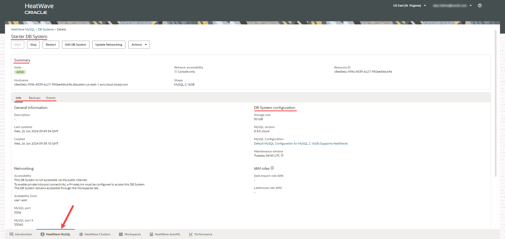
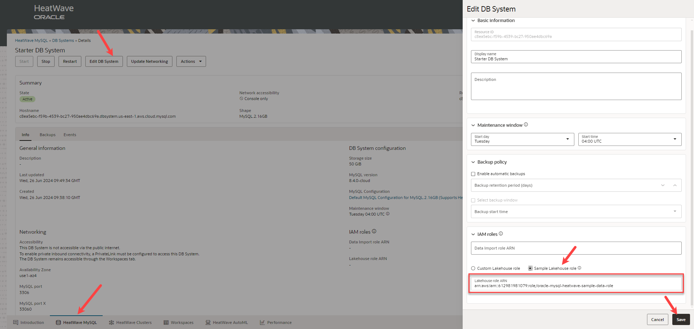

# Launch a Starter DB System

## Introduction

In this lab you will launch a starter DB System. A starter DB System is a preconfigured DB System with preloaded sample data.

_Estimated Time:_ 15 minutes

### Objectives

In this lab, you will be guided through the following tasks:

- Sign in to Heatwave on AWS Service console page.
- Launch a starter DB System.
- Specify an IAM role in the starter DB System.

### Prerequisites

- A Heatwave on AWS Trial or Paid Cloud Account. If you are a first-time user, follow the  [Sign Up](https://dev.mysql.com/doc/heatwave-aws/en/heatwave-aws-sign-procedure.html) instructions.

## Task 1: Sign in to Heatwave on AWS Service console page

1. Go to the [Heatwave Console](https://cloud.mysql.com).

2. Enter your **Cloud Account Name**, and  then click **Continue**.
    

3. Enter the OCI account credentials. This is your User Name and Password.  Click **Sign In**.
    

## Task 2: Launch a starter DB System

Once you have signed in, launch a starter DB System.

1. Click **Launch Starter DB System** to create a pre-configured DB System with preloaded sample data. 

    

2. In the **Launch Starter DB System** panel, enter administrator credentials. Note the credentials as you will need them to connect to the DB System. 

    

    The DB System should be created in a few minutes.

3. Once the DB System is created, click the name of the DB System to see the details.

    

## Task 3: Specify an IAM role in the starter DB System

You need to specify an IAM role with the correct policies and trust relationships to grant the HeatWave DB System access to the data in Amazon S3. This will provide enhanced security, making it suitable for enterprise production workloads.

1. Click **Edit DB System** and choose **Sample Lakehouse role**. The sample Lakehouse role contains the necessary policies and permissions to help you with Lakehouse mapping. 

    

2. Click the name of the DB System to see the updated Lakehouse role ARN.

    

You may now **proceed to the next lab**.

## Learn More

- [Heatwave on AWS Service Guide](https://dev.mysql.com/doc/heatwave-aws/en/)

- [HeatWave Lakehouse Documentation](https://dev.mysql.com/doc/heatwave/en/mys-hw-lakehouse.html)

- [MySQL Documentation](https://dev.mysql.com/)

## Acknowledgements

- **Author** - Aijaz Fatima, Product Manager
- **Contributors** - Mandy Pang, Senior Principal Product Manager, Aijaz Fatima, Product Manager
- **Last Updated By/Date** - Aijaz Fatima, Product Manager, June 2024