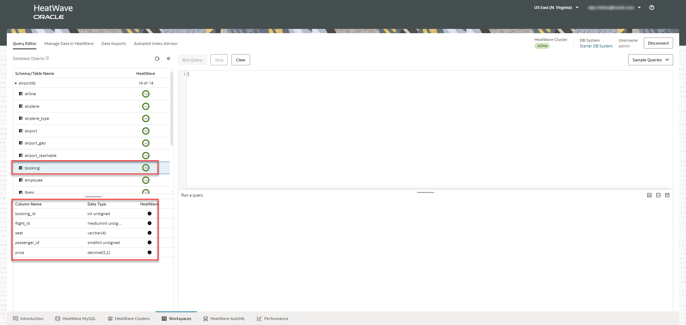

# Run Queries with HeatWave Lakehosue

## Introduction

You can run queries on the data in Amazon S3 from the HeatWave console, without having to copy the data in the MySQL database. The performance of querying data in Amazon S3 is identical to the performance of querying data inside the database. 

_Estimated Time:_ 10 minutes

### Objectives

In this lab, you will be guided through the following task:

- Run queries with HeatWave using Lakehouse.

### Prerequisites

- Must complete Lab 3.

## Task 1: Run queries with HeatWave Lakehouse

1. In the **Workspaces** tab, click **Query Editor**. Under **Database Objects**, you can see the schemas and tables in the MySQL database, the associated table definitions, and the HeatWave load status of each table.
 
    

2. Click **Sample Queries**, and then click **Sample AirportDB Queries**.

    

3. Copy Query 1, and click **Cancel**. 

    

4. Paste the query in the **Query Editor**, and click **Run Query**.

5. When you run the query with HeatWave using Lakehouse, it took only 0.0274 seconds, which is at par with when you run the query from MySQL.

    

You may now **proceed to the next lab**.

## Learn More

- [Heatwave on AWS Service Guide](https://dev.mysql.com/doc/heatwave-aws/en/)

- [HeatWave Lakehouse Documentation](https://dev.mysql.com/doc/heatwave/en/mys-hw-lakehouse.html)

- [MySQL Documentation](https://dev.mysql.com/)

## Acknowledgements

- **Author** - Aijaz Fatima, Product Manager
- **Contributors** - Mandy Pang, Senior Principal Product Manager
- **Last Updated By/Date** - Aijaz Fatima, Product Manager, June 2024
