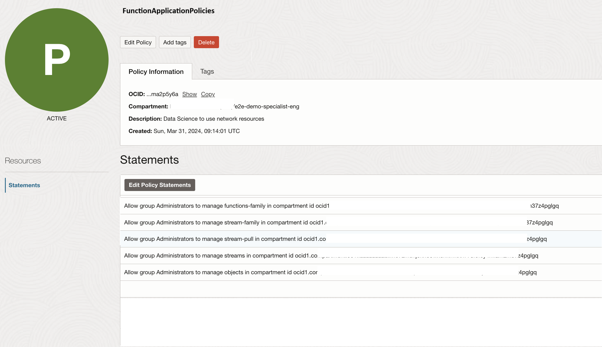
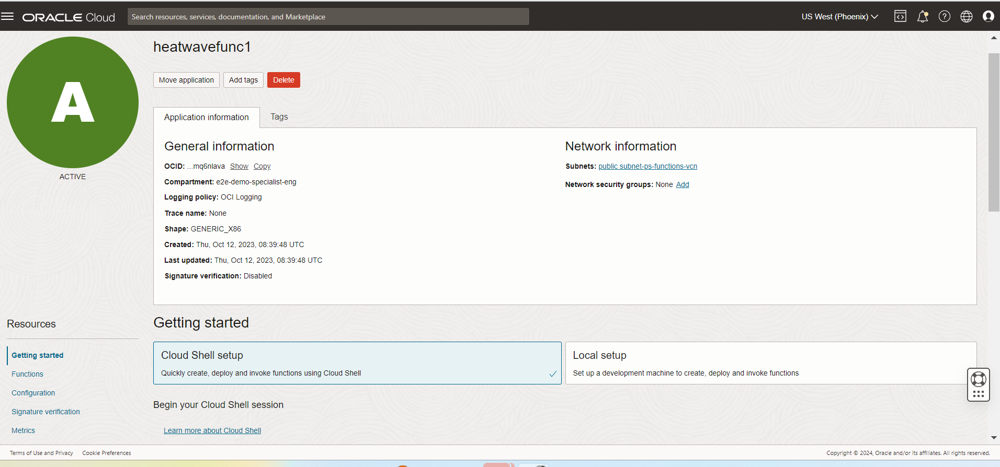
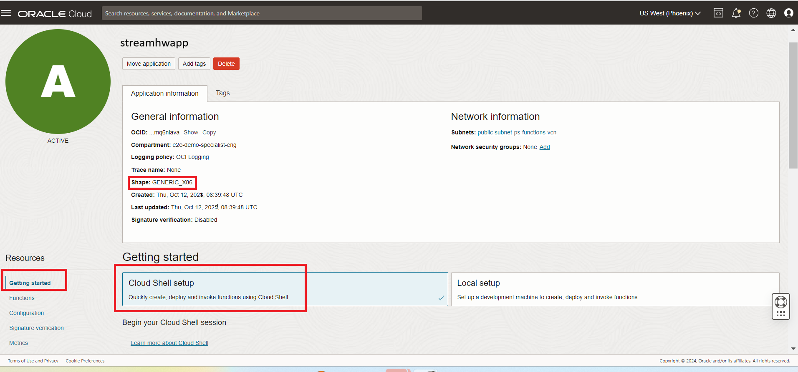
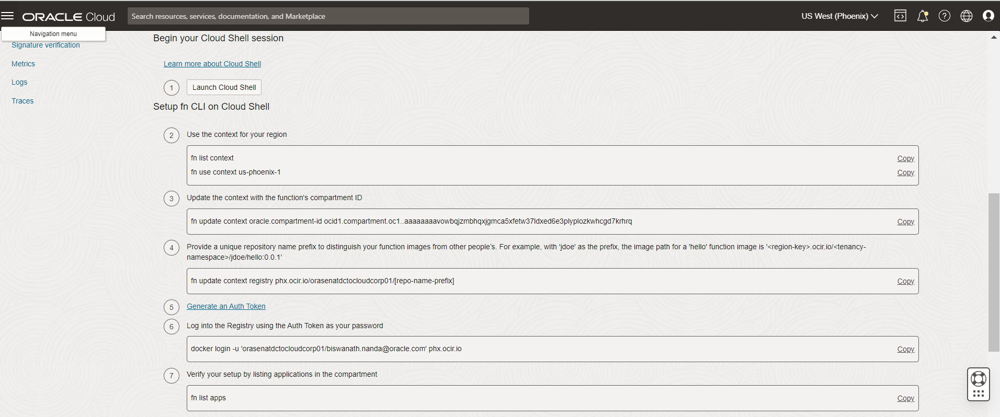
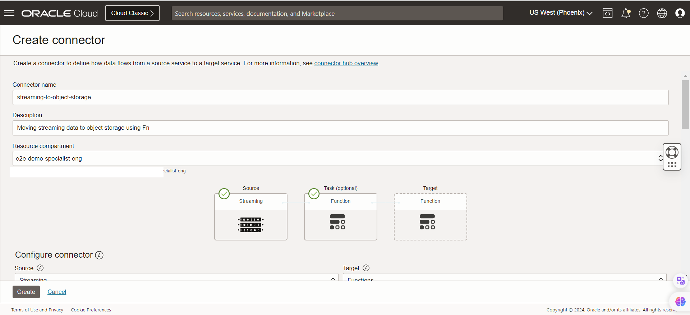

# Configuring and using OCI Functions to consume streamming data from OCI Streaming Topic

### Introduction

This lab focus on creating the Function ,deploying the function script and getting it connected to OCI service connector hub to get automatically triggered once the streaming data falls on the OCI streaming topic.Here the function is used to perform the below tasks :

- Connect to OCI streaming topic to receive the data streams.

- Pass the data stream to ML model API and write the streaming data along with prediction score to
   Object Storage and MySQL table.

_Estimated Lab Time_: 75 minutes

### Objectives

- Create a Function Application
- Configure and Invoke a Function
- Create Service Connector

### Prerequisites

- Completion of the previous labs.

##  
## Task 1: Create a Function Application

1. From the OCI services menu click **Policies** under **Identity** , Create "FunctionApplicationPolicies" into the name section and type "Allow functions to work" in the description section. Scroll down to the Policy statements section. Click the **+ Another Statement**.

    

    Copy and paste the following as policy statement. ```
    <copy>
    allow service FAAS to read repos in tenancy
    allow service datascience to use virtual-network-family in compartment id ocid1.compartment.oc1..xyz
    allow dynamic-group datascience to manage data-science-family in compartment id ocid1.compartment.oc1..xyz
    allow dynamic-group datascience to manage object-family in compartment id ocid1.compartment.oc1..xyz
    Allow group Administrators to manage functions-family in compartment id ocid1.compartment.oc1..xyz
    Allow group Administrators to manage stream-family in compartment id ocid1.compartment.oc1..xyz
    Allow group Administrators to manage stream-pull in compartment id ocid1.compartment.oc1..xyz
    Allow group Administrators to manage streams in compartment id ocid1.compartment.oc1..xyz
    Allow group Administrators to manage objects in compartment id ocid1.compartment.oc1..xyz
    </copy> ```

2. From the OCI services menu click **Functions** under **Developer Services** to create the Fn.

    

3. Click **Create Application** and fill out the dialog box.

    - **NAME**: streamhwapp
    - **VCN in** : Choose the compartment where your VCN was created
    - **SUBNETS** : Choose your VCN's public subnet
    - **SHAPE** : Choose your VCN's public subnet
    - **LOGGING POLICY**: GENERIC_X86

    Click **Create**.

    

4. Scroll down and click on **Getting Started** and follow the steps on the OCI console.

    

## Task 2: Configure and Invoke a Function

As a continuation of task 1 , folllow the steps shown in the OCI console to configure the Function.
Here we will be performing the below steps to Launch Cloud Console ,Create, deploy, and invoke your python function.

1. Follow steps No. 1 to No. 7 given on the OCI console to set up OCI cloud shell and listing the Applications.

    

2. Create, deploy, and invoke your function
   Create the Function : (Step No 8 on OCI console) ```
    <copy>
    fn init --runtime python streamhwfunc
    </copy> ```

3. Switch into the generated directory (Step No 9 on OCI console) ```
    <copy>
    cd streamhwfunc
    </copy> ```

4. Now change the content of **func.py** and **requirements.txt** file.

    Function Script for function :
    Scripts to be changed and moved to the OCI cloud console - func.py ,func.yaml,requirements.txt
    Link to download the Function script and Dependencies : [`MYSQLLakehouse_labfiles.zip`](https://objectstorage.us-ashburn-1.oraclecloud.com/p/RPka_orWclfWJmKN3gTHfEiv-uPckBJTZ3FV0sESZ3mm3PDCQcVDCT-uM2dsJNGf/n/orasenatdctocloudcorp01/b/MYSQLLakehouse\_labfiles/o/MYSQLLakehouse_labfiles.zip)

    ### Download Referece Path: MYSQLLakehouse_labfiles\Lab5\OCI Function\func.py

    [Refer to downloadbled MYSQLLakehouse_labfiles.zip]
    Changes in the func.py script is as below:
       ```
<copy>
    Line No -33 - In the endpoint replace the ML model deployment URL.
    endpoint = "http://IP:5000/predict" # change here for the lab with your compute ipfor Lab
    </copy>
    ```
    
    ```
    <copy>
    Line No -51 & 52 - Replace these lines with the OCI Streaming Enpoint URL and stream OCID.
    ociMessageEndpoint = https://cell-1.streaming.us-<xyz>.com # change here for Lab
    ociStreamOcid = "ocid1.stream.oc1.phx.xyz"  # change here for Lab
    </copy>
    ```

    ```
    <copy>
    Line No -65 & 66 - Replace these lines with the oci Objectstore details for the demo.
    namespace_name="<Object_store_namespace>" # change here for Lab
    bucket_name="e2e-demo-events-raw-mysqlhw" # change here for Lab
    </copy>
    ```
    ```
    <copy>
    Line No -76,77,78,79 - Replace these lines login credentials of MYSQL HW DB
    DB_HOST = '1x.x.x.xx' # change here for Lab
    DB_USER = 'admin' 
    DB_PASSWORD = 'xxxxx' # change here for Lab
    DB_NAME = 'MFG_SENSOR'
    </copy>
    ```

    ```
    <copy>
    fn update context registry phx.ocir.io/<tenancyid>/streamhwrepo  
    </copy>
    ```
     
5. Change the content of the <b>requirement.txt</b> file. The sample requirement.txt can be downloaded from the demo co-laterals as well.

    ```
    <copy>
    fdk>=0.1.75
    requests
    pymysql
    oci
    </copy>
    ```
6. Upload these files to the function directory and replace the existing func.py and requirement.txt files and move them to the funtion directory.
    
    Execute the below commands to deploy and  invoke the Function.

    ```
    <copy>
    fn -v deploy --app streamhwapp
    fn invoke streamhwapp streamhwfunc
    </copy>
    ```
Congratulations! You've just created, deployed, and invoked your first function using Oracle Functions!

### connect to service connector Hub and trigger the Fn.

## Task 3: Create Service Connector

For simple archiving operations, we don’t need to write a single line of code. Instead, we just create a service connector and point it at the source (stream) and destination (bucket). Navigate to the Service Connector Hub via the burger menu (or by searching for it).

1. Open the navigation menu and click ***Analytics & AI***. Under ***Messaging***, click ***Service Connector Hub***.

2. You can choose a compartment you have permission to work in (on the left side of the page). The page updates to display only the resources in that compartment. For this lab, we will work in the tenancy root compartment.

3. Click ***Create Service Connector***. 

4. Name the connector ***streaming-to-Fn*** .

5. Provide the description ***Moving streaming data to object storage using Fn***.

6. For the compartment, choose the demo compartment.



7. Now to configure your service connector, Choose  ’Streaming’ as the ***source***, and ‘function’ as the ***target***. Chose the compartment where the stream pool resides, choose the stream pool, and the stream. You can choose to read from either the ‘Latest’ offset or ’Trim Horizon’ (the oldest non-committed offset).


8. Click ***Create*** and the service connector is ready to collect the streams.

You may now **proceed to the next lab**

## Acknowledgements

* **Author** -  Biswanath Nanda - Master Principal Cloud Architect
* **Contributors** -  Lovelesh Saxena - Principal Cloud Architect, Biswanath Nanda -Master Principal Cloud Architect, Bhushan Arora - Principal Cloud Architect 
* **Last Updated By/Date** - Biswanath Nanda, November 2024
