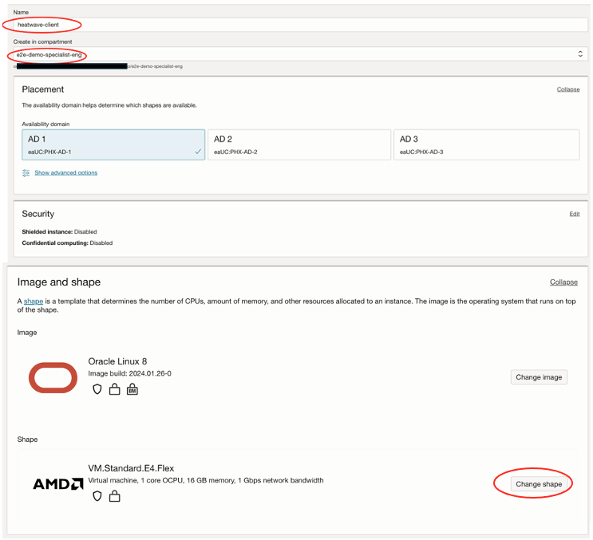

# Create Compute and MySQL Shell

### Introduction

In this lab we will be creating a compute instance which will solve the below purpose for the workshop :

1. Hosting IoT Simulator Code: The compute instance will serve as a virtual machine to host the custom Python generator codebase, which will be used to create IoT datasets for OCI streaming. This involves setting up the simulator code framework on the instance.

2. The instance will act as a Bastion Host, a resource that sits between the private resource and the endpoint, providing access to the private network. It will function as a   "jump box," allowing you to log in to the private resource through protocols like SSH. Additionally, we will use this compute instance for configuring the MySQL Shell client. This Bastion Host will be set up within a Virtual Cloud Network and will include a compute instance that can connect with the MySQL DB Systems.

3. This compute instance is also leveraged for building and deploying custom Machine Learning model which identifies the probablity of device failures .

Note - MySQL HeatWave on OCI is an example of a service that is only accessible through private networks. Since the service is fully managed, we keep it siloed away from the internet to help protect your data from potential attacks and vulnerabilities. It’s a good practice to limit resource exposure as much as possible, but at some point, you’ll likely want to connect to those resources. That’s where Compute Instance, also known as a Bastion host, enters the picture. 

_Estimated Lab Time:_ 45 minutes

### Objectives

In this lab, you will be guided through the following tasks:

- Create SSH Key on OCI Cloud
- Copy public SSH key value to Notepad
- Create Compute Instance
- Connect to Compute and Install MySQl Shell

### Prerequisites

- An Oracle Trial or Paid Cloud Account

##  
## Task 1: Create SSH Key on OCI Cloud Shell

The Cloud Shell machine is a small virtual machine running a Bash shell which you access through the Oracle Cloud Console (Homepage). You will start the Cloud Shell and generate a SSH Key to use  for the Bastion  session.

1. To start the Oracle Cloud shell, go to your Cloud console and click the cloud shell icon at the top right of the page. This will open the Cloud Shell in the browser, the first time it takes some time to generate it.

    

    

    *Note: You can use the icons in the upper right corner of the Cloud Shell window to minimize, maximize, restart, and close your Cloud Shell session.

2. Once the cloud shell has started, create the SSH Key using the following command:

    ```bash
    <copy>ssh-keygen -t rsa</copy>
    ```

    Press just enter for each question, here is what it should look like:

    

3. The SSH keys are stored as follows:
    - public SSH key stored in ~/.ssh/id_rsa.pub
    - private SSH keys stored in ~/.ssh/id_rsa

4. Examine the two files that you just created.

    ```bash
    <copy>cd .ssh</copy>
    ```

    ```bash
    <copy>ls</copy>
    ```

    

    **Note** in the output there are two files, a *private key:`id_rsa` and a public key: `id_rsa.pub`. Keep the private key safe and don't share its content with anyone. The public key will be needed for various activities and can be uploaded to certain systems as well as copied and pasted to facilitate secure communications in the cloud.

5. To asign the right permissions to your SSH keys, run the following command:

    ```bash
    <copy>chmod 600 id_rsa.pub</copy>
    ```

    ```bash
    <copy>chmod 600 id_rsa</copy>
    ```

## Task 2: Copy public SSH key value to Notepad

You will need a compute Instance to connect to your brand new MySQL database.

1. Before creating the Compute instance open a notepad.

2. Do the followings steps to copy the public SSH key to the notepad.

    Enter the following command  

    ```bash
    <copy>cat ~/.ssh/id_rsa.pub</copy>
    ```

     

3. Copy the above output to a notepad.

    Your notepad should look like this
    

## Task 3: Create Compute instance


1. To launch a Linux Compute instance, go to 
    Navigation Menu
    Compute
    Instances
    

2. On Instances in **e2e-demo-specialist-eng** Compartment, click  **Create Instance**.
    

3. On Create Compute Instance.

    Enter Name

    ```bash
    <copy>heatwave-client</copy>
    ```

4. Make sure **e2e-demo-specialist-eng** compartment is selected.

5. On Placement, keep the selected Availability Domain.

6. Keep the selected Image, Oracle Linux 8

    

7. Change the Instance Shape:
    - Click **Change shape** button as in above screen shot
    - Click **Virtual Machine** box
    - Click **Specialty and previous generation** box


    

    - Click **VM.Standard.E2.2**
    - Click the **Select Shape** button

     

8. On Networking, make sure '**vcn_phoenix**' is selected and Select the **subnet**

    'Automatically assign public IPv4 address' checkbox should be enabled under 'Public IPv4 address' as in following:

    

9. On Add SSH keys, paste the public key from the notepad.
  
    

10. Click '**Create**' to finish creating your Compute Instance.

11. The New Virtual Machine will be ready to use after a few minutes. The state 'Running' indicates that the Virtual Machine is ready to use.

    

## Task 4: Connect to Compute and Install MySQL Shell

1. Copy the public IP address of the active Compute Instance to your notepad

    - Go to Navigation Menu
            Compute
            Instances
        

    - Click the `heatwave-cient` Instance link

    - Copy the `Public IP Address` to the notepad
        
        

2. Now go to your OCI Console Cloud Shell, which we used earlier in the lab

3. Now from OCI Cloud Shell, ssh to **heatwave-client** compute instance

    Enter the username **opc** and the Public **IP Address**.


    ```bash
    <copy>ssh -i ~/.ssh/id_rsa opc@<your_compute_public_instance_ip></copy>
    ```

    

4.  Install MySQL Shell on the Compute Instance

 You will need a MySQL client tool to connect to your new MySQL DB System from your client machine.

    Install MySQL Shell with the following command (enter y for each question)

    **[opc@…]$**

     ```bash
    <copy>sudo yum install mysql-shell -y</copy>
    ```

    


You may now **proceed to the next lab**


## Acknowledgements
* **Author** - Bhushan Arora, Principal Cloud Architect, North America Cloud Infrastructure - Engineering
* **Contributors** - Bhushan Arora ,Principal Cloud Architect, Biswanath Nanda, Principal Cloud Architect, North America Cloud Infrastructure - Engineering
* **Last Updated By/Date** - Bhushan Arora, March 2024
