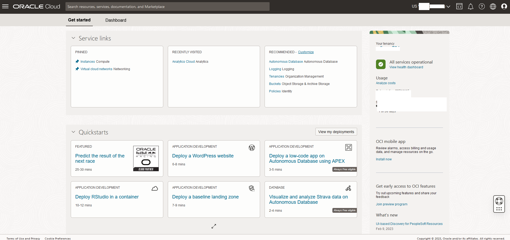
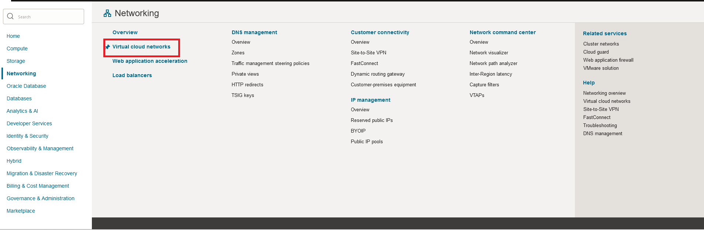
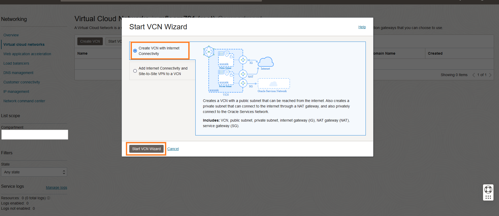
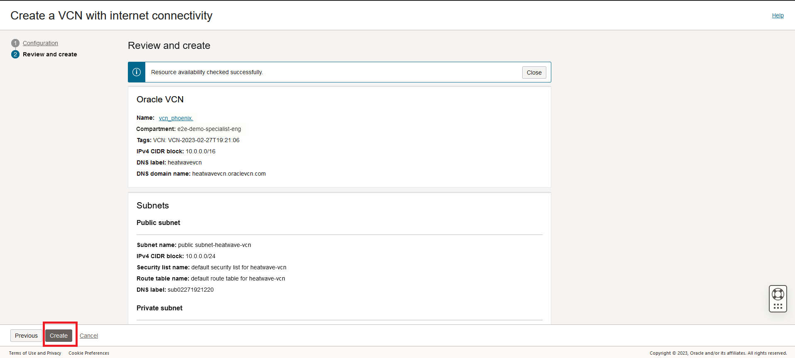
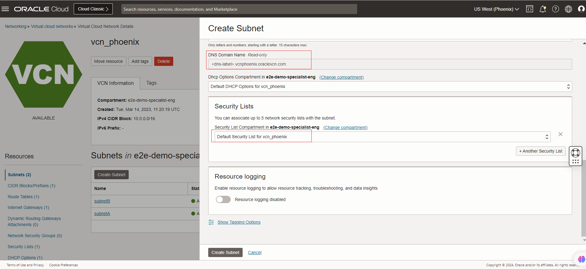
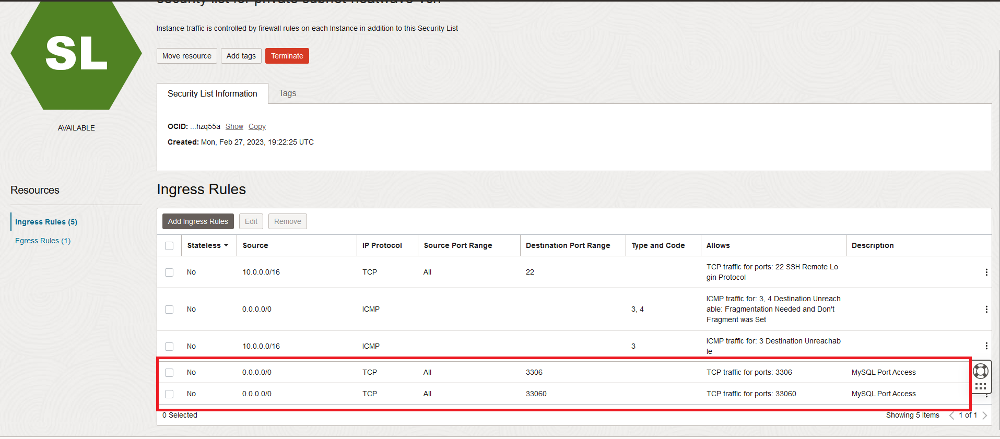

# Create VCN, Subnet and Allow Incoming Connections for the Workshop.

### Introduction

In this lab, you will create a Compartment and  Virtual Cloud Network (VCN) to connect your OCI resources. 

_Estimated Lab Time_: 15 minutes

### Objectives

In this lab, you will be guided through the following tasks:

- Create a Virtual Cloud Network
- Configure a security list to allow MySQL incoming connections
- Configure security list to allow HTTP incoming connections

### Prerequisites

- An Oracle Trial or Paid Cloud Account
- Some Experience with MySQL Shell
- Login to OCI to land on OCI Dashboard



##  
## Task 1: Create Virtual Cloud Network

1. Click Navigation Menu
    Select Networking
    Select Virtual Cloud Networks
    

2. Click **Start VCN Wizard**
    

3. Select 'Create VCN with Internet Connectivity'

    Click 'Start VCN Wizard'
    

4. Create a VCN with Internet Connectivity

    On Basic Information, complete the following fields:

    VCN Name:

    ```bash
    <copy>vcn_phoenix</copy>
    ```

    Compartment: Please Select - **e2e-demo-specialist-eng**

    The VCN name can be customized but ensure you use the same VCN through out the demo where ever required.
    Your screen should look similar to the following
        

5. Click 'Next' at the bottom of the screen

6. Review Oracle Virtual Cloud Network (VCN), Subnets, and Gateways

    Click 'Create' to create the VCN

7. The Virtual Cloud Network creation is completing
    

8. Click 'View VCN' to display the created VCN
    

## Task 2: Configure security list to allow MySQL incoming connections

1. On phoenix-vcn page under 'Subnets in lakehouse Compartment', click  '**Crete subnet**'

2. Create a subnet **subnetB**
     
     *** Assign the IPV4-CIDR Block ip -10.0.2.0/24
     

     
3. Delete the other two subnets created by default .

4. On vcn_phoenix page under 'Subnets in lakehouse Compartment', click  '**subnetB**'
     

5. On Private subnetB page under 'Security Lists',  click  '**Security List for subnetB**'
    

6. On Security List for Private subnetB page under 'Ingress Rules', click '**Add Ingress Rules**'
    

7. On Add Ingress Rules page under Ingress Rule

    Add an Ingress Rule with Source CIDR

    ```bash
    <copy>0.0.0.0/0</copy>
    ```

    Destination Port Range

    ```bash
    <copy>3306,33060</copy>
    ```

    Description

    ```bash
       <copy>MySQL Port Access</copy>
    ```

8. Click 'Add Ingress Rule'
    

9. On Security List for Private subnetB page, the new Ingress Rules will be shown under the Ingress Rules List
    

## Task 3: Configure security list to allow HTTP incoming connections

1. Navigation Menu > Networking > Virtual Cloud Networks

2. Open vcn_phoenix

3. Click  public subnetB

4. Click Default Security List for vcn_phoenix

5. Click Add Ingress Rules page under Ingress Rule

    Add an Ingress Rule with Source CIDR

    ```bash
    <copy>0.0.0.0/0</copy>
    ```

    Destination Port Range

    ```bash
    <copy>80,443,5000</copy>
    ```

    Description

    ```bash
    <copy>Allow HTTP connections</copy>
    ```

6. Click 'Add Ingress Rule'

    

7. On Security List for Default Security List for vcn_phoenix page, the new Ingress Rules will be shown under the Ingress Rules List

    

You may now **proceed to the next lab**

## Acknowledgements

- **Author** - Biswanath Nanda,Bhushan Arora Principal Cloud Architect, North America Cloud Infrastructure - Engineering
- **Contributors** - Biswanath Nanda, Bhushan Arora
- **Last Updated By/Date** - Biswanath Nanda, November 2024
